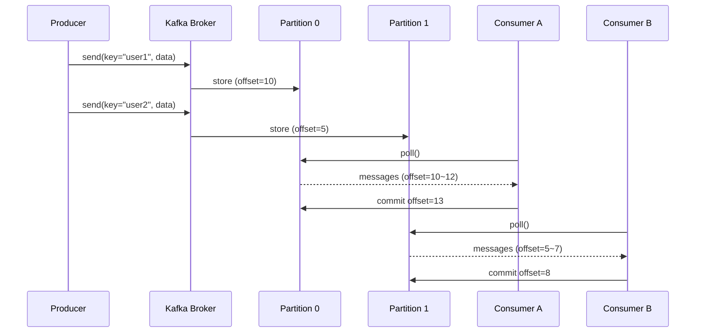

# Kafka 기초 개념

## 📌 Kafka란?

Apache Kafka는 **분산 스트리밍 플랫폼**으로, 대규모 실시간 데이터 스트림을 처리하기 위한 메시지 시스템입니다.

### 왜 Kafka를 사용하는가?

1. **높은 처리량(Throughput)**: 초당 수백만 개의 메시지 처리 가능
2. **확장성(Scalability)**: 수평 확장으로 시스템 용량 증대
3. **내구성(Durability)**: 디스크에 메시지 저장하여 데이터 유실 방지
4. **장애 복구(Fault Tolerance)**: Replication으로 고가용성 보장
5. **비동기 통신**: Producer와 Consumer 간의 느슨한 결합

---

## 🏗️ Kafka 핵심 구성 요소

### 1. Broker (브로커)

- **역할**: Kafka 서버 단위
- **기능**:
  - Producer로부터 메시지를 수신하여 디스크에 저장
  - Consumer의 요청에 응답하여 메시지 전달
  - Topic과 Partition 관리

```
[Producer] → [Broker 1] ← [Consumer]
              [Broker 2]
              [Broker 3]
```

#### 특수 Broker 역할

- **Controller**: 다른 Broker 모니터링, Leader 파티션 재분배
- **Coordinator**: Consumer Group 모니터링, Rebalancing 수행

---

### 2. Topic (토픽)

- **역할**: 메시지를 분류하는 논리적 채널 (카테고리)
- **예시**: `order-events`, `coupon-issue-request`, `user-notifications`
- **특징**: 하나의 Topic은 여러 Partition으로 구성

```
Topic: order-events
├── Partition 0
├── Partition 1
└── Partition 2
```

---

### 3. Partition (파티션)

- **역할**: Topic을 물리적으로 나눈 단위
- **핵심 특징**:
  - **순서 보장**: 하나의 파티션 내에서만 메시지 순서 보장
  - **병렬 처리**: 파티션 수만큼 Consumer를 병렬로 실행 가능
  - **메시지 저장**: 각 메시지는 고유한 Offset을 가짐

```
Partition 0: [msg1] [msg2] [msg3] [msg4] ...
             offset=0  offset=1  offset=2  offset=3
```

#### Partition과 순서 보장

```
❌ 전체 Topic 차원의 순서 보장 없음
✅ 동일한 Partition 내에서만 순서 보장

예시:
- Message A (Key: user1) → Partition 0 → offset 10
- Message B (Key: user1) → Partition 0 → offset 11
- Message C (Key: user2) → Partition 1 → offset 5

결과: A → B 순서 보장, but A와 C의 순서는 보장 안 됨
```

---

### 4. Producer (프로듀서)

- **역할**: 메시지를 Kafka Broker에 발행(Publish)하는 애플리케이션
- **메시지 구조**: `<Key, Value>`
  - Key: 파티션 결정에 사용 (해시값 기반)
  - Value: 실제 메시지 데이터

#### 메시지 키 전략

1. **Key가 있는 경우**: 같은 Key = 같은 Partition
   ```kotlin
   kafkaTemplate.send("order-events", userId, orderData)
   // userId가 같으면 항상 같은 파티션으로 전송 → 순서 보장
   ```

2. **Key가 없는 경우**: Round-Robin 방식으로 분산
   ```kotlin
   kafkaTemplate.send("order-events", orderData)
   // 부하 분산 Good, 순서 보장 Bad
   ```

#### Partitioner (파티셔너)

메시지를 어떤 파티션에 저장할지 결정하는 로직:

```
hash(key) % partition_count = target_partition

예시:
key: "user123"
hash("user123") = 50649483
partition_count = 3
target_partition = 50649483 % 3 = 2

→ Partition 2에 저장
```

---

### 5. Consumer (컨슈머)

- **역할**: Kafka Broker로부터 메시지를 읽어오는(Consume) 애플리케이션
- **Pull 방식**: Consumer가 능동적으로 메시지를 가져옴
- **Offset 관리**: 어디까지 읽었는지 추적

#### Offset

- **Current Offset**: Consumer가 현재까지 처리한 위치
- **Commit**: 처리 완료한 Offset을 Kafka에 기록
- **Offset Reset**: 문제 발생 시 특정 시점으로 되돌리기 가능

```bash
# Offset을 특정 시점으로 리셋
kafka-consumer-groups --bootstrap-server localhost:9092 \
  --group order-service \
  --reset-offsets --to-earliest \
  --topic order-events --execute
```

---

### 6. Consumer Group (컨슈머 그룹)

- **역할**: 하나의 Topic에 대해 여러 Consumer가 협력하여 메시지 소비
- **목적**: 수평 확장(Scale-out)으로 처리량 증대

#### 핵심 규칙

1. **하나의 파티션 = 하나의 Consumer (그룹 내)**
   ```
   Topic (Partition 3개)
   ├── Partition 0 → Consumer A (group1)
   ├── Partition 1 → Consumer B (group1)
   └── Partition 2 → Consumer C (group1)
   ```

2. **Consumer 수 > Partition 수**: 잉여 Consumer는 대기
   ```
   Topic (Partition 2개)
   ├── Partition 0 → Consumer A (group1)
   ├── Partition 1 → Consumer B (group1)
   └── (없음)     → Consumer C (유휴 상태)
   ```

3. **여러 Consumer Group**: 각 그룹은 독립적으로 메시지 소비
   ```
   Topic: order-events
   ├── Consumer Group: order-service   (주문 처리)
   ├── Consumer Group: billing-service (결제 처리)
   └── Consumer Group: analytics       (분석)
   ```

---

### 7. Rebalancing (리밸런싱)

- **역할**: Consumer Group 내에서 Partition 소유권을 재분배
- **트리거**:
  1. Consumer 추가
  2. Consumer 장애/종료
  3. Topic에 Partition 추가

#### ⚠️ 주의사항

```
Rebalancing 중에는 Consumer가 메시지를 읽을 수 없음
→ 일시적인 처리 중단 발생
```

**예시:**
```
1. 초기 상태: Consumer A, B가 Partition 0, 1 담당
2. Consumer C 추가
3. Rebalancing 시작 (처리 중단)
4. 재분배: A → P0, B → P1, C → P2
5. Rebalancing 완료 (처리 재개)
```

---

### 8. Cluster (클러스터)

- **역할**: 여러 Broker를 묶어 고가용성(HA) 제공
- **장점**:
  - 특정 Broker 장애 시에도 서비스 계속 가능
  - Broker 증설로 처리량 확장 가능

```
Kafka Cluster
├── Broker 1 (Leader for P0)
├── Broker 2 (Leader for P1)
└── Broker 3 (Leader for P2)
```

---

### 9. Replication (복제)

- **역할**: 각 Partition을 여러 Broker에 복제하여 데이터 백업
- **구성**:
  - **Leader Replica**: 모든 읽기/쓰기 처리
  - **Follower Replica**: Leader의 데이터를 복제, 백업 역할

```
Partition 0 (Replication Factor = 3)
├── Leader Replica   (Broker 1) ← 읽기/쓰기
├── Follower Replica (Broker 2) ← 동기화
└── Follower Replica (Broker 3) ← 동기화

만약 Broker 1 장애 발생:
→ Follower 중 하나가 새로운 Leader로 선출
```

#### ⚠️ 중요 규칙

```
Leader의 메시지가 동기화되지 않은 Replica는 Leader가 될 수 없음
→ 데이터 정합성 보장
```

---

## 📊 Kafka 메시지 흐름

### 전체 흐름



---

## 🎯 Kafka 사용 전략

### 1. 순서 보장이 중요한 경우

- **메시지 키**: 순서를 보장해야 하는 단위로 설정
- **예시**: 사용자별 주문 순서 보장 → `userId`를 Key로 사용

```kotlin
// 같은 사용자의 메시지는 항상 같은 파티션으로
kafkaTemplate.send("order-events", userId, orderData)
```

### 2. 처리량이 중요한 경우

- **파티션 수 증가**: 병렬 처리 능력 향상
- **Consumer 수 증가**: 파티션 수만큼 Consumer 배치
- **메시지 키 분산**: 가능한 여러 파티션에 고르게 분산

```kotlin
// 부하 분산을 위해 Key를 null로 (Round-Robin)
kafkaTemplate.send("log-events", null, logData)
```

### 3. 동시성 제어가 필요한 경우

- **메시지 키 전략**: 동시 처리되면 안 되는 리소스 ID를 Key로 사용
- **예시**: 쿠폰 발급 → `couponId`를 Key로 사용하여 순차 처리

```kotlin
// 같은 쿠폰에 대한 요청은 순차 처리 (동시성 제어)
kafkaTemplate.send("coupon-issue-request", couponId, issueRequest)
```

---

## 🔧 Kafka CLI 명령어

### Topic 관리

```bash
# Topic 생성
kafka-topics --bootstrap-server localhost:9092 \
  --create --topic order-events \
  --partitions 3 --replication-factor 1

# Topic 목록 조회
kafka-topics --bootstrap-server localhost:9092 --list

# Topic 상세 정보
kafka-topics --bootstrap-server localhost:9092 \
  --describe --topic order-events
```

### 메시지 발행/소비

```bash
# Producer (메시지 발행)
kafka-console-producer --bootstrap-server localhost:9092 \
  --topic order-events

# Consumer (메시지 소비)
kafka-console-consumer --bootstrap-server localhost:9092 \
  --topic order-events --from-beginning

# Consumer Group으로 소비
kafka-console-consumer --bootstrap-server localhost:9092 \
  --topic order-events --group order-service
```

### Consumer Group 관리

```bash
# Consumer Group 목록
kafka-consumer-groups --bootstrap-server localhost:9092 --list

# Consumer Group 상세 정보
kafka-consumer-groups --bootstrap-server localhost:9092 \
  --describe --group order-service

# Offset 리셋
kafka-consumer-groups --bootstrap-server localhost:9092 \
  --group order-service --reset-offsets --to-earliest \
  --topic order-events --execute
```

---

## 📈 성능 최적화 체크리스트

### Producer 최적화

- [ ] Batch Size 조정 (`batch.size`, `linger.ms`)
- [ ] Compression 활성화 (`compression.type=snappy`)
- [ ] Acks 설정 조정 (`acks=1` or `acks=all`)

### Consumer 최적화

- [ ] Fetch Size 조정 (`max.poll.records`, `fetch.min.bytes`)
- [ ] Commit 전략 (`enable.auto.commit=false`, 수동 커밋)
- [ ] Consumer 수 = Partition 수

### Broker 최적화

- [ ] Partition 수 증가 (병렬 처리)
- [ ] Replication Factor 설정 (고가용성)
- [ ] Log Retention 설정 (`log.retention.hours`)

---

## 🔗 참고 자료

- [Apache Kafka 공식 문서](https://kafka.apache.org/documentation/)
- [Confluent Kafka 튜토리얼](https://docs.confluent.io/platform/current/tutorials/index.html)
- [Spring Kafka 공식 문서](https://docs.spring.io/spring-kafka/reference/)

---
