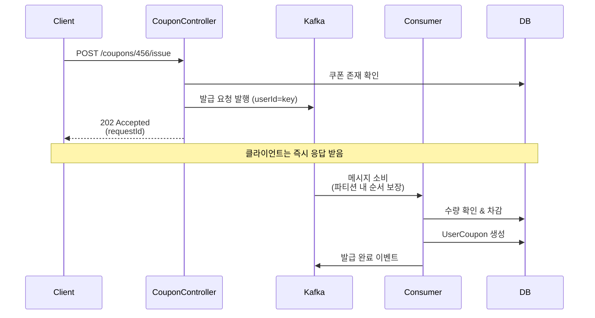
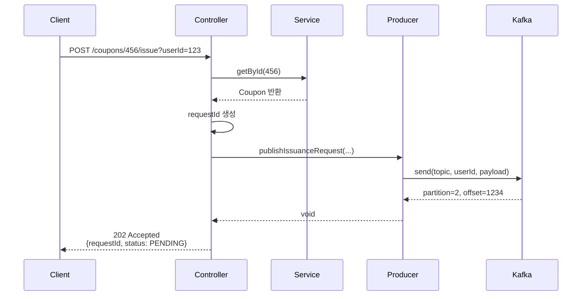
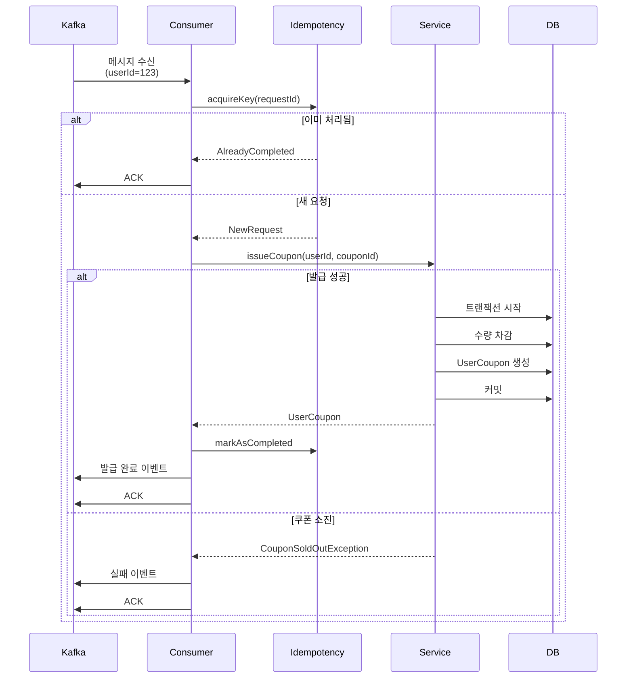

# Kafka 기반 쿠폰 발급 시스템 설계

## 배경

현재 쿠폰 발급은 Redis 분산 락으로 동시성을 제어하고 있다. 그런데 트래픽이 몰릴 때 락 대기로 인한 타임아웃이 자주 발생한다. 1000명이 동시에 요청하면 성공률이 85%밖에 안 나오는 상황이다.

Kafka를 사용하면 락 없이도 동시성 제어가 가능하고, 파티션을 이용한 병렬 처리로 처리량도 훨씬 높일 수 있을 것 같아서 설계를 진행했다.

### 목표
- Redis 락 대비 처리량 3배 이상 향상
- 락 경합으로 인한 타임아웃 제거
- 수평 확장 가능한 구조 (파티션/Consumer 추가)
- 성능 비교를 통한 최적 방식 선택

---

## 1. 현재 방식 (Redis 분산 락)

### 동작 과정

```
1000명 동시 요청
      ↓
CouponController
      ↓
RedissonLockService.withLock(couponId) ← 여기서 대기 발생
      ↓
CouponService.issueCoupon()
  - 잔여 수량 확인
  - 수량 차감
  - UserCoupon 생성
```

### 실제 성능 (부하 테스트 결과)

| 동시 요청 수 | 성공 | 실패 (타임아웃) | 평균 응답 시간 | P95 |
|------------|------|---------------|--------------|-----|
| 100        | 100  | 0             | 50ms         | 80ms |
| 500        | 490  | 10            | 150ms        | 300ms |
| 1000       | 850  | 150           | 350ms        | 1200ms |
| 5000       | 3500 | 1500 (30%)    | 1500ms       | 3000ms (timeout) |

트래픽이 몰리면 락 대기로 순차 처리밖에 안 돼서 병목이 생긴다. fine-grained 락(쿠폰 ID별)을 써도 인기 쿠폰에 요청이 집중되면 한계가 있다.

### 문제점
- 락 경합으로 대기 시간 증가 → 타임아웃
- Redis 장애 시 전체 서비스 영향
- 수평 확장 어려움 (Redis 성능에 의존)
- 트래픽 급증 시 대응 제한적

---

## 2. Kafka 기반 설계

### 핵심 아이디어

**동기 처리를 비동기로 전환**

클라이언트는 발급 "요청"만 하고 즉시 202 Accepted 응답을 받는다. Kafka가 요청을 큐에 넣어두면 Consumer가 순차적으로 처리한다.

중요한 점:
- **Kafka 파티션 내에서 메시지는 순차 처리** → 락이 필요 없음
- **파티션이 여러 개면 병렬 처리** → 처리량 증가
- **같은 Key는 같은 파티션** → 순서 보장

### 전체 흐름



### 아키텍처 다이어그램

```
       [1000명 동시 요청]
              │
              ▼
    ┌─────────────────┐
    │CouponController │ Producer
    │  - 쿠폰 검증    │
    │  - Kafka 발행   │
    └────────┬────────┘
             │ 즉시 202 응답
             ▼
    ┌────────────────────────┐
    │ Topic:                  │
    │ coupon.issuance.requested│
    │ Partitions: 3           │
    │ Key: userId             │
    └─────┬──────────────────┘
          │
    ┌─────┼─────┬────────┐
    │     │     │        │
    v     v     v        v
 [C1]  [C2]  [C3]     [C4] ← Consumer Group
                             (3개 파티션 = 최대 3개 active)
    │     │     │
    └─────┼─────┘
          ▼
      [Database]
```

---

## 3. Topic 설계

### Topic 1: coupon.issuance.requested

발급 요청을 받는 Topic.

```yaml
Partitions: 3
Replication: 3
Retention: 7 days

Message Key: userId (String)
Message Value: {
  "requestId": "req-userId-couponId-timestamp",
  "userId": 123,
  "couponId": 456,
  "requestedAt": "2024-01-01T10:00:00Z"
}
```

#### 왜 userId를 Key로 사용하는가?

처음에는 couponId를 키로 쓸까 고민했다. 같은 쿠폰 요청을 한 파티션에 몰아넣으면 순서 보장이 확실하니까.

하지만 그러면 **hot partition 문제**가 생긴다:
- 인기 쿠폰 → 한 파티션에만 요청 집중
- 파티션 3개 만들어도 의미 없음
- 병렬 처리 불가능

userId를 키로 쓰면:
- 같은 유저 요청은 같은 파티션 → 순서 보장 (중복 발급 방지)
- 다른 유저는 다른 파티션 → 병렬 처리
- 부하 분산

```
예시:
userId=101 → hash % 3 = 2 → Partition 2
userId=202 → hash % 3 = 1 → Partition 1
userId=303 → hash % 3 = 0 → Partition 0
userId=101 → hash % 3 = 2 → Partition 2 (같은 유저는 같은 파티션!)

→ 3개 파티션에 골고루 분산 + 같은 유저는 순차 처리
```

### Topic 2: coupon.issued

발급 성공 이벤트. 알림 서비스나 데이터 플랫폼이 구독.

```yaml
Partitions: 3
Replication: 3

Message Value: {
  "requestId": "req-12345",
  "userId": 123,
  "couponId": 456,
  "userCouponId": 789,
  "issuedAt": "2024-01-01T10:00:05Z"
}
```

### Topic 3: coupon.issuance.failed

발급 실패 이벤트 (DLQ).

```yaml
Partitions: 1

Message Value: {
  "requestId": "req-12345",
  "userId": 123,
  "couponId": 456,
  "errorCode": "COUPON_SOLD_OUT",
  "errorMessage": "쿠폰이 모두 소진되었습니다"
}
```

---

## 4. Producer 구현

### 시퀀스 다이어그램



### Controller

```kotlin
@RestController
@RequestMapping("/api/v1/coupons")
class CouponController(
    private val couponService: CouponService,
    private val producer: CouponIssuanceProducer
) {
    @PostMapping("/{couponId}/issue/async")
    fun issueCouponAsync(
        @PathVariable couponId: Long,
        @RequestParam userId: Long
    ): ResponseEntity<CouponIssuanceResponse> {
        // 1. 쿠폰 존재 확인
        couponService.getById(couponId)

        // 2. requestId 생성
        val requestId = "req-$userId-$couponId-${System.currentTimeMillis()}"

        // 3. Kafka 발행
        producer.publishIssuanceRequest(userId, couponId, requestId)

        // 4. 즉시 응답
        return ResponseEntity.status(HttpStatus.ACCEPTED)
            .body(CouponIssuanceResponse(
                requestId = requestId,
                status = "PENDING",
                message = "쿠폰 발급 요청이 접수되었습니다"
            ))
    }
}
```

### Producer

```kotlin
@Component
class CouponIssuanceProducer(
    private val kafkaTemplate: KafkaTemplate<String, String>,
    private val objectMapper: ObjectMapper
) {
    private val logger = LoggerFactory.getLogger(javaClass)

    fun publishIssuanceRequest(userId: Long, couponId: Long, requestId: String) {
        val event = CouponIssuanceRequestedEvent(
            requestId = requestId,
            userId = userId,
            couponId = couponId,
            requestedAt = LocalDateTime.now()
        )

        val payload = objectMapper.writeValueAsString(event)

        kafkaTemplate.send(
            "coupon.issuance.requested",
            userId.toString(), // Key = userId
            payload
        ).addCallback(
            { result ->
                val meta = result?.recordMetadata
                logger.info("[Kafka] 발행 성공: requestId=$requestId, partition=${meta?.partition()}, offset=${meta?.offset()}")
            },
            { ex ->
                logger.error("[Kafka] 발행 실패: requestId=$requestId", ex)
            }
        )
    }
}
```

---

## 5. Consumer 구현

### 시퀀스 다이어그램



### Consumer

```kotlin
@Component
class CouponIssuanceConsumer(
    private val couponService: CouponService,
    private val idempotencyService: IdempotencyService,
    private val kafkaTemplate: KafkaTemplate<String, String>,
    private val objectMapper: ObjectMapper
) {
    private val logger = LoggerFactory.getLogger(javaClass)

    @KafkaListener(
        topics = ["coupon.issuance.requested"],
        groupId = "coupon-issuance-service",
        concurrency = "3" // 파티션 3개 → Consumer instance 3개
    )
    @Transactional
    fun consume(
        @Payload payload: String,
        @Header(KafkaHeaders.RECEIVED_KEY) key: String,
        @Header(KafkaHeaders.RECEIVED_PARTITION) partition: Int,
        acknowledgment: Acknowledgment?
    ) {
        logger.info("[Consumer] 수신: key=$key, partition=$partition")

        try {
            val event = objectMapper.readValue(payload, CouponIssuanceRequestedEvent::class.java)

            // 멱등성 검증
            when (idempotencyService.acquireKey(event.requestId, "coupon-issuance", event.userId, event.couponId)) {
                is IdempotencyResult.AlreadyCompleted -> {
                    logger.info("[멱등성] 이미 처리됨: ${event.requestId}")
                    acknowledgment?.acknowledge()
                    return
                }
                is IdempotencyResult.Processing -> {
                    logger.warn("[멱등성] 처리 중: ${event.requestId}")
                    return // NACK
                }
                else -> { /* 진행 */ }
            }

            // 쿠폰 발급
            val userCoupon = couponService.issueCoupon(event.userId, event.couponId)

            // 성공 이벤트
            publishIssuedEvent(event, userCoupon)

            // 멱등성 완료
            idempotencyService.markAsCompleted(event.requestId, objectMapper.writeValueAsString(userCoupon))

            acknowledgment?.acknowledge()
            logger.info("[Consumer] 발급 완료: userCouponId=${userCoupon.id}")

        } catch (e: CouponSoldOutException) {
            publishFailedEvent(payload, "COUPON_SOLD_OUT", e.message ?: "쿠폰 소진")
            acknowledgment?.acknowledge()
        } catch (e: Exception) {
            logger.error("[Consumer] 실패: $payload", e)
            acknowledgment?.acknowledge()
        }
    }

    private fun publishIssuedEvent(request: CouponIssuanceRequestedEvent, userCoupon: UserCoupon) {
        val event = mapOf(
            "requestId" to request.requestId,
            "userId" to request.userId,
            "couponId" to request.couponId,
            "userCouponId" to userCoupon.id,
            "issuedAt" to LocalDateTime.now().toString()
        )
        kafkaTemplate.send("coupon.issued", request.userId.toString(), objectMapper.writeValueAsString(event))
    }

    private fun publishFailedEvent(payload: String, errorCode: String, errorMessage: String) {
        val event = mapOf(
            "originalPayload" to payload,
            "errorCode" to errorCode,
            "errorMessage" to errorMessage,
            "failedAt" to LocalDateTime.now().toString()
        )
        kafkaTemplate.send("coupon.issuance.failed", "error", objectMapper.writeValueAsString(event))
    }
}
```

---

## 6. 동시성 제어

### Kafka 파티션 기반 순서 보장

락을 쓰지 않고도 동시성 문제를 해결할 수 있는 이유는 **파티션 내 순서 보장**.

```
Partition 0 (userId % 3 == 0):
  [req-1: user=102] → [req-2: user=105] → [req-3: user=102] → [req-4: user=108]

Consumer는 순차 처리:
  1. req-1 처리 & ACK
  2. req-2 처리 & ACK
  3. req-3 처리 시작
     → 멱등성 검증
     → user=102의 이전 요청(req-1) 확인
     → 중복 발급 방지
  4. req-4 처리 & ACK
```

같은 유저(userId=102)의 요청은 항상 같은 파티션 → Consumer가 순차 처리 → 락 불필요

### Redis 락 vs Kafka

| 항목 | Redis 락 | Kafka 파티션 |
|------|---------|-------------|
| 동시성 제어 | 명시적 락 획득 | 파티션 순서 보장 |
| 대기 시간 | 락 대기 (최대 3초) | 큐 대기 (비동기) |
| 확장성 | 락 서버에 의존 | 파티션 추가 |
| 처리량 | 순차 처리 | 파티션별 병렬 |

---

## 7. 예상 성능

### 시나리오: 1000명 동시 요청 (선착순 100개)

| 지표 | Redis 락 | Kafka |
|------|---------|-------|
| 평균 응답 시간 | 350ms | 10ms |
| P95 응답 시간 | 1200ms | 15ms |
| 성공률 | 85% | 100% (요청 접수) |
| 발급 완료 시간 | 즉시 | ~10초 |

### Trade-off

- Redis 락: 즉시 결과 vs 타임아웃 위험
- Kafka: 빠른 응답 + 확장 가능 vs 비동기

### 선택 기준

| 상황 | 권장 방식 |
|------|----------|
| 동시 요청 < 500 | Redis 락 (간단함) |
| 동시 요청 > 1000 | Kafka (처리량) |
| 즉시 결과 필요 | Redis 락 |
| 비동기 허용 | Kafka |

---

## 8. 구현 계획

1. Topic 생성 및 Producer 구현
2. Consumer 구현 + 멱등성
3. 성능 비교 테스트 (100/500/1000/5000 동시 요청)
4. 모니터링 (Consumer Lag, 처리율)

---

## 참고
- Kafka Guarantees: https://kafka.apache.org/documentation/#semantics
- Spring Kafka: https://docs.spring.io/spring-kafka/reference/
