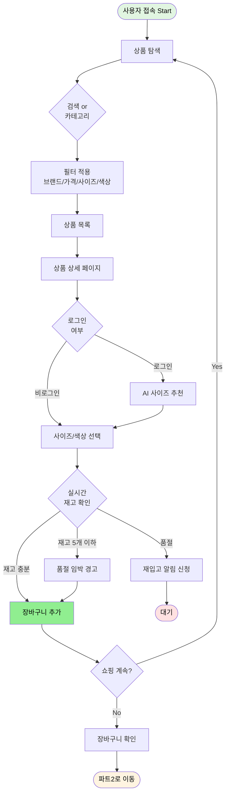
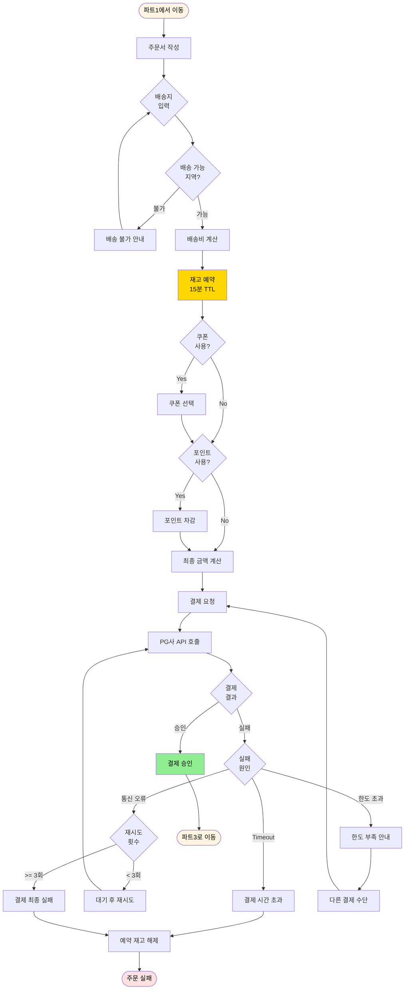
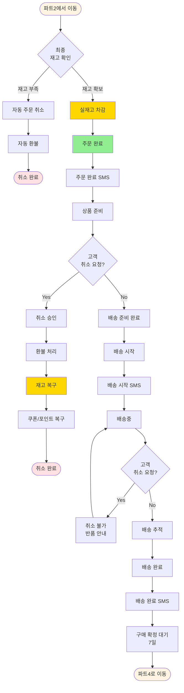
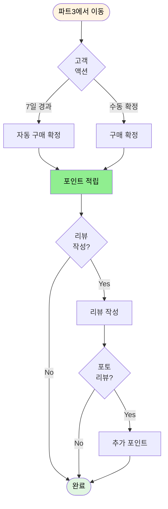

### <상품 탐색 및 장바구니>

```mermaid
flowchart TD
    Start([사용자 접속 Start]) --> Browse[상품 탐색]
    
    Browse --> Search{검색 or<br/>카테고리}
    Search --> Filter[필터 적용<br/>브랜드/가격/사이즈/색상]
    Filter --> ProductList[상품 목록]
    
    ProductList --> Detail[상품 상세 페이지]
    
    Detail --> CheckAuth{로그인<br/>여부}
    CheckAuth -->|비로그인| SizeSelect[사이즈/색상 선택]
    CheckAuth -->|로그인| SizeRec[AI 사이즈 추천]
    
    SizeRec --> SizeSelect
    SizeSelect --> CheckStock1{실시간<br/>재고 확인}
    
    CheckStock1 -->|재고 충분| AddCart[장바구니 추가]
    CheckStock1 -->|재고 5개 이하| Warning[품절 임박 경고]
    CheckStock1 -->|품절| SoldOut[재입고 알림 신청]
    
    Warning --> AddCart
    SoldOut --> End1([대기])
    
    AddCart --> ContinueShopping{쇼핑 계속?}
    ContinueShopping -->|Yes| Browse
    ContinueShopping -->|No| Cart[장바구니 확인]
    
    Cart --> End2([파트2로 이동])
    
    style Start fill:#e1f5e1, color:black
    style End1 fill:#ffe1e1, color:black
    style End2 fill:#fff4e1, color:black
    style AddCart fill:#90EE90, color:black
```

### <주문서 작성 및 결제>

```mermaid
flowchart TD
    Start([파트1에서 이동]) --> OrderSheet[주문서 작성]
    
    OrderSheet --> Address{배송지<br/>입력}
    Address --> CheckDeliveryArea{배송 가능<br/>지역?}
    CheckDeliveryArea -->|불가| AlertArea[배송 불가 안내]
    AlertArea --> Address
    CheckDeliveryArea -->|가능| CalcShipping[배송비 계산]
    
    CalcShipping --> ReserveStock[재고 예약<br/>15분 TTL]
    
    ReserveStock --> Coupon{쿠폰<br/>사용?}
    Coupon -->|Yes| SelectCoupon[쿠폰 선택]
    Coupon -->|No| Point
    SelectCoupon --> Point{포인트<br/>사용?}
    
    Point -->|Yes| UsePoint[포인트 차감]
    Point -->|No| FinalPrice
    UsePoint --> FinalPrice[최종 금액 계산]
    
    FinalPrice --> Payment[결제 요청]
    
    Payment --> PG[PG사 API 호출]
    PG --> PayResult{결제<br/>결과}
    
    PayResult -->|승인| PaySuccess[결제 승인]
    PayResult -->|실패| PayFail{실패<br/>원인}
    
    PayFail -->|한도 초과| PayFailMsg1[한도 부족 안내]
    PayFail -->|통신 오류| Retry{재시도<br/>횟수}
    PayFail -->|Timeout| PayTimeout[결제 시간 초과]
    
    Retry -->|< 3회| WaitRetry[대기 후 재시도]
    Retry -->|>= 3회| PayFailFinal[결제 최종 실패]
    
    WaitRetry --> PG
    PayFailMsg1 --> ChangePayment[다른 결제 수단]
    ChangePayment --> Payment
    
    PayTimeout --> ReleaseReserve1[예약 재고 해제]
    PayFailFinal --> ReleaseReserve1
    ReleaseReserve1 --> End1([주문 실패])
    
    PaySuccess --> End2([파트3로 이동])
    
    style Start fill:#fff4e1, color:black
    style End1 fill:#ffe1e1, color:black
    style End2 fill:#fff4e1, color:black
    style PaySuccess fill:#90EE90, color:black
    style ReserveStock fill:#FFD700, color:black
```

### <주문 완료 및 배송>

```mermaid
flowchart TD
    Start([파트2에서 이동]) --> CheckFinalStock{최종<br/>재고 확인}
    CheckFinalStock -->|재고 확보| DeductStock[실재고 차감]
    CheckFinalStock -->|재고 부족| AutoCancel[자동 주문 취소]
    
    AutoCancel --> RefundAuto[자동 환불]
    RefundAuto --> End1([취소 완료])
    
    DeductStock --> OrderComplete[주문 완료]
    OrderComplete --> SendOrderSMS[주문 완료 SMS]
    SendOrderSMS --> PrepareShip[상품 준비]
    
    PrepareShip --> CancelReq1{고객<br/>취소 요청?}
    CancelReq1 -->|Yes| CancelApprove[취소 승인]
    CancelReq1 -->|No| ShipReady
    
    CancelApprove --> RefundNormal[환불 처리]
    RefundNormal --> RestoreStock1[재고 복구]
    RestoreStock1 --> RestoreCoupon1[쿠폰/포인트 복구]
    RestoreCoupon1 --> End2([취소 완료])
    
    ShipReady[배송 준비 완료] --> Ship[배송 시작]
    Ship --> SendShipSMS[배송 시작 SMS]
    SendShipSMS --> Delivering[배송중]
    
    Delivering --> CancelReq2{고객<br/>취소 요청?}
    CancelReq2 -->|Yes| CancelReject[취소 불가<br/>반품 안내]
    CancelReq2 -->|No| TrackShip
    
    CancelReject --> Delivering
    
    TrackShip[배송 추적] --> Delivered[배송 완료]
    Delivered --> SendDeliverSMS[배송 완료 SMS]
    SendDeliverSMS --> ConfirmWait[구매 확정 대기<br/>7일]
    
    ConfirmWait --> End3([파트4로 이동])
    
    style Start fill:#fff4e1
    style End1 fill:#ffe1e1
    style End2 fill:#ffe1e1
    style End3 fill:#fff4e1
    style OrderComplete fill:#90EE90
    style DeductStock fill:#FFD700
    style RestoreStock1 fill:#FFD700
```

### <구매확정 및 리뷰>

```mermaid
flowchart TD
    Start([파트3에서 이동]) --> UserAction{고객<br/>액션}

    UserAction -->|7일 경과| AutoConfirm[자동 구매 확정]
    UserAction -->|수동 확정| ManualConfirm[구매 확정]

    AutoConfirm --> PointEarn[포인트 적립]
    ManualConfirm --> PointEarn
    PointEarn --> ReviewRequest{리뷰<br/>작성?}
    ReviewRequest -->|Yes| WriteReview[리뷰 작성]
    ReviewRequest -->|No| End1
    WriteReview --> PhotoReview{포토<br/>리뷰?}
    PhotoReview -->|Yes| BonusPoint[추가 포인트]
    PhotoReview -->|No| End1
    BonusPoint --> End1([완료])

    style Start fill:#fff4e1, color:black
    style End1 fill:#e1f5e1, color:black
    style PointEarn fill:#90EE90, color:black
```