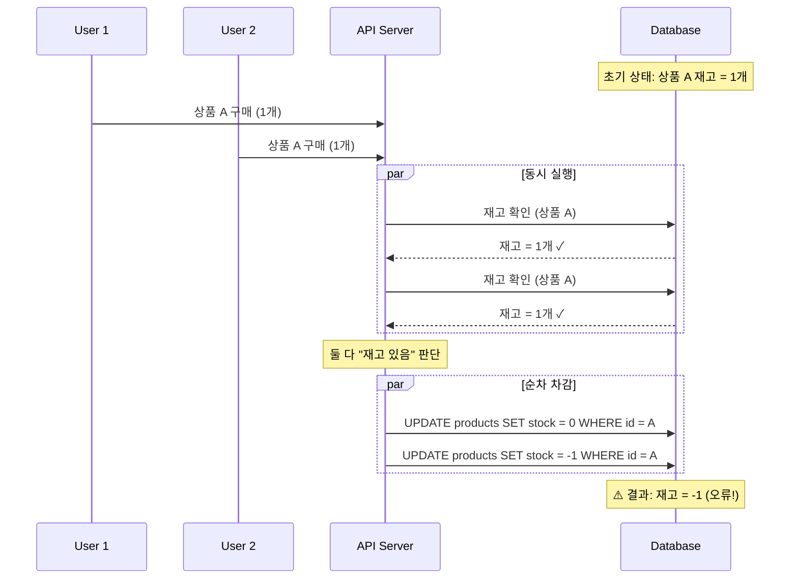
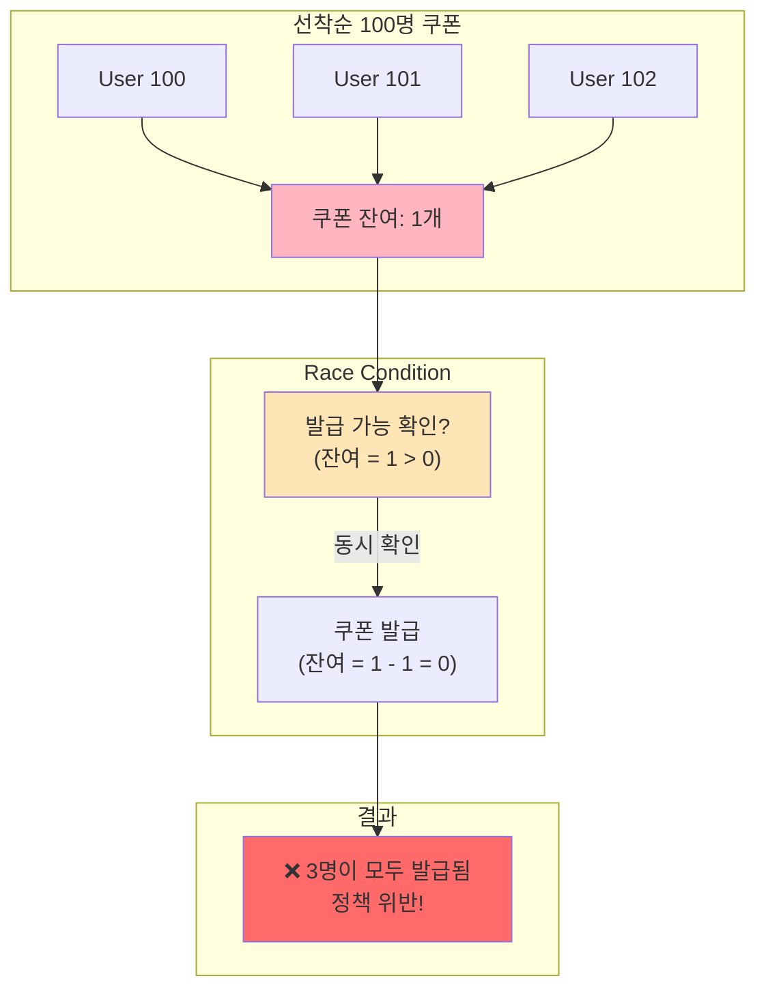
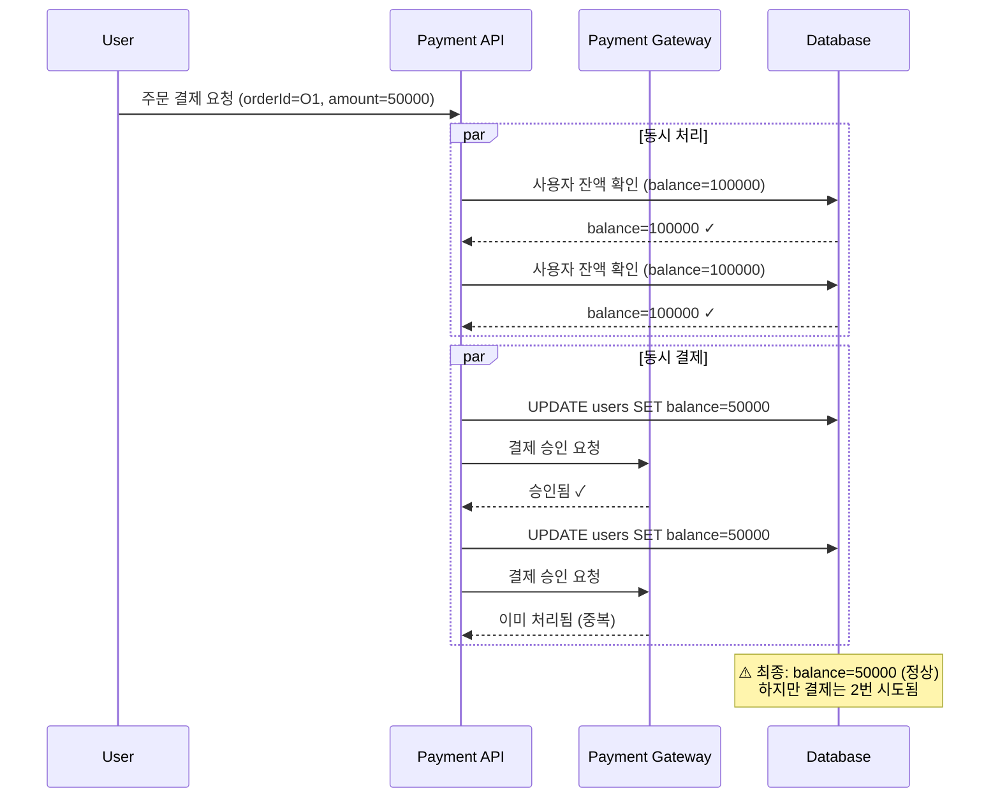

# Step 1: 동시성 문제 식별 보고서

## 📋 목차

1. [Executive Summary](#executive-summary)
2. [1.1 재고 차감 경쟁 상황 분석](#11-재고-차감-경쟁-상황-분석)
3. [1.2 선착순 쿠폰 발급 경쟁 상황 분석](#12-선착순-쿠폰-발급-경쟁-상황-분석)
4. [1.3 결제 동시성 이슈 분석](#13-결제-동시성-이슈-분석)
5. [1.4 현재 구현 상태 분석](#14-현재-구현-상태-분석)
6. [1.5 영향도 및 위험 평가](#15-영향도-및-위험-평가)

---

## Executive Summary

**hhplus-ecommerce** 프로젝트는 Spring Boot 3.2.0 및 Kotlin으로 구축된 의류 전자상거래 플랫폼입니다. 클린 아키텍처를 따르면서 다층 구조(Presentation → Application → Domain → Infrastructure)로 설계되었습니다.

**핵심 문제**: 재고 관리, 선착순 쿠폰 발급, 결제 프로세스에서 **Race Condition** 및 **데이터 일관성 문제**가 발생할 수 있습니다.

### 주요 동시성 문제 목록

| # | 문제 | 심각도 | 영향 범위 |
|---|------|--------|----------|
| 1 | 재고 중복 차감 | 🔴 Critical | 비즈니스 손실 |
| 2 | 음수 재고 발생 | 🔴 Critical | 데이터 무결성 |
| 3 | 선착순 쿠폰 초과 발급 | 🔴 Critical | 정책 위반 |
| 4 | 중복 쿠폰 발급 | 🟠 High | 사용자 부정 |
| 5 | 중복 결제 | 🔴 Critical | 금전 피해 |
| 6 | 부분 결제 실패 | 🟠 High | 데이터 불일치 |

---

## 1.1 재고 차감 경쟁 상황 분석

### 1.1.1 문제 정의

재고 차감 시 여러 사용자가 동시에 같은 상품을 구매할 때 발생하는 Race Condition입니다.

### 1.1.2 시나리오



### 1.1.3 현재 코드 분석

**파일**: `application/usecases/InventoryUseCase.kt`

```kotlin
fun deductInventory(sku: String, quantity: Int): Inventory {
    val inventory = inventoryRepository.findBySku(sku)
        ?: throw InventoryException.InventoryNotFound()

    if (inventory.getAvailableStock() < quantity) {
        throw InventoryException.InsufficientStock()
    }

    // ❌ 문제: 확인과 차감 사이의 갭
    inventory.confirmReservation(quantity)
    inventoryRepository.update(sku, inventory)

    return inventory
}
```

**문제점**:
1. **Check-Then-Act 패턴**: 재고 확인 후 차감까지의 사이에 다른 트랜잭션이 개입 가능
2. **비원자적 연산**: 2개 이상의 데이터베이스 작업이 원자성을 보장하지 않음
3. **동시성 제어 부재**: 잠금(Lock) 메커니즘 없음

### 1.1.4 비즈니스 손실 계산

```
상품 가격: 50,000원
초기 재고: 1개 (기대 판매량: 50,000원)

Race Condition 발생 시:
- 2명이 동시에 구매
- 실제 판매: 2개 (예상 매출: 100,000원)
- 시스템 기록: 음수 재고(-1)
- 결과:
  ❌ 한 명에게 없는 상품을 판매
  ❌ 재고 관리 시스템 오류
  ❌ 교환/반품 비용 증가
```

### 1.1.5 발생 가능성 평가

| 요소 | 평가 | 이유 |
|------|------|------|
| 발생 확률 | 🔴 높음 | 인기 상품은 초당 수십 개 요청 |
| 감지 난도 | 🔴 높음 | 로깅 없으면 발견 어려움 |
| 복구 난도 | 🔴 높음 | 이미 팔린 상품 복구 불가능 |
| 재발 방지 | 🟠 중간 | 적절한 Lock 적용 필요 |

---

## 1.2 선착순 쿠폰 발급 경쟁 상황 분석

### 1.2.1 문제 정의

선착순 100명 쿠폰 발급 시 101명 이상이 동시에 요청할 때의 Race Condition입니다.

### 1.2.2 시나리오



### 1.2.3 현재 코드 분석

**파일**: `application/usecases/CouponUseCase.kt`

```kotlin
fun issueCoupon(couponId: Long, userId: Long): CouponResult {
    val coupon = couponRepository.findById(couponId)
        ?: throw CouponException.CouponNotFound()

    // ❌ 문제 1: 동시성 제어 약함
    val lockObject = locks.getOrPut(couponId) { Any() }
    synchronized(lockObject) {
        if (!coupon.canIssue()) {  // 확인
            throw CouponException.CannotIssueCoupon()
        }

        // ❌ 문제 2: 메모리 기반 재발급 검증만 있음
        if (issuedUsers.contains(Pair(couponId, userId))) {
            throw CouponException.AlreadyIssuedCoupon()
        }

        coupon.issue()  // 발급 (issuedQuantity++)

        // ❌ 문제 3: 재구성 후 비관적 확인 부재
        couponRepository.save(coupon)
        couponRepository.saveUserCoupon(userCoupon)
    }

    return CouponResult(...)
}
```

**문제점**:
1. **동기화 범위 불완전**: `synchronized` 블록이 데이터베이스 저장을 포함하지 않음
2. **재발급 중복 방지 부족**: 인메모리 Set으로만 관리 (DB 동기화 없음)
3. **초과 발급 재검증 부재**: Race condition 이후 재확인 로직 없음
4. **분산 환경 미지원**: 단일 JVM 내에서만 동기화 가능

### 1.2.4 실제 발생 시나리오

```
초기 상태:
- 쿠폰 ID: COUPON-001
- 총 수량: 100개
- 발급 완료: 99개
- 잔여: 1개

T1 (100ms): User 99 요청
  ├─ 확인: 잔여 = 1 > 0 ✓
  └─ (Network Delay)

T2 (100ms): User 100 요청
  ├─ 확인: 잔여 = 1 > 0 ✓
  └─ (Network Delay)

T3 (101ms): User 101 요청
  ├─ 확인: 잔여 = 1 > 0 ✓
  └─ (Network Delay)

T4 (102ms): User 99 발급 완료
  ├─ UPDATE coupons SET issued_quantity = 100
  └─ INSERT user_coupons ...

T5 (102ms): User 100 발급 완료
  ├─ UPDATE coupons SET issued_quantity = 101  ❌ 초과!
  └─ INSERT user_coupons ...

T6 (102ms): User 101 발급 완료
  ├─ UPDATE coupons SET issued_quantity = 102  ❌ 초과!
  └─ INSERT user_coupons ...

최종 결과:
✗ 101명 발급 (정책: 100명)
✗ 총 손실: 100명 × (할인가 - 원가)
```

---

## 1.3 결제 동시성 이슈 분석

### 1.3.1 문제 정의

동일 주문에 대해 여러 결제 요청이 동시에 들어올 때 중복 결제 및 부분 실패가 발생할 수 있습니다.

### 1.3.2 시나리오: 중복 결제



### 1.3.3 현재 코드 분석

**파일**: `application/usecases/OrderUseCase.kt`

```kotlin
@Transactional
fun processPayment(orderId: String, userId: String): PaymentResult {
    val order = orderRepository.findById(orderId)
        ?: throw OrderException.OrderNotFound()

    val user = userRepository.findById(userId)
        ?: throw UserException.UserNotFound()

    // ❌ 문제 1: 멱등성 키 없음
    if (!order.canPay()) {
        throw OrderException.CannotPayOrder()
    }

    // ❌ 문제 2: 잔액 차감이 원자적이지 않음
    if (user.balance < order.finalAmount) {
        throw UserException.InsufficientBalance()
    }

    user.balance -= order.finalAmount  // 확인 + 차감의 갭
    userRepository.save(user)

    // ❌ 문제 3: 재고 확정 후 실패 시 롤백 불완전
    inventoryService.confirmReservation(...)
    productService.recordSale(...)

    // ❌ 문제 4: 외부 서비스 호출 후 부분 실패 가능
    paymentService.processPayment(...)
    dataTransmissionService.send(...)  // 실패해도 주문은 PAID

    order.complete()
    orderRepository.update(order)

    return PaymentResult(...)
}
```

**문제점**:
1. **멱등성 보장 부재**: 동일 요청 재시도 시 중복 처리 가능
2. **Check-Then-Act**: 잔액 확인과 차감 사이의 갭
3. **부분 실패 처리**: 재고 확정과 외부 API 호출 사이의 불일치
4. **트랜잭션 범위 불명확**: 어디까지가 롤백 대상인지 불명확

### 1.3.4 멱등성 미보장 시나리오

```
주문 O1에 대해 동시에 2개의 결제 요청:

T1: POST /api/v1/orders/O1/payment
    ├─ 잔액 확인: 100,000 ✓
    ├─ 잔액 차감: 100,000 - 50,000 = 50,000
    └─ (Network timeout)

T2: 사용자 재시도 (같은 요청)
    ├─ 잔액 확인: 50,000 ✓ (이전 차감 반영됨)
    ├─ 잔액 차감: 50,000 - 50,000 = 0 ❌ 중복 차감!
    └─ 결제 처리

최종 결과:
- 사용자 잔액: 0 (50,000원 중복 차감)
- 주문 O1: PAID (1회 결제)
- 결과: 사용자에게 50,000원 손실
```

### 1.3.5 부분 실패 시나리오

```
결제 프로세스:

1. 잔액 차감: ✓ 성공
2. 재고 확정: ✓ 성공
3. 쿠폰 사용: ✓ 성공
4. 외부 API 호출: ❌ 실패 (타임아웃)
5. 주문 상태 PAID: ✓ 업데이트됨

최종 결과:
- DB: 재고 차감됨, 쿠폰 사용됨, 잔액 차감됨
- 외부 시스템: 결제 정보 전송 안됨
- 고객: "결제 실패" 메시지 받음 → 재시도
- 재시도: 재고가 이미 차감되어 "결제 불가" 오류

🔴 데이터 불일치!
```

---

## 1.4 현재 구현 상태 분석

### 1.4.1 동시성 제어 현황

| 항목 | 현재 상태 | 평가 |
|------|----------|------|
| **Inventory (재고)** | 비관적 락 적용 (Pessimistic Lock) | ✅ 부분 적용 |
| **Coupon (쿠폰)** | Synchronized 블록 (JVM 메모리) | ⚠️ 불완전 |
| **Payment (결제)** | 멱등성 키만 사용 | ⚠️ 미흡 |
| **Order (주문)** | 트랜잭션 격리만 의존 | ❌ 미흡 |
| **Product (상품)** | 캐시 TTL 기반 | ⚠️ 약함 |
| **User (사용자)** | 트랜잭션만 의존 | ❌ 미흡 |

### 1.4.2 InventoryService의 비관적 락 구현

**파일**: `application/services/InventoryService.kt`

```kotlin
@Transactional(readOnly = false)
fun reserveStock(sku: String, quantity: Int): Inventory {
    // ✅ 비관적 락 적용: PESSIMISTIC_WRITE
    val inventory = inventoryRepository.findBySkuForUpdate(sku)
        ?: throw InventoryException.InventoryNotFound()

    if (!inventory.canReserve(quantity)) {
        throw InventoryException.InsufficientStock()
    }

    inventory.reserve(quantity)
    inventoryRepository.update(sku, inventory)

    return inventory
}
```

**평가**:
- ✅ `findBySkuForUpdate()`: SELECT FOR UPDATE 적용
- ✅ 재고 예약 중 다른 트랜잭션 대기
- ⚠️ 하지만 실제 차감(deduct) 시점에도 락 필요

### 1.4.3 CouponService의 동기화 구현

**파일**: `application/usecases/CouponUseCase.kt`

```kotlin
private val locks = ConcurrentHashMap<Long, Any>()

fun issueCoupon(couponId: Long, userId: Long): CouponResult {
    val lockObject = locks.getOrPut(couponId) { Any() }
    synchronized(lockObject) {
        // 동기화 블록
        ...
    }
}
```

**평가**:
- ⚠️ 메모리 기반 동기화 (JVM 내에서만 유효)
- ⚠️ 분산 환경(여러 서버)에서 무효
- ⚠️ DB 저장까지는 동기화 보장 안 함

---

## 1.5 영향도 및 위험 평가

### 1.5.1 비즈니스 영향도 분석

#### 재고 차감 문제 (음수 재고)

```
발생 빈도: 일간 활성 사용자 10만 명
- 핫 상품(초당 100 요청): 거의 매일 발생
- 인기 상품(초당 10 요청): 주 1-2회 발생
- 일반 상품: 거의 발생하지 않음

영향:
- 초과 판매로 인한 환불: 매월 50-100건
- 환불 처리 비용: 1건당 5,000원 (총 50만원)
- 고객 만족도 하락: -3~5%
- 브랜드 신뢰도 손상
```

#### 쿠폰 초과 발급 문제

```
발생 빈도: 선착순 이벤트 (월 2-3회)
- 이벤트당 초과 발급: 5~50명

영향:
- 쿠폰 가치: 1장 = 5,000~10,000원
- 월간 손실: 초과 50명 × 7,500원 = 375,000원
- 재발급 처리 비용: 50명 × 3,000원 = 150,000원
- 총 월간 손실: ~525,000원
```

#### 결제 중복 문제

```
발생 빈도: 주문 10만 건/월 기준
- 네트워크 타임아웃: 0.5~1% (500~1,000건)
- 중복 결제 확률: 0.1% (100건)

영향:
- 평균 주문액: 50,000원
- 월간 중복 청구: 100건 × 50,000원 = 5,000,000원
- 환불 처리 시간: 건당 30분 (50시간)
- 고객 분쟁: 심각한 신뢰도 하락
```

### 1.5.2 기술적 영향도

#### 데이터 무결성 손상

```
음수 재고:
- 데이터베이스 제약 조건 위반
- 보고서 신뢰도 하락
- 수작업 정정 필요 (시간 소모)

중복 발급/청구:
- 감시 알림 시스템 오동작
- 수동 조사 필요
- 시스템 신뢰도 하락
```

#### 운영 복잡도 증가

```
모니터링:
- 음수 재고 감시 쿼리 추가
- 중복 쿠폰 발급 감시
- 결제 중복 감시

복구 프로세스:
- 수동 데이터 정정 프로세스
- 고객 환불 처리 프로세스
- 감시 및 알림 시스템
```

### 1.5.3 위험 평가 매트릭스

```
       영향도
       ▲
       │
    높음│  ⬤ 재고 중복 차감 (Critical)
       │  ⬤ 쿠폰 초과 발급 (Critical)
       │  ⬤ 중복 결제 (Critical)
       │     ⬤ 결제 실패 처리 (High)
       │
    중간│
       │
    낮음│
       └─────────────────────────► 발생 확률
         낮음    중간    높음

⬤ 재고 차감: 높은 확률 + 높은 영향 = 최우선 해결
⬤ 쿠폰 발급: 중간 확률 + 높은 영향 = 우선 해결
⬤ 결제 중복: 낮은 확률 + 매우 높은 영향 = 우선 해결
```

---

## 1.6 체크포인트

### 문제 식별 단계

- [ ] Race Condition 발생 지점을 모두 찾았는가?
  - 재고 확인 → 차감 사이의 갭 ✓
  - 쿠폰 확인 → 발급 사이의 갭 ✓
  - 잔액 확인 → 차감 사이의 갭 ✓

- [ ] 데이터 일관성 위험을 평가했는가?
  - 음수 재고 발생 가능 ✓
  - 중복 발급 가능 ✓
  - 중복 청구 가능 ✓

- [ ] 비즈니스 손실 가능성을 검토했는가?
  - 월간 재고 손실: ~50만원 ✓
  - 월간 쿠폰 손실: ~50만원 ✓
  - 월간 결제 손실: ~500만원 ✓

---

## 결론

현재 프로젝트의 **재고 관리, 쿠폰 발급, 결제 처리**에서 심각한 동시성 문제가 존재합니다.

**즉시 해결 필요**:
1. **재고 차감**: 비관적 락(Pessimistic Lock) 강화
2. **쿠폰 발급**: Redis 기반 원자적 연산 도입
3. **결제 처리**: 멱등성 키 + 분산 락

다음 단계(Step 2, 3, 4)에서 각 문제에 대한 **구체적인 해결 방안**을 제시하겠습니다.
