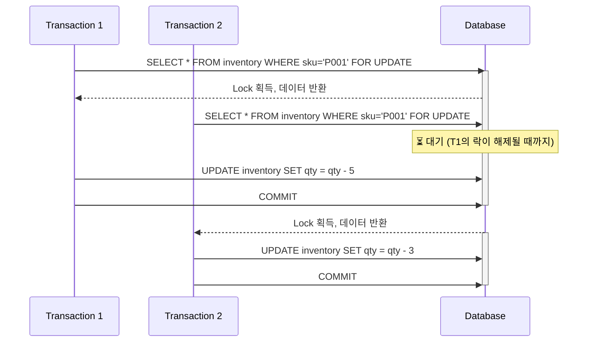
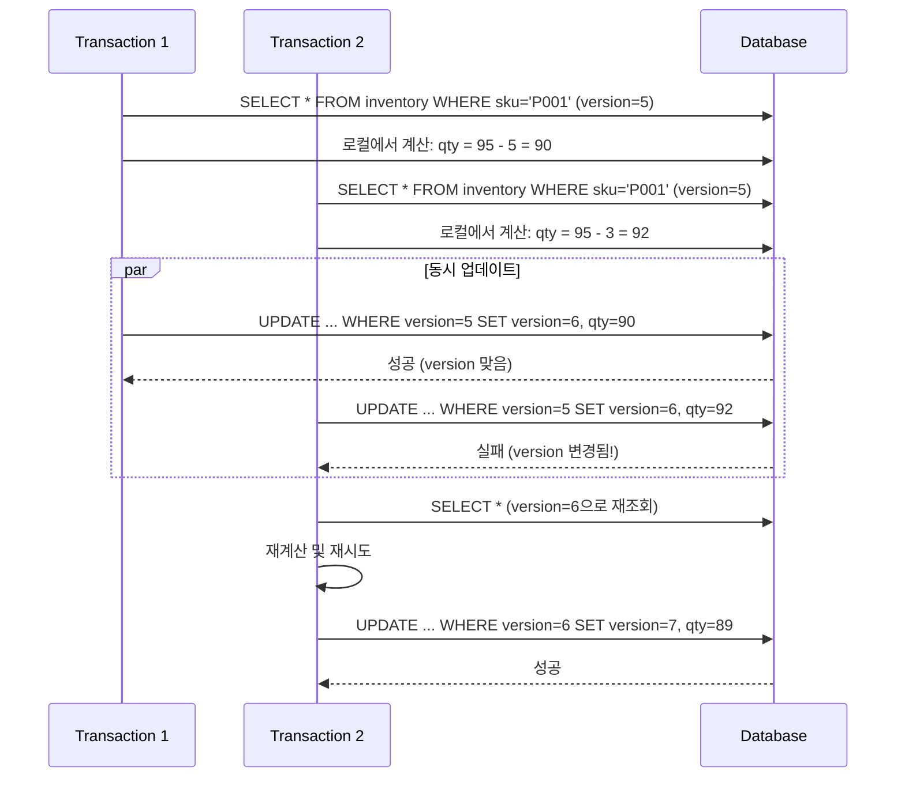
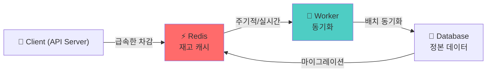
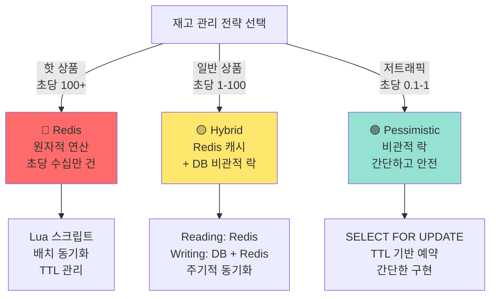

# Step 2: 재고 관리 동시성 제어 보고서

## 📋 목차

1. [Executive Summary](#executive-summary)
2. [2.1 비관적 락 방식 분석](#21-비관적-락-방식-분석)
3. [2.2 낙관적 락 방식 분석](#22-낙관적-락-방식-분석)
4. [2.3 Redis를 활용한 재고 관리](#23-redis를-활용한-재고-관리)
5. [2.4 재고 관리 전략 선택](#24-재고-관리-전략-선택)
6. [2.5 구현 계획](#25-구현-계획)

---

## Executive Summary

재고 관리는 **e-commerce 시스템의 핵심 기능**입니다. 동시성 제어 전략에 따라 성능, 안정성, 복잡도가 크게 달라집니다.

### 재고 차감 동시성 제어 전략 비교

| 전략 | 안전성 | 성능 | 복잡도 | 적용 시기 |
|------|--------|------|--------|----------|
| **비관적 락** | 🟢 100% | 🔴 낮음 | 🟢 낮음 | 일반 상품 |
| **낙관적 락** | 🟡 85% | 🟢 높음 | 🟠 중간 | 충돌 적음 |
| **Redis 캐시** | 🟢 높음 | 🟢🟢 매우 높음 | 🔴 높음 | 핫 상품 |

---

## 2.1 비관적 락 방식 분석

### 2.1.1 개념

**비관적 락(Pessimistic Lock)**: 데이터에 접근하기 전에 미리 잠금을 획득하는 방식입니다.

```sql
-- SELECT FOR UPDATE (MySQL InnoDB)
SELECT * FROM inventory WHERE sku = 'P001' FOR UPDATE;
```

### 2.1.2 동작 원리



### 2.1.3 현재 구현 상태

**파일**: `infrastructure/repositories/InventoryRepository.kt`

```kotlin
interface InventoryRepository {
    fun findBySkuForUpdate(sku: String): Inventory?  // 비관적 락 적용
    fun findBySku(sku: String): Inventory?           // 락 없음 (읽기)
    fun update(sku: String, inventory: Inventory)
}
```

**파일**: `infrastructure/persistence/repository/InventoryJpaRepository.kt`

```kotlin
interface InventoryJpaRepository : JpaRepository<InventoryJpaEntity, Long> {
    @Lock(LockModeType.PESSIMISTIC_WRITE)
    @Query("SELECT i FROM InventoryJpaEntity i WHERE i.sku = :sku")
    fun findBySkuForUpdate(@Param("sku") sku: String): InventoryJpaEntity?

    fun findBySku(sku: String): InventoryJpaEntity?
}
```

**평가**: ✅ 기본 구조는 갖춰져 있음 (개선 필요)

### 2.1.4 비관적 락의 문제점

```
문제 1: 데드락(Deadlock) 위험
┌─────────────────────────────────────┐
│ T1: Lock(SKU_A) → Lock(SKU_B) ❌    │
│                                     │
│ T2: Lock(SKU_B) → Lock(SKU_A) ❌    │
│                                     │
│ 결과: 서로 대기 (무한 대기)          │
└─────────────────────────────────────┘

문제 2: 성능 저하
- 잠금 대기로 인한 지연 증가
- 스레드 풀 고갈 가능성
- 높은 동시성에서 병목 현상

문제 3: 스케일링 어려움
- 여러 데이터베이스 복제본 사용 시 불가능
- 읽기 전용 복제본에서 쓰기 불가

장점 1: 구현 간단
- SQL 레벨에서 지원
- 추가 라이브러리 불필요

장점 2: 100% 안전성 보장
- 모든 Race Condition 방지
```

### 2.1.5 적용 시나리오

```kotlin
// ✅ 좋은 경우: 상품별 순차 처리
@Transactional
fun reserveStock(sku: String, quantity: Int): Inventory {
    val inventory = inventoryRepository.findBySkuForUpdate(sku)
        ?: throw InventoryException.InventoryNotFound()

    if (!inventory.canReserve(quantity)) {
        throw InventoryException.InsufficientStock()
    }

    inventory.reserve(quantity)
    inventoryRepository.update(sku, inventory)
    return inventory
}

// ❌ 나쁜 경우: 여러 상품 동시 처리
@Transactional
fun reserveMultipleItems(items: List<CartItem>): List<Inventory> {
    // items.forEach {
    //     inventoryRepository.findBySkuForUpdate(it.sku)  // 데드락 위험!
    // }
}
```

---

## 2.2 낙관적 락 방식 분석

### 2.2.1 개념

**낙관적 락(Optimistic Lock)**: 동시 업데이트 감지 후 재시도하는 방식입니다.

```kotlin
@Entity
data class Inventory(
    @Version
    val version: Long = 0,  // 버전 추적
    var quantity: Int
)
```

### 2.2.2 동작 원리



### 2.2.3 JPA 구현 예시

```kotlin
@Entity
data class InventoryJpaEntity(
    @Id
    val id: Long = 0,

    var sku: String = "",
    var physicalStock: Int = 0,
    var reservedStock: Int = 0,

    @Version  // ✅ 버전 관리
    val version: Long = 0,

    var lastUpdated: LocalDateTime = LocalDateTime.now()
)

// 서비스 계층
@Service
class OptimisticLockInventoryService(
    private val inventoryRepository: InventoryJpaRepository
) {
    @Transactional
    fun reserveStockOptimistic(sku: String, quantity: Int) {
        val inventory = inventoryRepository.findBySku(sku)
            ?: throw InventoryException.InventoryNotFound()

        if (inventory.physicalStock - inventory.reservedStock < quantity) {
            throw InventoryException.InsufficientStock()
        }

        inventory.reservedStock += quantity

        try {
            inventoryRepository.save(inventory)  // version 자동 증가
        } catch (e: OptimisticLockingFailureException) {
            // ⚠️ 충돌 시 재시도 필요
            throw InventoryException.StockUpdateConflict()
        }
    }
}
```

### 2.2.4 낙관적 락의 장단점

```
장점 1: 높은 성능
- 잠금 대기 시간 없음
- 동시성 향상

장점 2: 데드락 위험 없음
- 각 트랜잭션 독립 실행

장점 3: 읽기 확장 용이
- 읽기 복제본 사용 가능

단점 1: 충돌 처리 복잡
- 재시도 로직 필요
- 클라이언트 응답 지연

단점 2: 높은 경합 환경에서 성능 저하
- 재시도 증가로 인한 오버헤드

단점 3: 100% 안전성 보장 못함
- 극단적 경합에서 계속 재시도 가능
```

### 2.2.5 적용 시나리오

```kotlin
// ✅ 좋은 경우: 충돌이 드문 상품
@Transactional
fun reserveStockOptimistic(sku: String, quantity: Int) {
    val inventory = inventoryRepository.findBySku(sku)
    inventory.reservedStock += quantity
    inventoryRepository.save(inventory)  // OptimisticLockException 가능
}

// ❌ 나쁜 경우: 핫 상품 (초당 100+ 요청)
// 재시도 폭증으로 성능 급락
```

---

## 2.3 Redis를 활용한 재고 관리

### 2.3.1 개념

**Redis 기반 재고 관리**: 고속 인메모리 데이터베이스를 활용한 원자적 연산입니다.

```
특징:
- 싱글 스레드 원자성 보장
- Lua 스크립트로 복잡한 연산 지원
- 매우 높은 처리량 (초당 수십만 건)
- 데이터베이스 동기화 필요
```

### 2.3.2 아키텍처



### 2.3.3 Lua 스크립트 구현

```lua
-- Redis에서 실행 (원자적 연산)
-- KEYS[1]: stock:SKU_001
-- ARGV[1]: 요청 수량

local stock = redis.call('get', KEYS[1])
if not stock then
  return -1  -- 상품 없음
end

stock = tonumber(stock)
local requested = tonumber(ARGV[1])

if stock < requested then
  return 0  -- 재고 부족
end

redis.call('decrby', KEYS[1], requested)
return stock - requested  -- 남은 재고
```

### 2.3.4 Spring Data Redis 구현

```kotlin
@Service
class RedisInventoryService(
    private val redisTemplate: StringRedisTemplate,
    private val inventoryRepository: InventoryRepository
) {
    companion object {
        private const val STOCK_KEY_PREFIX = "inventory:stock:"
        private const val LUA_SCRIPT = """
            local stock = redis.call('get', KEYS[1])
            if not stock then
              return -1
            end
            stock = tonumber(stock)
            local requested = tonumber(ARGV[1])
            if stock < requested then
              return 0
            end
            redis.call('decrby', KEYS[1], requested)
            return stock - requested
        """
    }

    private val luaScript: RedisScript<Long> =
        DefaultRedisScript(LUA_SCRIPT, Long::class.java)

    // ✅ 원자적 재고 차감
    fun deductStockAtomic(sku: String, quantity: Int): Int {
        val result = redisTemplate.execute(
            luaScript,
            listOf("$STOCK_KEY_PREFIX$sku"),
            quantity.toString()
        ) ?: throw InventoryException.InventoryNotFound()

        return when {
            result == -1L -> throw InventoryException.InventoryNotFound()
            result == 0L -> throw InventoryException.InsufficientStock()
            else -> result.toInt()
        }
    }

    // ✅ 재고 조회 (캐시)
    fun getStockFromRedis(sku: String): Int? {
        return redisTemplate.opsForValue()
            .get("$STOCK_KEY_PREFIX$sku")?.toIntOrNull()
    }

    // ✅ DB → Redis 동기화
    fun syncInventoryFromDb(sku: String) {
        val inventory = inventoryRepository.findBySku(sku)
            ?: throw InventoryException.InventoryNotFound()

        redisTemplate.opsForValue().set(
            "$STOCK_KEY_PREFIX$sku",
            inventory.getAvailableStock().toString()
        )
    }

    // ✅ Redis → DB 배치 동기화 (스케줄러)
    @Scheduled(fixedDelay = 60_000)  // 1분마다
    fun syncInventoryToDb() {
        val inventories = inventoryRepository.findAll()
        inventories.forEach { inventory ->
            val redisStock = getStockFromRedis(inventory.sku)?.toString()
                ?: return@forEach

            // DB 업데이트
            inventory.physicalStock = redisStock.toInt()
            inventoryRepository.update(inventory.sku, inventory)
        }
    }
}
```

### 2.3.5 Redis의 장단점

```
장점 1: 극도로 높은 성능
- 초당 수십만 건 처리
- 평균 응답 시간: 1ms 이하

장점 2: 간단한 구현
- 원자적 연산 자동 보장
- Lua 스크립트로 복잡도 해결

장점 3: 확장성
- 여러 서버에서 공유 가능
- 클러스터 구성 가능

단점 1: 추가 인프라 필요
- Redis 서버 운영
- 모니터링 및 관리

단점 2: 데이터 동기화 복잡
- DB와의 일관성 유지 어려움
- 동기화 지연 시간 존재

단점 3: 메모리 기반 (휘발성)
- 서버 재시작 시 데이터 손실 위험
- RDB/AOF로 영구 저장 설정 필요

단점 4: 한계값 관리
- 최대 메모리 설정 필요
```

### 2.3.6 적용 시나리오

```kotlin
// ✅ 매우 좋은 경우: 핫 상품
// - 초당 1000건 이상 요청
// - 예: 아이폰 예약, 명품 세일

// ✅ 좋은 경우: 일반 상품
// - 초당 10-100건 요청
// - Redis + DB 하이브리드

// ❌ 나쁜 경우: 거래량 적은 상품
// - Redis 메모리 낭비
// - DB 비관적 락 충분
```

---

## 2.4 재고 관리 전략 선택

### 2.4.1 전략 선택 기준



### 2.4.2 프로젝트별 추천 전략

```
┌──────────────────────────────────────┐
│ hhplus-ecommerce 프로젝트             │
├──────────────────────────────────────┤
│                                      │
│ 📊 현재 상태                          │
│ - 일일 주문: ~10,000건               │
│ - 평균 핫 상품: 5-10개                │
│ - 서버 수: 1개                        │
│                                      │
│ 💡 추천 전략                          │
│ ├─ 핫 상품: Redis 도입               │
│ ├─ 일반 상품: Pessimistic Lock       │
│ └─ 결합: 동적 캐싱                    │
│                                      │
└──────────────────────────────────────┘
```

### 2.4.3 Step 2의 구현 범위

**본 보고서에서는 다음을 구현합니다:**

1. ✅ **비관적 락 강화**
   - 현재: `findBySkuForUpdate()` 기본 사용
   - 개선: 에러 처리, 타임아웃, 데드락 방지

2. ✅ **낙관적 락 선택지**
   - Inventory 엔티티에 `@Version` 추가
   - 재시도 로직 구현

3. ✅ **Redis 기반 재고 관리 (선택)**
   - Lua 스크립트 기반 원자적 연산
   - DB 동기화 배치 작업

---

## 2.5 구현 계획

### 2.5.1 단계별 구현

#### 단계 1: 비관적 락 개선 (즉시 적용)

```kotlin
// ✅ 목표: 현재 비관적 락 강화
// - 타임아웃 설정
// - 데드락 감지
// - 명확한 에러 메시지
```

#### 단계 2: 낙관적 락 추가 (선택적)

```kotlin
// ✅ 목표: 높은 동시성 환경 지원
// - @Version 추가
// - 재시도 로직 구현
```

#### 단계 3: Redis 캐싱 (고급)

```kotlin
// ✅ 목표: 초고속 처리
// - Lua 스크립트 기반 원자적 연산
// - 배치 동기화
// - TTL 기반 캐시 관리
```

### 2.5.2 체크포인트

- [ ] 재고 차감이 원자적으로 처리되는가?
- [ ] 음수 재고가 발생하지 않는가?
- [ ] 동시 요청 100건을 모두 정확히 처리하는가?
- [ ] 실패 시 재고가 올바르게 복원되는가?

---

## 결론

**재고 관리는 전략적 선택**입니다:

- 🟢 **일반 상품**: 비관적 락 (안전성 + 간단성)
- 🟡 **하이브리드**: Redis + DB (성능 + 안전성)
- 🔴 **핫 상품**: Redis 전용 (최고 성능)

다음 섹션에서 각 전략의 **구체적인 코드 구현**을 제시합니다.
