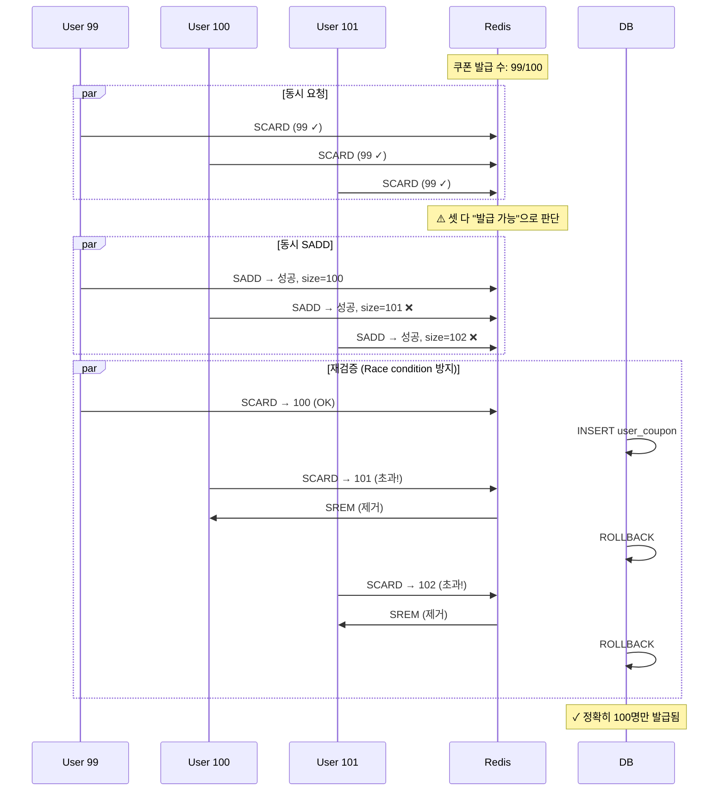
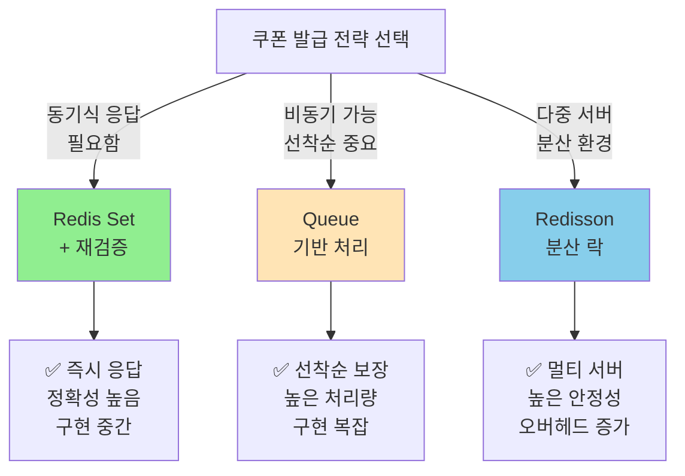

# Step 3: 선착순 쿠폰 발급 보고서

## 📋 목차

1. [Executive Summary](#executive-summary)
2. [3.1 Redis Set을 활용한 선착순 방식](#31-redis-set을-활용한-선착순-방식)
3. [3.2 Queue를 활용한 순차 처리](#32-queue를-활용한-순차-처리)
4. [3.3 분산 환경 쿠폰 발급](#33-분산-환경-쿠폰-발급)
5. [3.4 구현 전략 선택](#34-구현-전략-선택)
6. [3.5 구현 계획](#35-구현-계획)

---

## Executive Summary

선착순 쿠폰 발급은 **정확히 N개만 발급**되어야 하는 임계적 요구사항입니다.

### 선착순 쿠폰 발급 전략 비교

| 전략 | 정확성 | 성능 | 확장성 | 구현 복잡도 |
|------|--------|------|--------|----------|
| **Redis Set** | 🟢 높음 | 🟢🟢 매우 높음 | 🟢 우수 | 🟠 중간 |
| **Queue** | 🟢 높음 | 🟢 높음 | 🟢 우수 | 🟡 높음 |
| **Distributed Lock** | 🟢 높음 | 🟠 중간 | 🟢 우수 | 🔴 매우 높음 |

---

## 3.1 Redis Set을 활용한 선착순 방식

### 3.1.1 개념

**Redis Set을 이용한 선착순 발급**: 원자적 연산으로 정확성을 보장합니다.

```
핵심 아이디어:
- 쿠폰:ID:issued = Set (발급받은 사용자들)
- 쿠폰:ID:limit = 100 (제한 수량)

발급 절차:
1. Set 크기 확인 (현재 발급 수)
2. 제한 수 비교 (한계값 < 발급 수)
3. 사용자 추가 (SET.add(userId))
4. 재검증 (Race condition 재확인)
```

### 3.1.2 Redis 명령어

```bash
# 1. 초기화
SET coupon:COUPON-001:limit 100
DEL coupon:COUPON-001:issued

# 2. 사용자별 발급 확인
SCARD coupon:COUPON-001:issued  # 현재 발급 수
SISMEMBER coupon:COUPON-001:issued 12345  # 사용자 12345 발급 여부

# 3. 사용자 추가 (원자적)
SADD coupon:COUPON-001:issued 12345  # 반환: 1(성공), 0(이미 있음)

# 4. 최종 확인
SCARD coupon:COUPON-001:issued

# 5. 모든 발급자 확인
SMEMBERS coupon:COUPON-001:issued  # 모든 userId 반환
```

### 3.1.3 Race Condition 처리



### 3.1.4 Spring Data Redis 구현

```kotlin
@Service
class RedisCouponService(
    private val redisTemplate: StringRedisTemplate,
    private val couponRepository: CouponRepository
) {
    companion object {
        private const val ISSUED_KEY = "coupon:%s:issued"
        private const val LIMIT_KEY = "coupon:%s:limit"
    }

    @Transactional
    fun issueCouponWithRedisSet(couponId: Long, userId: Long): Boolean {
        val issuedKey = String.format(ISSUED_KEY, couponId)
        val limitKey = String.format(LIMIT_KEY, couponId)

        // 1️⃣ 쿠폰 정보 조회
        val coupon = couponRepository.findById(couponId)
            ?: throw CouponException.CouponNotFound()

        // 2️⃣ 한계값 확인
        val limit = redisTemplate.opsForValue().get(limitKey)?.toIntOrNull()
            ?: throw IllegalStateException("쿠폰 한계값 없음")

        // 3️⃣ 현재 발급 수 확인
        val currentCount = redisTemplate.opsForSet().size(issuedKey) ?: 0

        if (currentCount >= limit) {
            throw CouponException.CouponExhausted()
        }

        // 4️⃣ 사용자 추가 (원자적, 중복 방지)
        val added = redisTemplate.opsForSet().add(issuedKey, userId.toString())
        if (added == 0L) {
            throw CouponException.AlreadyIssuedCoupon()
        }

        // 5️⃣ 재검증 (Race condition 최종 확인)
        val finalCount = redisTemplate.opsForSet().size(issuedKey) ?: 0
        if (finalCount > limit) {
            // 초과 발급된 경우 롤백
            redisTemplate.opsForSet().remove(issuedKey, userId.toString())
            throw CouponException.CouponExhausted()
        }

        // 6️⃣ DB 저장
        val userCoupon = UserCoupon(couponId, userId)
        couponRepository.saveUserCoupon(userCoupon)

        return true
    }

    fun initializeCouponLimit(couponId: Long, limit: Int) {
        val limitKey = String.format(LIMIT_KEY, couponId)
        redisTemplate.opsForValue().set(limitKey, limit.toString())
    }
}
```

### 3.1.5 Redis Set의 장단점

```
장점:
✅ 원자적 연산 (SADD)
✅ 중복 방지 자동 (Set 특성)
✅ 매우 높은 성능 (O(1) 조회)
✅ 간단한 구현

단점:
❌ Redis 의존성
❌ 메모리 사용량 증가 (모든 userId 저장)
❌ 데이터베이스와 동기화 필요
❌ 만료 정책 수동 관리
```

---

## 3.2 Queue를 활용한 순차 처리

### 3.2.1 개념

**요청 큐를 통한 순차 처리**: 선착순을 보장하기 위해 요청 순서대로 처리합니다.

```
아키텍처:
┌──────────┐
│ User 100 │
├──────────┤
│ User 101 │  ──┐
├──────────┤    │
│ User 102 │  ──┼──► Redis Queue ──► Worker ──► Issue Coupon
├──────────┤    │
│ User 103 │  ──┘
└──────────┘

특징:
- 사용자 요청 → Redis List에 추가 (O(1))
- Worker가 한 건씩 처리
- 정확히 100개만 발급 보장
- 선착순 순서 유지
```

### 3.2.2 동작 흐름

```mermaid
sequenceDiagram
    participant User
    participant API
    participant Queue as Redis Queue
    participant Worker
    participant DB

    User->>API: 쿠폰 발급 요청
    API->>Queue: LPUSH queue:coupon:123 {userId, timestamp}
    Queue-->>API: 요청 접수 (즉시 반환)
    API-->>User: "요청이 접수되었습니다"

    Note over Worker: 비동기 처리 시작
    Worker->>Queue: RPOP queue:coupon:123
    Queue-->>Worker: 첫 번째 요청

    loop 100번 또는 큐 빌 때까지
        Worker->>DB: 쿠폰 발급 수 확인
        alt 발급 수 < 100
            Worker->>DB: INSERT user_coupon
            Note over Worker: ✓ 발급
        else 발급 수 >= 100
            Note over Worker: ✗ 소진
            break
        end
        Worker->>Queue: RPOP queue:coupon:123
    end

    Worker-->>Queue: 처리 완료
```

### 3.2.3 구현 예시

```kotlin
@Service
class QueueBasedCouponService(
    private val redisTemplate: StringRedisTemplate,
    private val couponRepository: CouponRepository,
    private val coroutineScope: CoroutineScope
) {
    companion object {
        private const val QUEUE_KEY = "coupon:%s:queue"
        private const val LIMIT_KEY = "coupon:%s:limit"
    }

    // 1️⃣ 요청 큐에 추가 (즉시 반환)
    fun requestCoupon(couponId: Long, userId: Long): Map<String, String> {
        val queueKey = String.format(QUEUE_KEY, couponId)

        val request = mapOf(
            "userId" to userId.toString(),
            "timestamp" to System.currentTimeMillis().toString()
        )

        // Redis List에 추가 (O(1))
        redisTemplate.opsForList().leftPush(
            queueKey,
            request.toString()
        )

        // 비동기 처리 트리거
        coroutineScope.launch {
            processCouponRequests(couponId)
        }

        return mapOf("message" to "쿠폰 발급 요청 접수됨")
    }

    // 2️⃣ 비동기 처리 (Worker)
    private suspend fun processCouponRequests(couponId: Long) {
        val queueKey = String.format(QUEUE_KEY, couponId)
        val limitKey = String.format(LIMIT_KEY, couponId)

        val limit = redisTemplate.opsForValue().get(limitKey)?.toIntOrNull()
            ?: return

        var issued = 0

        while (issued < limit) {
            // 한 건씩 처리
            val request = redisTemplate.opsForList().rightPop(queueKey)
                ?: break  // 큐가 비었으면 종료

            try {
                // 요청 파싱
                val userId = request.extractUserId()

                // DB 중복 확인
                val exists = couponRepository.findUserCoupon(userId, couponId) != null
                if (exists) {
                    continue  // 이미 발급받은 사용자는 스킵
                }

                // 발급 수량 재확인
                val currentIssued = couponRepository.countIssuedCoupons(couponId)
                if (currentIssued >= limit) {
                    break  // 한계 도달
                }

                // 발급 처리
                val userCoupon = UserCoupon(couponId, userId)
                couponRepository.saveUserCoupon(userCoupon)
                issued++

            } catch (e: Exception) {
                logger.error("쿠폰 발급 실패: $request", e)
            }
        }
    }

    fun initializeCouponQueue(couponId: Long, limit: Int) {
        val limitKey = String.format(LIMIT_KEY, couponId)
        redisTemplate.opsForValue().set(limitKey, limit.toString())
    }
}

private fun String.extractUserId(): Long {
    // userId= 파싱
    val match = Regex("userId=(\\d+)").find(this)
    return match?.groupValues?.get(1)?.toLong()
        ?: throw IllegalArgumentException("Invalid request format")
}
```

### 3.2.4 Queue 방식의 장단점

```
장점:
✅ 정확한 선착순 보장
✅ 사용자에게 즉시 응답 (비동기)
✅ 높은 처리량
✅ 메모리 효율 (처리 후 제거)

단점:
❌ 비동기 처리로 인한 지연 (결과 확인 어려움)
❌ Worker 프로세스 관리 필요
❌ 실패 처리 복잡
❌ 중복 처리 방지 로직 필요
```

---

## 3.3 분산 환경 쿠폰 발급

### 3.3.1 개념

**분산 락을 활용한 멀티 서버 환경 지원**: Redisson을 사용한 분산 락입니다.

```
문제점:
- 단일 서버: Synchronized 충분
- 다중 서버: Synchronized 작동 안 함
- 해결책: Redis 기반 분산 락 (Redisson)
```

### 3.3.2 Redisson 구현

```kotlin
@Service
class DistributedCouponService(
    private val redissonClient: RedissonClient,
    private val couponRepository: CouponRepository
) {
    companion object {
        private const val LOCK_KEY = "lock:coupon:%s"
        private const val ISSUED_KEY = "coupon:%s:issued"
        private const val REMAINING_KEY = "coupon:%s:remaining"
    }

    @Transactional
    fun issueCouponWithDistributedLock(
        couponId: Long,
        userId: Long
    ): CouponResult {
        val lockKey = String.format(LOCK_KEY, couponId)
        val rlock = redissonClient.getLock(lockKey)

        try {
            // 분산 락 획득 (대기 시간: 1초, 락 유지: 1초)
            if (!rlock.tryLock(1, 1, TimeUnit.SECONDS)) {
                throw IllegalStateException("락 획득 실패")
            }

            // ===== Critical Section =====

            // 1️⃣ 잔여 수량 확인
            val remainingKey = String.format(REMAINING_KEY, couponId)
            val remaining = redisTemplate.opsForValue()
                .get(remainingKey)?.toIntOrNull() ?: 0

            if (remaining <= 0) {
                throw CouponException.CouponExhausted()
            }

            // 2️⃣ 중복 발급 확인
            val issuedKey = String.format(ISSUED_KEY, couponId)
            val alreadyIssued = redisTemplate.opsForSet()
                .isMember(issuedKey, userId.toString()) ?: false

            if (alreadyIssued) {
                throw CouponException.AlreadyIssuedCoupon()
            }

            // 3️⃣ 발급 처리
            redisTemplate.opsForValue().decrement(remainingKey)
            redisTemplate.opsForSet().add(issuedKey, userId.toString())

            // 4️⃣ DB 저장
            val userCoupon = UserCoupon(couponId, userId)
            couponRepository.saveUserCoupon(userCoupon)

            // ===== End Critical Section =====

            return CouponResult(userId, couponId, Instant.now())

        } catch (e: InterruptedException) {
            Thread.currentThread().interrupt()
            throw RuntimeException("쿠폰 발급 중 중단됨", e)
        } finally {
            if (rlock.isHeldByCurrentThread) {
                rlock.unlock()
            }
        }
    }
}
```

### 3.3.3 분산 락의 장단점

```
장점:
✅ 다중 서버 지원
✅ 높은 정확성
✅ Redisson의 다양한 기능 활용 가능

단점:
❌ Redis 의존성 증가
❌ 네트워크 지연 가능성
❌ 데드락 위험
❌ 구현 복잡도 높음
```

---

## 3.4 구현 전략 선택

### 3.4.1 선택 기준



### 3.4.2 프로젝트 추천 전략

```
현재 hhplus-ecommerce 상황:
- 서버 수: 1개 (다중 배포 가능)
- 이벤트 빈도: 월 2-3회
- 동시 사용자: 최대 수천 명

추천: Redis Set + 재검증
이유:
1. 즉시 응답 가능 (UX 향상)
2. 구현 복잡도 중간 수준
3. 정확성 높음 (재검증)
4. 나중에 분산 락으로 업그레이드 가능

선택지:
┌──────────────────────────────────────┐
│ Phase 1: Redis Set (현재)            │
│ - 단일 서버                          │
│ - synchronized 블록 강화              │
│                                      │
│ Phase 2: Redis Set + 재검증 추가    │
│ - 멀티 서버 준비                     │
│                                      │
│ Phase 3: Redisson 분산 락 (선택)    │
│ - 다중 서버 운영 시                  │
└──────────────────────────────────────┘
```

---

## 3.5 구현 계획

### 3.5.1 단계별 구현

#### 단계 1: Redis Set 기반 선착순 (즉시)

```kotlin
// ✅ 목표: 현재 synchronized 블록 → Redis 기반 원자적 연산
```

#### 단계 2: 재검증 로직 추가

```kotlin
// ✅ 목표: Race condition 최종 검증
```

#### 단계 3: Queue 기반 (선택)

```kotlin
// ✅ 목표: 비동기 처리로 고부하 대응
```

### 3.5.2 체크포인트

- [ ] 정확히 N개만 발급되는가?
- [ ] 중복 발급이 방지되는가?
- [ ] 발급 순서가 보장되는가?
- [ ] 멀티 서버 환경에서도 작동하는가?

---

## 결론

**선착순 쿠폰 발급 전략**:

1. 🟢 **Phase 1 (현재)**: Redis Set + Synchronized
2. 🟡 **Phase 2**: Redis Set + 재검증 (권장)
3. 🔴 **Phase 3**: Redisson 분산 락 (다중 서버)

다음 섹션에서 **구체적인 코드 구현**을 제시합니다.
