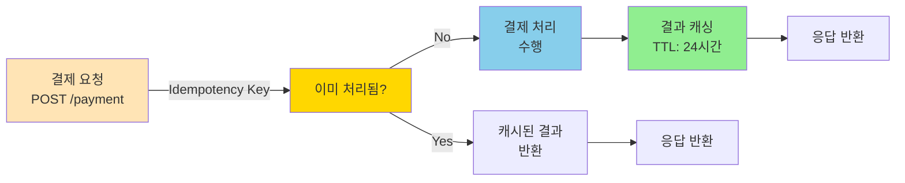
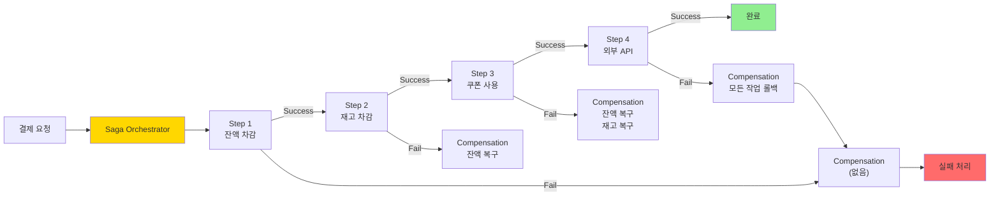
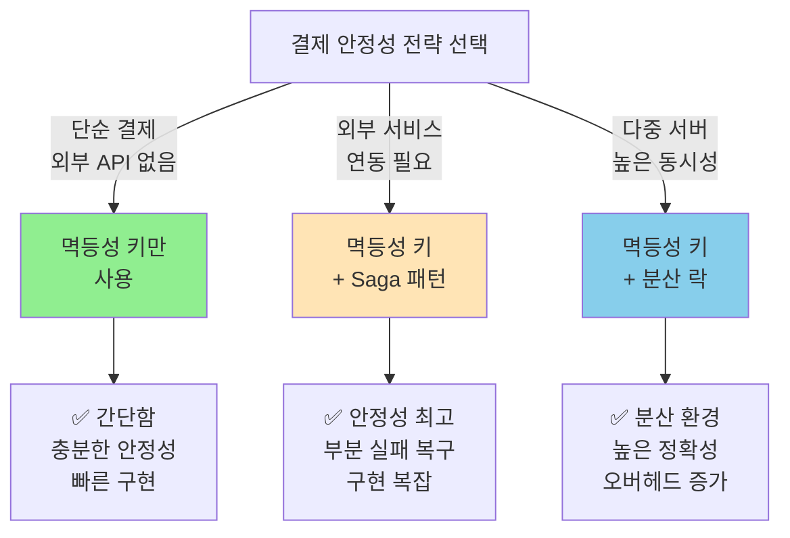

# Step 4: 결제 프로세스 동시성 & 멱등성 보고서

## 📋 목차

1. [Executive Summary](#executive-summary)
2. [4.1 결제 멱등성 개념](#41-결제-멱등성-개념)
3. [4.2 멱등성 키 기반 구현](#42-멱등성-키-기반-구현)
4. [4.3 Saga 패턴으로 분산 트랜잭션](#43-saga-패턴으로-분산-트랜잭션)
5. [4.4 구현 전략 선택](#44-구현-전략-선택)
6. [4.5 구현 계획](#45-구현-계획)

---

## Executive Summary

결제는 **금전 거래**가 발생하는 가장 중요한 프로세스입니다.

### 결제 안정성 요구사항

```
핵심 원칙 (금융 산업 표준):
1. 멱등성(Idempotency): 중복 요청 시 한 번만 처리
2. 원자성(Atomicity): 모두 성공 또는 모두 실패
3. 추적성(Traceability): 모든 거래 기록
4. 감사(Audit): 사후 검증 가능
```

### 결제 동시성 전략 비교

| 전략 | 멱등성 | 안전성 | 성능 | 확장성 | 복잡도 |
|------|--------|--------|------|--------|--------|
| **Idempotency Key** | 🟢 높음 | 🟢 높음 | 🟢 높음 | 🟠 중간 | 🟢 낮음 |
| **Distributed Lock** | 🟢 높음 | 🟢🟢 매우 높음 | 🟠 중간 | 🟢 우수 | 🟠 중간 |
| **Saga Pattern** | 🟢 높음 | 🟡 중간 | 🟢 높음 | 🟢 우수 | 🔴 높음 |

---

## 4.1 결제 멱등성 개념

### 4.1.1 멱등성(Idempotency)이란?

```
수학 정의:
f(f(x)) = f(x)

실생활 예시:
- 전등 버튼: 누른다 → 켜짐 / 다시 누른다 → 켜짐 (변화 없음)
- 결제: 결제한다 → PAID / 다시 결제한다 → PAID (중복 차감 없음)
```

### 4.1.2 문제: 결제 중복

```
시나리오: 네트워크 타임아웃

T1: POST /orders/O1/payment
    ├─ 잔액 확인: 100,000
    ├─ 잔액 차감: 100,000 - 50,000 = 50,000
    ├─ 결제 게이트웨이 호출: ...
    └─ (네트워크 타임아웃 - 응답 못 받음)

사용자: "결제가 실패한 것 같은데... 다시 시도해야 하나?"

T2: 재시도 (같은 요청)
    ├─ 잔액 확인: 50,000 ✓ (이전 차감 반영)
    ├─ 잔액 차감: 50,000 - 50,000 = 0  ❌ 중복 차감!
    └─ 결제 처리

최종 결과:
- 사용자 잔액: 0 (50,000원 중복 차감)
- 주문: PAID (1건)
- 시스템: 데이터 불일치
```

### 4.1.3 멱등성 보장 전략



---

## 4.2 멱등성 키 기반 구현

### 4.2.1 개념

**멱등성 키(Idempotency Key)**: 동일한 요청을 식별하는 고유 키입니다.

```
표준: RFC 7231 (HTTP Semantics)

요청:
POST /api/v1/orders/O1/payment
Idempotency-Key: "550e8400-e29b-41d4-a716-446655440000"

이점:
- 클라이언트가 요청 고유성 보장
- 재시도 안전 (멱등성 보장)
- 네트워크 신뢰성 문제 해결
```

### 4.2.2 멱등성 키 생성 방식

```kotlin
// 방식 1: 클라이언트 생성 (권장)
// 클라이언트가 UUID 생성 후 전송
// 장점: 클라이언트 제어, 중복 감지
POST /payment
Idempotency-Key: ${UUID}

// 방식 2: 서버 생성
// 서버가 orderId + userId 기반으로 생성
// 장점: 간단함, 자동 생성
idempotencyKey = hash(orderId + userId)

// 방식 3: 요청 내용 기반
// 요청 바디 해시
idempotencyKey = hash(requestBody)
```

### 4.2.3 구현 예시

```kotlin
// 1️⃣ 요청 DTO (클라이언트 → 서버)
data class PaymentRequest(
    val orderId: String,
    val idempotencyKey: String  // UUID 형식
)

// 2️⃣ 데이터베이스 저장 (멱등성 키 추적)
@Entity
@Table(name = "payments")
data class PaymentJpaEntity(
    @Id
    val id: Long = 0,

    val orderId: String,
    val userId: String,
    val amount: Int,

    @Column(unique = true, nullable = false)
    val idempotencyKey: String,  // ✅ 유니크 제약

    @Enumerated(EnumType.STRING)
    var status: PaymentStatus = PaymentStatus.PENDING,

    var approvedAt: LocalDateTime? = null,
    val createdAt: LocalDateTime = LocalDateTime.now()
)

enum class PaymentStatus {
    PENDING,    // 결제 대기
    APPROVED,   // 승인됨
    FAILED,     // 실패
    REFUNDED    // 환불됨
}

// 3️⃣ 서비스 계층
@Service
class PaymentService(
    private val paymentRepository: PaymentRepository,
    private val userRepository: UserRepository,
    private val inventoryService: InventoryService,
    private val redisTemplate: StringRedisTemplate
) {
    @Transactional
    fun processPaymentWithIdempotency(
        orderId: String,
        userId: String,
        amount: Int,
        idempotencyKey: String
    ): PaymentResult {
        // 1️⃣ 멱등성 키 확인 (이미 처리되었는가?)
        val cachedResult = getCachedPaymentResult(idempotencyKey)
        if (cachedResult != null) {
            return cachedResult  // 캐시된 결과 반환 (중복 차단)
        }

        // 2️⃣ DB에서 확인 (더블 체크)
        val existingPayment = paymentRepository.findByIdempotencyKey(idempotencyKey)
        if (existingPayment != null) {
            return PaymentResult(existingPayment)
        }

        // 3️⃣ 결제 처리 (트랜잭션 내)
        return try {
            val user = userRepository.findById(userId)
                ?: throw UserException.UserNotFound()

            // 잔액 확인
            if (user.balance < amount) {
                throw UserException.InsufficientBalance()
            }

            // 잔액 차감 (원자적)
            user.balance -= amount
            userRepository.save(user)

            // 결제 기록 생성
            val payment = PaymentJpaEntity(
                orderId = orderId,
                userId = userId,
                amount = amount,
                idempotencyKey = idempotencyKey,
                status = PaymentStatus.APPROVED,
                approvedAt = LocalDateTime.now()
            )

            paymentRepository.save(payment)

            // 결과 캐싱 (24시간)
            cachePaymentResult(idempotencyKey, payment)

            PaymentResult(payment)

        } catch (e: Exception) {
            // 결제 실패 기록
            val payment = PaymentJpaEntity(
                orderId = orderId,
                userId = userId,
                amount = amount,
                idempotencyKey = idempotencyKey,
                status = PaymentStatus.FAILED
            )
            paymentRepository.save(payment)

            throw e
        }
    }

    // 캐시에서 조회
    private fun getCachedPaymentResult(idempotencyKey: String): PaymentResult? {
        val cached = redisTemplate.opsForValue()
            .get("payment:$idempotencyKey")
        return cached?.let { json -> Json.decodeFromString(it) }
    }

    // 결과 캐싱
    private fun cachePaymentResult(idempotencyKey: String, payment: PaymentJpaEntity) {
        redisTemplate.opsForValue().set(
            "payment:$idempotencyKey",
            Json.encodeToString(PaymentResult(payment)),
            Duration.ofHours(24)
        )
    }
}

// 4️⃣ 컨트롤러
@RestController
@RequestMapping("/api/v1/orders")
class OrderController(
    private val paymentService: PaymentService
) {
    @PostMapping("/{orderId}/payment")
    fun processPayment(
        @PathVariable orderId: String,
        @RequestHeader("Idempotency-Key") idempotencyKey: String,
        @RequestBody request: PaymentRequest
    ): PaymentResult {
        return paymentService.processPaymentWithIdempotency(
            orderId,
            getCurrentUserId(),  // 현재 사용자 ID
            request.amount,
            idempotencyKey
        )
    }
}
```

### 4.2.4 멱등성 키의 장단점

```
장점:
✅ 간단한 구현 (유니크 제약만으로)
✅ 네트워크 신뢰성 향상
✅ 중복 결제 100% 방지
✅ 캐시로 빠른 응답
✅ 대부분의 결제 게이트웨이 지원

단점:
❌ 클라이언트 협력 필요 (올바른 키 생성)
❌ 키 생성 실패 시 멱등성 미보장
❌ 캐시 관리 필요
❌ 24시간 TTL 설정 필요
```

### 4.2.5 Best Practices

```kotlin
// ✅ 좋은 예: 올바른 구현
POST /payment
Idempotency-Key: "550e8400-e29b-41d4-a716-446655440000"
{
    "orderId": "O1",
    "amount": 50000
}

// ❌ 나쁜 예: 키 중복 생성
// 같은 요청인데 다른 키 생성
Idempotency-Key: "550e8400-..." (첫 번째 요청)
Idempotency-Key: "660f8400-..." (재시도, 다른 키) → 중복 결제!

// ✅ 클라이언트 구현 (권장)
class PaymentClient {
    private val idempotencyKey = UUID.randomUUID().toString()

    fun payOrder(orderId: String) {
        // 재시도해도 같은 키 사용
        post("/payment", idempotencyKey = idempotencyKey)
        // 재시도 1
        post("/payment", idempotencyKey = idempotencyKey)
        // 재시도 2
        post("/payment", idempotencyKey = idempotencyKey)
        // ✓ 모두 같은 결과 반환
    }
}
```

---

## 4.3 Saga 패턴으로 분산 트랜잭션

### 4.3.1 문제: 부분 실패

```
결제 프로세스:

1. 잔액 차감 ✓
2. 재고 차감 ✓
3. 쿠폰 사용 ✓
4. 외부 API 호출 ❌ (실패!)
5. 주문 상태 업데이트 ✓

결과:
- DB: 잔액 차감, 재고 차감, 쿠폰 사용됨
- 외부 시스템: 결제 정보 전송 안 됨
- 고객: "결제 실패" 메시지 받음

🔴 데이터 불일치!
```

### 4.3.2 Saga 패턴 개념

**Saga**: 분산 트랜잭션을 관리하는 패턴입니다.

```
특징:
- 마이크로서비스 간의 장기 실행 트랜잭션 조율
- 실패 시 보상 트랜잭션(Compensation) 실행
- 2가지 종류: Orchestration, Choreography
```

### 4.3.3 Orchestration Saga (권장)



### 4.3.4 구현 예시

```kotlin
// Step 1: 각 단계의 인터페이스
interface SagaStep {
    suspend fun execute(): Result<Boolean>
    suspend fun compensate(): Result<Boolean>
}

// Step 2: 구체적인 단계 구현
class DeductBalanceStep(
    private val userRepository: UserRepository
) : SagaStep {
    override suspend fun execute(): Result<Boolean> {
        val user = userRepository.findById(userId)
        user.balance -= amount
        userRepository.save(user)
        return Result.success(true)
    }

    override suspend fun compensate(): Result<Boolean> {
        val user = userRepository.findById(userId)
        user.balance += amount  // 복구
        userRepository.save(user)
        return Result.success(true)
    }
}

// Step 3: Saga Orchestrator
@Service
class PaymentSaga(
    private val userRepository: UserRepository,
    private val inventoryService: InventoryService,
    private val couponService: CouponService,
    private val dataTransmissionService: DataTransmissionService
) {
    @Transactional
    suspend fun executeOrderPayment(orderData: OrderData): SagaResult {
        val steps = mutableListOf<SagaStep>()

        return try {
            // Step 1: 잔액 차감
            val deductBalance = DeductBalanceStep(
                userRepository,
                orderData.userId,
                orderData.amount
            )
            deductBalance.execute().getOrThrow()
            steps.add(deductBalance)

            // Step 2: 재고 차감
            val deductInventory = DeductInventoryStep(
                inventoryService,
                orderData.items
            )
            deductInventory.execute().getOrThrow()
            steps.add(deductInventory)

            // Step 3: 쿠폰 사용
            if (orderData.couponId != null) {
                val useCoupon = UseCouponStep(
                    couponService,
                    orderData.userId,
                    orderData.couponId
                )
                useCoupon.execute().getOrThrow()
                steps.add(useCoupon)
            }

            // Step 4: 외부 데이터 전송
            val transmitData = TransmitDataStep(
                dataTransmissionService,
                orderData
            )
            transmitData.execute().getOrThrow()
            steps.add(transmitData)

            SagaResult.Success(orderData.orderId)

        } catch (e: Exception) {
            // 보상 트랜잭션 (역순)
            steps.reversed().forEach { step ->
                try {
                    step.compensate()
                } catch (ex: Exception) {
                    logger.error("보상 실패: ${step::class.simpleName}", ex)
                }
            }

            SagaResult.Failure(e.message ?: "Unknown error")
        }
    }
}

sealed class SagaResult {
    data class Success(val orderId: String) : SagaResult()
    data class Failure(val reason: String) : SagaResult()
}
```

### 4.3.5 Saga 패턴의 장단점

```
장점:
✅ 부분 실패 처리 가능
✅ 보상 트랜잭션으로 데이터 일관성 복구
✅ 롱 러닝 트랜잭션 지원
✅ 각 단계별 독립 처리

단점:
❌ 구현 복잡도 높음
❌ 디버깅 어려움
❌ 보상 트랜잭션도 실패할 수 있음
❌ 순환 의존성 위험
```

---

## 4.4 구현 전략 선택

### 4.4.1 선택 기준



### 4.4.2 프로젝트 추천 전략

```
현재 hhplus-ecommerce 상황:
- 외부 API 호출: DataTransmissionService (이미 있음)
- 트랜잭션 범위: 잔액 - 재고 - 쿠폰 - 외부 API
- 서버 수: 1개 (다중 배포 가능)

추천 레벨:

┌─────────────────────────────────────┐
│ Level 1 (필수): 멱등성 키            │
│ - 중복 결제 방지                    │
│ - Redis 캐싱                        │
│ - 구현 시간: 2-3시간                │
│                                     │
│ Level 2 (권장): Saga 패턴 추가      │
│ - 부분 실패 대응                    │
│ - 보상 트랜잭션                     │
│ - 구현 시간: 4-5시간                │
│                                     │
│ Level 3 (선택): 분산 락             │
│ - 다중 서버 지원                    │
│ - Redisson 적용                     │
│ - 구현 시간: 1-2시간 (추가)        │
└─────────────────────────────────────┘

권장 순서:
1. 멱등성 키 구현 (우선순위: 높음)
2. Saga 패턴 추가 (우선순위: 중간)
3. 분산 락 (우선순위: 낮음, 필요 시)
```

---

## 4.5 구현 계획

### 4.5.1 단계별 구현

#### 단계 1: 멱등성 키 기반 결제 (즉시)

```kotlin
// ✅ 목표: 중복 결제 방지
// - 유니크 제약 추가
// - Redis 캐싱
// - 더블 체크
```

#### 단계 2: 보상 트랜잭션 (권장)

```kotlin
// ✅ 목표: 부분 실패 대응
// - Saga 패턴 구현
// - 각 단계의 rollback 로직
```

#### 단계 3: 분산 락 (선택)

```kotlin
// ✅ 목표: 다중 서버 지원
// - Redisson 도입
// - 락 타임아웃 설정
```

### 4.5.2 체크포인트

- [ ] 중복 결제가 방지되는가?
- [ ] 실패 시 롤백이 완전한가?
- [ ] 부분 실패를 처리하는가?
- [ ] 모든 거래가 기록되는가?
- [ ] 감시 및 모니터링이 가능한가?

---

## 결론

**결제 안정성 계층**:

1. 🟢 **멱등성 키**: 중복 차단 (필수)
2. 🟡 **Saga 패턴**: 부분 실패 대응 (권장)
3. 🔴 **분산 락**: 다중 서버 지원 (선택)

다음 섹션에서 **구체적인 코드 구현**을 제시합니다.