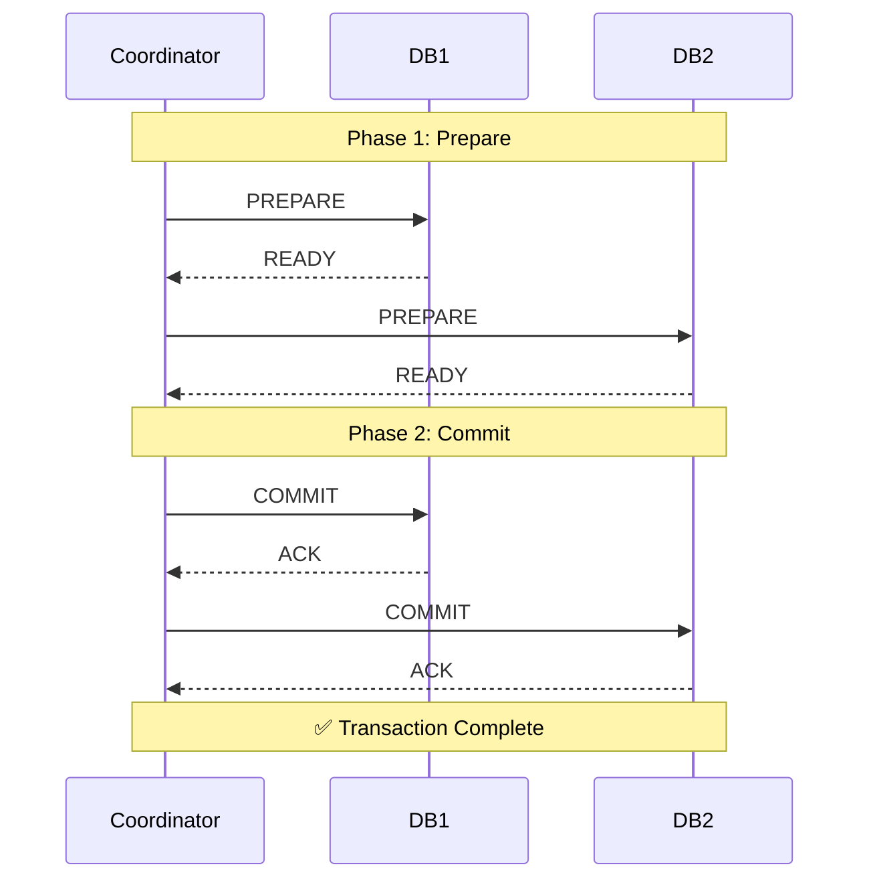
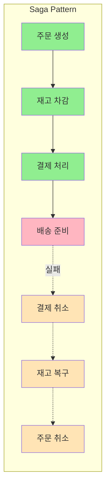

# 분산 트랜잭션 관리

**분산 트랜잭션의 필요성**

마이크로서비스 환경에서 **여러 데이터베이스에 걸친 트랜잭션**을 관리해야 하는 경우가 발생합니다.

### 2PC (Two-Phase Commit)



### Saga 패턴



### **분산 트랜잭션 패턴 비교**

| **패턴** | **일관성** | **가용성** | **복잡도** | **사용 사례** |
| --- | --- | --- | --- | --- |
| **2PC** | 강함 | 낮음 | 높음 | 금융 거래 |
| **Saga** | 최종 일관성 | 높음 | 중간 | 이커머스 |
| **Event Sourcing** | 최종 일관성 | 높음 | 높음 | 감사 추적 필요 |
| **TCC** | 강함 | 중간 | 매우 높음 | 예약 시스템 |

제공해주신 분산 트랜잭션 요약본은 핵심 패턴인 \*\*2PC(Two-Phase Commit)\*\*와 **Saga 패턴**의 구조를 아주 명확하게 시각화했습니다.

시니어 개발자로서, 의류 이커머스 서비스를 Kotlin + Spring Boot로 개발 중이시라면 \*\*"무엇을 쓸 것인가?"\*\*에 대한 답은 거의 정해져 있습니다. 바로 **Saga 패턴**입니다.

2PC는 데이터 무결성은 완벽하지만, 마이크로서비스 환경에서는 성능 병목과 장애 전파(Cascading Failure)의 주원인이 되기 때문에 잘 쓰지 않습니다. 실무적인 관점에서 **Saga 패턴의 구현 전략**과 **반드시 고려해야 할 3가지 난제**를 보충해 드리겠습니다.

-----

## 🚀 1. Saga 패턴 구현 전략: 코레오그래피 vs 오케스트레이션

Saga 패턴을 구현하는 방식은 크게 두 가지가 있습니다. 우리 서비스의 복잡도에 따라 선택해야 합니다.

### A. 코레오그래피 (Choreography) - "이벤트 기반의 릴레이"

중앙 관리자 없이, 각 서비스가 이벤트를 주고받으며 스스로 판단하는 방식입니다.

* **동작:** `주문 서비스`가 "주문 생성됨" 이벤트를 발행 -\> `재고 서비스`가 이를 구독하여 재고 차감 -\> "재고 차감됨" 이벤트 발행 -\> `결제 서비스`가 구독...
* **장점:** 구현이 간단하고 서비스 간 결합도가 낮습니다.
* **단점:** 프로세스가 길어지면 "누가 어떤 순서로 동작하는지" 파악하기 힘들어집니다(사이클 발생 위험).
* **추천:** 서비스가 2\~3개로 적을 때.

### B. 오케스트레이션 (Orchestration) - "지휘자 방식"

중앙의 \*\*Orchestrator(주로 주문 서비스)\*\*가 모든 흐름을 통제합니다.

* **동작:** `주문 서비스`가 `재고 서비스`에 "재고 줄여" 요청 -\> 응답 오면 -\> `결제 서비스`에 "결제해" 요청.
* **장점:** 비즈니스 흐름이 한곳에 보여 관리가 쉽고 로직 추적이 명확합니다.
* **단점:** 오케스트레이터 서비스에 로직이 집중됩니다.
* **추천:** **이커머스 주문 로직처럼 복잡한 흐름일 때 (강력 추천).**

-----

## 💻 2. 실전 구현 예제 (Spring Boot + Kafka)

이커머스에서 가장 많이 쓰는 **Saga 오케스트레이션**의 느낌을 Kotlin 코드로 보여드릴게요.

여기서 핵심은 **보상 트랜잭션(Compensating Transaction)** 입니다. `ROLLBACK` 명령어가 없으므로, \*\*"반대 행동을 하는 로직"\*\*을 직접 짜야 합니다.

```kotlin
// OrderSagaOrchestrator.kt

@Service
class OrderSagaOrchestrator(
    private val inventoryClient: InventoryClient, // FeignClient or Kafka Producer
    private val paymentClient: PaymentClient,
    private val orderRepository: OrderRepository
) {

    fun processOrder(orderId: Long) {
        val order = orderRepository.findById(orderId).get()

        try {
            // 1. 재고 차감 요청
            inventoryClient.decreaseStock(order.productId, order.quantity)
            
            // 2. 결제 시도
            paymentClient.processPayment(order.userId, order.totalAmount)
            
            // 3. 주문 완료 처리
            order.status = OrderStatus.COMPLETED
            orderRepository.save(order)

        } catch (e: Exception) {
            // 🚨 예외 발생! 보상 트랜잭션(롤백) 시작
            logger.error("주문 처리 실패, 보상 트랜잭션 시작: $orderId", e)
            compensateOrder(order, e)
        }
    }

    private fun compensateOrder(order: Order, e: Exception) {
        // 결제까지 갔다가 실패했다면 결제 취소
        if (e is PaymentFailedException) {
             // 재고는 이미 차감되었으므로 다시 복구해야 함
             inventoryClient.increaseStock(order.productId, order.quantity)
        }
        
        // 재고 차감 자체에서 실패했다면 복구할 필요 없음
        
        // 최종적으로 주문 실패 처리
        order.status = OrderStatus.FAILED
        orderRepository.save(order)
    }
}
```

-----

## ⚠️ 3. 분산 트랜잭션의 3가지 숨겨진 난제

Saga 패턴 그림만 보면 쉬워 보이지만, 실무에서는 다음 3가지 문제로 고통받습니다. 이 부분을 미리 대비해야 "시니어" 소리를 듣습니다.

### ① 멱등성 (Idempotency) 보장

네트워크 통신은 불안정해서, `재고 차감` 메시지가 **두 번 도착**할 수 있습니다.

* **문제:** 재고 1개를 줄여야 하는데, 메시지 중복으로 2개가 줄어듦.
* **해결:** 모든 요청에 고유한 `transaction_id`나 `message_id`를 포함하고, 받는 쪽(재고 서비스)에서 "이미 처리한 ID인지" 확인해야 합니다. Redis 등을 이용해 처리된 ID를 저장해 두는 것이 일반적입니다.

### ② 트랜잭셔널 아웃박스 패턴 (Transactional Outbox)

DB 업데이트와 메시지 발송은 원자적(Atomic)이어야 합니다.

* **문제:** 주문 DB에는 `INSERT` 했는데, 카프카로 메시지 보내기 직전에 **서버가 죽는다면?** -\> 주문은 생성됐는데 결제/재고 로직은 실행되지 않는 **데이터 불일치** 발생.
* **해결:**
    1.  주문 DB에 `outbox`라는 테이블을 만듭니다.
    2.  주문 데이터와 "발송할 메시지"를 **한 트랜잭션**으로 DB에 저장합니다.
    3.  별도의 스케줄러나 Debezium(CDC)이 `outbox` 테이블을 읽어 카프카로 메시지를 쏩니다.

### ③ 격리성(Isolation) 부족 문제

Saga는 ACID 중 `I(Isolation)`를 완벽히 보장하지 못합니다.

* **문제:** (T1) 재고 차감 -\> (T2) 재고 조회 -\> (T1) 결제 실패로 재고 복구.
* (T2)는 "차감된 재고"를 읽었지만, 나중에 (T1)이 롤백되면서 (T2)가 읽은 데이터는 유령 데이터(Dirty Read)가 될 수 있습니다.
* **해결:** 시맨틱 락(Semantic Lock)을 사용합니다. 주문 진행 중인 상품에는 `PENDING` 상태를 두어 다른 트랜잭션이 건드리지 못하게 하거나, "재고 부족 시 알림" 등의 비즈니스 정책으로 풀어야 합니다.

-----

## 📊 4. TCC (Try-Confirm-Cancel) 보충

표에서 `TCC`가 언급되었는데, 이는 Saga보다 더 강력한 일관성이 필요할 때 씁니다.

* **개념:** 2단계로 나누어 자원을 미리 선점합니다.
    * **Try:** "일단 쿠폰 사용할게, 찜\!" (쿠폰 상태: `RESERVED`)
    * **Confirm:** "주문 완료됐어, 진짜 사용 처리해." (쿠폰 상태: `USED`)
    * **Cancel:** "주문 취소됐어, 아까 찜한 거 풀어줘." (쿠폰 상태: `AVAILABLE`)
* **Saga와의 차이:** Saga는 선조치 후수습(일단 차감, 실패하면 복구)이라면, TCC는 **선예약 후확정**입니다. 구현 복잡도가 매우 높습니다.

-----

## 🎯 결론 및 다음 단계

의류 이커머스라면 \*\*Saga 패턴(오케스트레이션 방식)\*\*이 정답에 가깝습니다.

**다음 단계로 제가 도와드릴 수 있는 것:**

1.  "트랜잭셔널 아웃박스 패턴"을 적용한 Spring Boot 코드 예시를 작성해 드릴까요?
2.  Kafka를 연동하여 주문 서비스와 재고 서비스가 통신하는 구체적인 설정 코드를 보여드릴까요?
3.  결제 실패 시 보상 트랜잭션이 동작하는 테스트 케이스(TestContainer 활용)를 만들어 드릴까요?