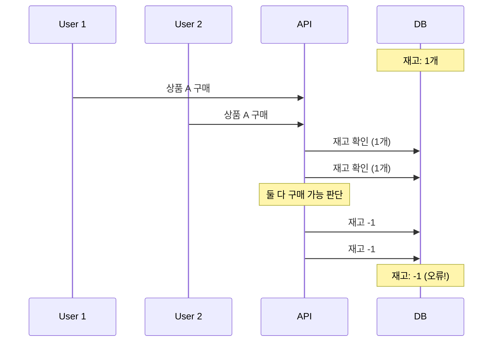
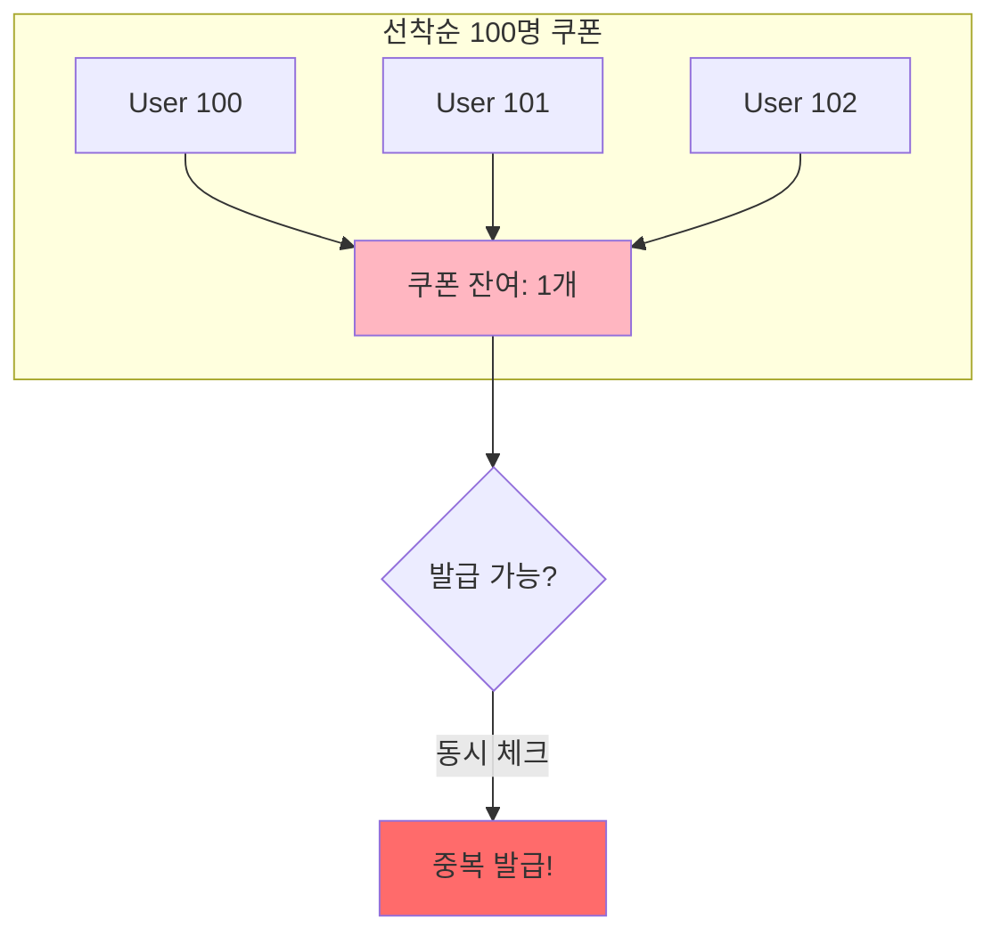
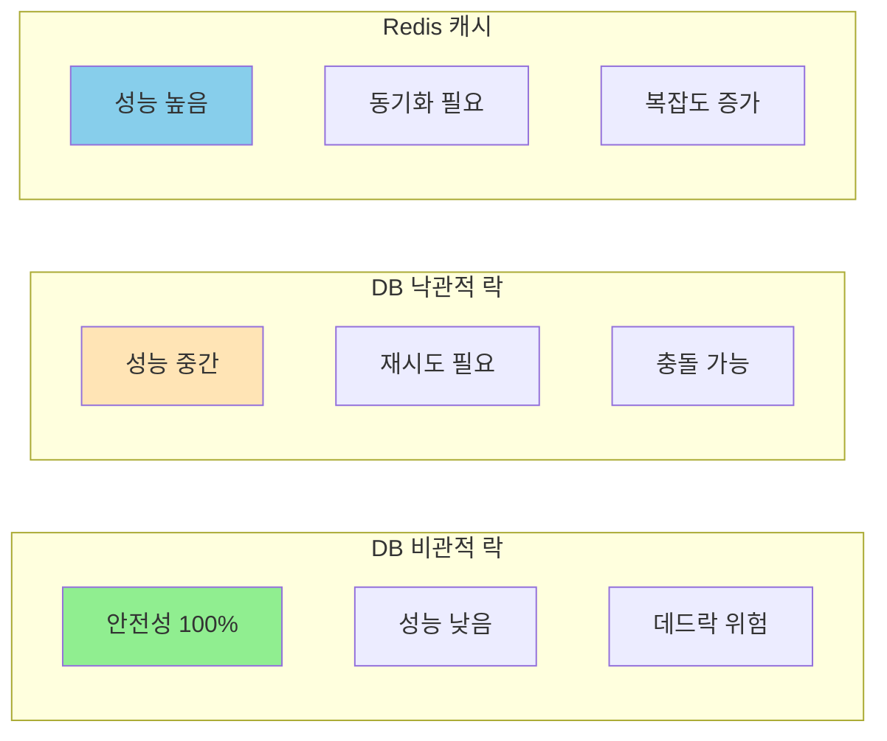
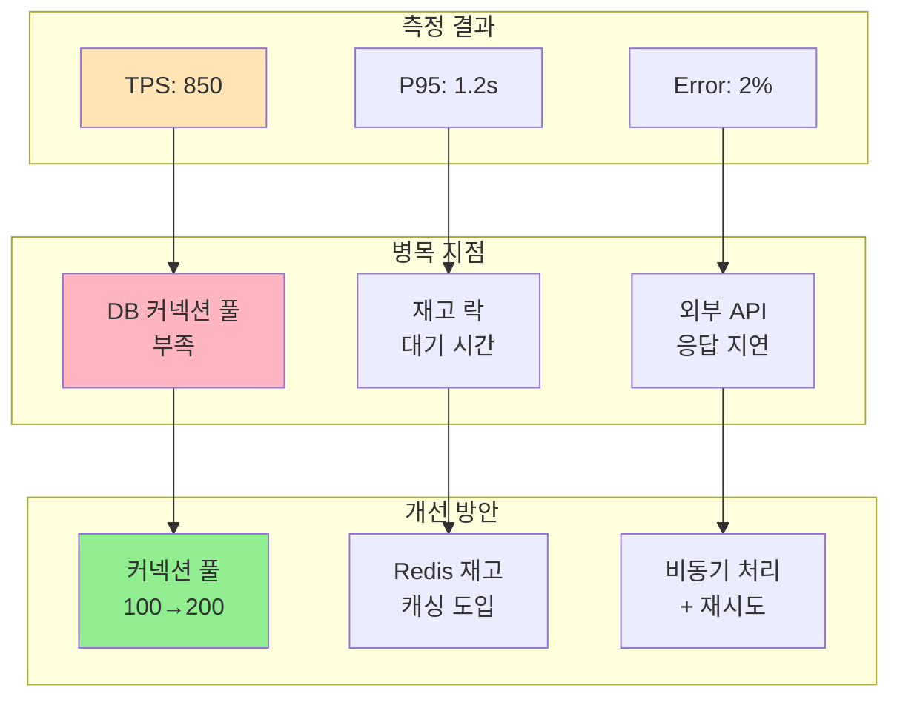

> 📌 참고: 이 문서의 모든 코드는 예시입니다. 정답이 아니며, 다양한 방식으로 구현할 수 있습니다.
>

## 🎯 학습 목표

- 재고 관리의 동시성 문제를 해결할 수 있다
- 선착순 쿠폰 발급을 안전하게 구현할 수 있다
- 결제 프로세스의 일관성을 보장할 수 있다
- 시스템 성능을 측정하고 개선할 수 있다

---

## Step 1: 동시성 문제 식별

### 1.1 재고 차감 경쟁 상황



### 1.2 쿠폰 발급 경쟁 상황



### 1.3 결제 동시성 이슈

```markdown
## 결제 프로세스 위험 지점
1. 잔액 확인과 차감 사이의 간격
2. 주문 상태 변경 중복
3. 외부 결제 시스템 중복 호출
4. 포인트/쿠폰 중복 사용

```

### ✅ 체크포인트

- [ ]  Race Condition 발생 지점을 모두 찾았나요?
- [ ]  데이터 일관성 위험을 평가했나요?
- [ ]  비즈니스 손실 가능성을 검토했나요?

---

## Step 2: 재고 관리 동시성 제어

### 2.1 비관적 락 방식 (예시)

- JS

    ```jsx
    // stock.repository.js
    class StockRepository {
      async decreaseStockPessimistic(productId, quantity, connection) {
        // 트랜잭션 내에서 락 획득
        const product = await connection.query(
          `SELECT * FROM products
           WHERE id = ?
           FOR UPDATE`,
          [productId]
        );
    
        if (!product || product.stock < quantity) {
          throw new Error('재고 부족');
        }
    
        await connection.query(
          `UPDATE products
           SET stock = stock - ?
           WHERE id = ?`,
          [quantity, productId]
        );
    
        return product.stock - quantity;
      }
    }
    
    ```

- Java

    ```java
    // StockRepository.java
    @Repository
    public class StockRepository {
    
        @PersistenceContext
        private EntityManager entityManager;
    
        @Transactional
        public int decreaseStockPessimistic(Long productId, int quantity) {
            // 비관적 락으로 상품 조회 (SELECT FOR UPDATE)
            Product product = entityManager
                .createQuery("SELECT p FROM Product p WHERE p.id = :id", Product.class)
                .setParameter("id", productId)
                .setLockMode(LockModeType.PESSIMISTIC_WRITE)
                .getSingleResult();
    
            if (product == null || product.getStock() < quantity) {
                throw new IllegalStateException("재고 부족");
            }
    
            product.setStock(product.getStock() - quantity);
            entityManager.persist(product);
    
            return product.getStock();
        }
    }
    ```


### 2.2 낙관적 락 방식 (예시)

- JS

    ```jsx
    // product.entity.js
    class Product {
      constructor(id, name, stock, version) {
        this.id = id;
        this.name = name;
        this.stock = stock;
        this.version = version;
      }
    
      decreaseStock(quantity) {
        if (this.stock < quantity) {
          throw new Error('재고 부족');
        }
        this.stock -= quantity;
        this.version++;
      }
    }
    
    // stock.repository.js
    async decreaseStockOptimistic(product, quantity) {
      product.decreaseStock(quantity);
    
      const result = await this.db.query(
        `UPDATE products
         SET stock = ?, version = ?
         WHERE id = ? AND version = ?`,
        [product.stock, product.version, product.id, product.version - 1]
      );
    
      if (result.affectedRows === 0) {
        throw new Error('재고 변경 충돌');
      }
    }
    
    ```

- Java

    ```java
    // Product.java
    @Entity
    @Table(name = "products")
    @OptimisticLocking(type = OptimisticLockType.VERSION)
    public class Product {
    
        @Id
        private Long id;
    
        private String name;
        private int stock;
    
        @Version
        private int version;
    
        public void decreaseStock(int quantity) {
            if (this.stock < quantity) {
                throw new IllegalStateException("재고 부족");
            }
            this.stock -= quantity;
        }
    
        // getter, setter 생략
    }
    ```

    ```java
    // StockRepository.java
    @Repository
    public class StockRepository {
    
        @PersistenceContext
        private EntityManager entityManager;
    
        @Transactional
        public void decreaseStockOptimistic(Long productId, int quantity) {
            Product product = entityManager.find(Product.class, productId);
    
            if (product == null) {
                throw new IllegalArgumentException("상품을 찾을 수 없습니다.");
            }
    
            product.decreaseStock(quantity);
    
            try {
                entityManager.flush(); // version 체크
            } catch (OptimisticLockException e) {
                throw new IllegalStateException("재고 변경 충돌 발생");
            }
        }
    }
    ```


### 2.3 Redis를 활용한 재고 관리 (예시)

- JS

    ```jsx
    // redis-stock.service.js
    class RedisStockService {
      async initStock(productId, quantity) {
        await this.redis.set(`stock:${productId}`, quantity);
      }
    
      async decreaseStock(productId, quantity) {
        // Lua script for atomic operation
        const luaScript = `
          local stock = redis.call('get', KEYS[1])
          if not stock then
            return -1
          end
    
          stock = tonumber(stock)
          local requested = tonumber(ARGV[1])
    
          if stock < requested then
            return 0
          end
    
          redis.call('decrby', KEYS[1], requested)
          return stock - requested
        `;
    
        const result = await this.redis.eval(
          luaScript,
          1,
          `stock:${productId}`,
          quantity
        );
    
        if (result === -1) throw new Error('상품 없음');
        if (result === 0) throw new Error('재고 부족');
    
        // DB 동기화 (비동기)
        this.syncToDatabase(productId, result);
    
        return result;
      }
    
      async syncToDatabase(productId, currentStock) {
        // 주기적으로 또는 이벤트 기반으로 DB 동기화
        await this.db.query(
          'UPDATE products SET stock = ? WHERE id = ?',
          [currentStock, productId]
        );
      }
    }
    
    ```

- java

    ```java
    // RedisStockService.java
    @Service
    public class RedisStockService {
    
        private final StringRedisTemplate redisTemplate;
        private final JdbcTemplate jdbcTemplate;
    
        public RedisStockService(StringRedisTemplate redisTemplate, JdbcTemplate jdbcTemplate) {
            this.redisTemplate = redisTemplate;
            this.jdbcTemplate = jdbcTemplate;
        }
    
        public void initStock(Long productId, int quantity) {
            redisTemplate.opsForValue().set("stock:" + productId, String.valueOf(quantity));
        }
    
        public int decreaseStock(Long productId, int quantity) {
            String luaScript = """
                local stock = redis.call('get', KEYS[1])
                if not stock then
                  return -1
                end
                stock = tonumber(stock)
                local requested = tonumber(ARGV[1])
                if stock < requested then
                  return 0
                end
                redis.call('decrby', KEYS[1], requested)
                return stock - requested
            """;
    
            DefaultRedisScript<Long> script = new DefaultRedisScript<>(luaScript, Long.class);
            Long result = redisTemplate.execute(script, List.of("stock:" + productId), String.valueOf(quantity));
    
            if (result == null || result == -1) {
                throw new IllegalArgumentException("상품 없음");
            } else if (result == 0) {
                throw new IllegalStateException("재고 부족");
            }
    
            // 비동기 DB 동기화
            CompletableFuture.runAsync(() -> syncToDatabase(productId, result.intValue()));
    
            return result.intValue();
        }
    
        private void syncToDatabase(Long productId, int currentStock) {
            jdbcTemplate.update("UPDATE products SET stock = ? WHERE id = ?", currentStock, productId);
        }
    }
    ```


### 2.4 재고 관리 전략 비교



### ✅ 체크포인트

- [ ]  재고 차감이 원자적으로 처리되나요?
- [ ]  음수 재고가 발생하지 않나요?
- [ ]  실패 시 재고 복원이 가능한가요?

---

## Step 3: 선착순 쿠폰 발급

### 3.1 Redis Set을 활용한 선착순 (예시)

- JS

    ```jsx
    // coupon.service.js
    class CouponService {
      async issueCoupon(couponId, userId) {
        const key = `coupon:${couponId}:issued`;
        const limitKey = `coupon:${couponId}:limit`;
    
        // 발급 한도 확인
        const limit = await this.redis.get(limitKey);
        const issued = await this.redis.scard(key);
    
        if (issued >= limit) {
          throw new Error('쿠폰 소진');
        }
    
        // 원자적 발급 (중복 방지)
        const added = await this.redis.sadd(key, userId);
        if (added === 0) {
          throw new Error('이미 발급받음');
        }
    
        // 재확인 (race condition 방지)
        const currentCount = await this.redis.scard(key);
        if (currentCount > limit) {
          await this.redis.srem(key, userId);
          throw new Error('쿠폰 소진');
        }
    
        // DB 저장
        await this.saveCouponToDB(couponId, userId);
    
        return {
          userId,
          couponId,
          issuedAt: new Date(),
          remaining: limit - currentCount
        };
      }
    }
    
    ```

- java

    ```java
    // CouponService.java
    @Service
    public class CouponService {
    
        private final StringRedisTemplate redisTemplate;
        private final JdbcTemplate jdbcTemplate;
    
        public CouponService(StringRedisTemplate redisTemplate, JdbcTemplate jdbcTemplate) {
            this.redisTemplate = redisTemplate;
            this.jdbcTemplate = jdbcTemplate;
        }
    
        @Transactional
        public CouponResult issueCoupon(Long couponId, Long userId) {
            String issuedKey = "coupon:" + couponId + ":issued";
            String limitKey = "coupon:" + couponId + ":limit";
    
            // 쿠폰 한도 및 발급 수량 조회
            int limit = Integer.parseInt(redisTemplate.opsForValue().get(limitKey));
            Long issuedCount = redisTemplate.opsForSet().size(issuedKey);
    
            if (issuedCount >= limit) {
                throw new IllegalStateException("쿠폰 소진");
            }
    
            // 원자적 중복 방지 (이미 발급된 경우)
            Boolean added = redisTemplate.opsForSet().add(issuedKey, String.valueOf(userId));
            if (Boolean.FALSE.equals(added)) {
                throw new IllegalStateException("이미 발급받음");
            }
    
            // race condition 방지 재검증
            Long currentCount = redisTemplate.opsForSet().size(issuedKey);
            if (currentCount > limit) {
                redisTemplate.opsForSet().remove(issuedKey, String.valueOf(userId));
                throw new IllegalStateException("쿠폰 소진");
            }
    
            // DB 저장 (예시)
            saveCouponToDB(couponId, userId);
    
            return new CouponResult(userId, couponId, Instant.now(), limit - currentCount);
        }
    
        private void saveCouponToDB(Long couponId, Long userId) {
            jdbcTemplate.update(
                "INSERT INTO issued_coupons (coupon_id, user_id, issued_at) VALUES (?, ?, NOW())",
                couponId, userId
            );
        }
    
        public record CouponResult(Long userId, Long couponId, Instant issuedAt, long remaining) {}
    }
    ```


### 3.2 Queue를 활용한 순차 처리 (예시)

- JS

    ```jsx
    // coupon-queue.service.js
    class CouponQueueService {
      async requestCoupon(couponId, userId) {
        // 요청을 큐에 추가
        await this.redis.lpush(
          `coupon:${couponId}:requests`,
          JSON.stringify({ userId, timestamp: Date.now() })
        );
    
        // 비동기 처리 트리거
        this.processCouponRequests(couponId);
    
        return { message: '쿠폰 발급 요청 접수' };
      }
    
      async processCouponRequests(couponId) {
        const limit = 100;
        let issued = 0;
    
        while (issued < limit) {
          // 큐에서 하나씩 꺼내서 처리
          const request = await this.redis.rpop(
            `coupon:${couponId}:requests`
          );
    
          if (!request) break;
    
          const { userId } = JSON.parse(request);
    
          // 중복 체크
          const exists = await this.redis.sismember(
            `coupon:${couponId}:issued`,
            userId
          );
    
          if (!exists) {
            await this.redis.sadd(
              `coupon:${couponId}:issued`,
              userId
            );
            issued++;
    
            // DB 저장
            await this.saveCouponToDB(couponId, userId);
          }
        }
      }
    }
    
    ```

- java

    ```java
    // CouponQueueService.java
    @Service
    public class CouponQueueService {
    
        private final StringRedisTemplate redisTemplate;
        private final JdbcTemplate jdbcTemplate;
    
        public CouponQueueService(StringRedisTemplate redisTemplate, JdbcTemplate jdbcTemplate) {
            this.redisTemplate = redisTemplate;
            this.jdbcTemplate = jdbcTemplate;
        }
    
        public Map<String, String> requestCoupon(Long couponId, Long userId) {
            String queueKey = "coupon:" + couponId + ":requests";
    
            // 요청을 큐에 추가 (JSON 문자열 형태)
            String request = "{\"userId\":" + userId + ",\"timestamp\":" + System.currentTimeMillis() + "}";
            redisTemplate.opsForList().leftPush(queueKey, request);
    
            // 비동기 처리 트리거
            CompletableFuture.runAsync(() -> processCouponRequests(couponId));
    
            return Map.of("message", "쿠폰 발급 요청 접수");
        }
    
        public void processCouponRequests(Long couponId) {
            String queueKey = "coupon:" + couponId + ":requests";
            String issuedKey = "coupon:" + couponId + ":issued";
            int limit = 100;
            int issued = 0;
    
            while (issued < limit) {
                String request = redisTemplate.opsForList().rightPop(queueKey);
                if (request == null) break;
    
                // JSON 단순 파싱
                Long userId = Long.parseLong(request.replaceAll("[^0-9]", ""));
    
                Boolean exists = redisTemplate.opsForSet().isMember(issuedKey, String.valueOf(userId));
                if (Boolean.FALSE.equals(exists)) {
                    redisTemplate.opsForSet().add(issuedKey, String.valueOf(userId));
                    issued++;
                    saveCouponToDB(couponId, userId);
                }
            }
        }
    
        private void saveCouponToDB(Long couponId, Long userId) {
            jdbcTemplate.update(
                "INSERT INTO issued_coupons (coupon_id, user_id, issued_at) VALUES (?, ?, NOW())",
                couponId, userId
            );
        }
    }
    ```


### 3.3 분산 환경 쿠폰 발급 (예시)

- JS

    ```jsx
    // distributed-coupon.service.js
    class DistributedCouponService {
      async issueCouponWithLock(couponId, userId) {
        const lockKey = `lock:coupon:${couponId}`;
        const lock = await this.redlock.lock(lockKey, 1000);
    
        try {
          // 잔여 수량 확인
          const remaining = await this.redis.get(
            `coupon:${couponId}:remaining`
          );
    
          if (remaining <= 0) {
            throw new Error('쿠폰 소진');
          }
    
          // 발급 처리
          await this.redis.decr(`coupon:${couponId}:remaining`);
          await this.redis.sadd(`coupon:${couponId}:users`, userId);
    
          return true;
        } finally {
          await lock.unlock();
        }
      }
    }
    
    ```

- java

    ```java
    // DistributedCouponService.java
    @Service
    public class DistributedCouponService {
    
        private final RedissonClient redissonClient;
        private final StringRedisTemplate redisTemplate;
        private final JdbcTemplate jdbcTemplate;
    
        public DistributedCouponService(
            RedissonClient redissonClient,
            StringRedisTemplate redisTemplate,
            JdbcTemplate jdbcTemplate
        ) {
            this.redissonClient = redissonClient;
            this.redisTemplate = redisTemplate;
            this.jdbcTemplate = jdbcTemplate;
        }
    
        public boolean issueCouponWithLock(Long couponId, Long userId) {
            String lockKey = "lock:coupon:" + couponId;
            RLock lock = redissonClient.getLock(lockKey);
    
            try {
                if (lock.tryLock(1, 1, TimeUnit.SECONDS)) {
                    String remainingKey = "coupon:" + couponId + ":remaining";
                    String remainingStr = redisTemplate.opsForValue().get(remainingKey);
    
                    int remaining = remainingStr == null ? 0 : Integer.parseInt(remainingStr);
                    if (remaining <= 0) {
                        throw new IllegalStateException("쿠폰 소진");
                    }
    
                    // 쿠폰 차감
                    redisTemplate.opsForValue().decrement(remainingKey);
                    redisTemplate.opsForSet().add("coupon:" + couponId + ":users", String.valueOf(userId));
    
                    // DB 반영 (비동기)
                    CompletableFuture.runAsync(() -> saveCouponToDB(couponId, userId));
    
                    return true;
                } else {
                    throw new IllegalStateException("잠금 획득 실패");
                }
            } catch (InterruptedException e) {
                Thread.currentThread().interrupt();
                throw new RuntimeException("락 처리 중 인터럽트 발생");
            } finally {
                if (lock.isHeldByCurrentThread()) {
                    lock.unlock();
                }
            }
        }
    
        private void saveCouponToDB(Long couponId, Long userId) {
            jdbcTemplate.update(
                "INSERT INTO issued_coupons (coupon_id, user_id, issued_at) VALUES (?, ?, NOW())",
                couponId, userId
            );
        }
    }
    ```


### ✅ 체크포인트

- [ ]  정확히 N개만 발급되나요?
- [ ]  중복 발급이 방지되나요?
- [ ]  발급 순서가 보장되나요?

---

## Step 4: 결제 프로세스 동시성

### 4.1 결제 멱등성 보장 (예시)

- JS

    ```jsx
    // payment.service.js
    class PaymentService {
      async processPayment(orderId, userId, amount) {
        // 멱등성 키 생성
        const idempotencyKey = `payment:${orderId}`;
    
        // 이미 처리된 결제인지 확인
        const processed = await this.redis.get(idempotencyKey);
        if (processed) {
          return JSON.parse(processed);
        }
    
        // 결제 처리 (분산 락 사용)
        const lockKey = `lock:payment:${orderId}`;
        const lock = await this.redlock.lock(lockKey, 5000);
    
        try {
          // 다시 한번 확인 (double-check)
          const doubleCheck = await this.redis.get(idempotencyKey);
          if (doubleCheck) {
            return JSON.parse(doubleCheck);
          }
    
          // 실제 결제 처리
          const result = await this.executePayment(orderId, userId, amount);
    
          // 결과 캐싱 (24시간)
          await this.redis.setex(
            idempotencyKey,
            86400,
            JSON.stringify(result)
          );
    
          return result;
        } finally {
          await lock.unlock();
        }
      }
    
      async executePayment(orderId, userId, amount) {
        return await this.db.transaction(async (trx) => {
          // 잔액 차감
          const result = await trx.query(
            `UPDATE users
             SET balance = balance - ?
             WHERE id = ? AND balance >= ?`,
            [amount, userId, amount]
          );
    
          if (result.affectedRows === 0) {
            throw new Error('잔액 부족');
          }
    
          // 주문 상태 업데이트
          await trx.query(
            `UPDATE orders
             SET status = 'PAID', paid_at = NOW()
             WHERE id = ? AND status = 'PENDING'`,
            [orderId]
          );
    
          // 결제 기록
          await trx.query(
            `INSERT INTO payments
             (order_id, user_id, amount, status)
             VALUES (?, ?, ?, 'SUCCESS')`,
            [orderId, userId, amount]
          );
    
          return { orderId, status: 'SUCCESS', paidAt: new Date() };
        });
      }
    }
    
    ```

- java

    ```java
    // PaymentService.java
    @Service
    public class PaymentService {
    
        private final RedissonClient redissonClient;
        private final StringRedisTemplate redisTemplate;
        private final JdbcTemplate jdbcTemplate;
    
        public PaymentService(
                RedissonClient redissonClient,
                StringRedisTemplate redisTemplate,
                JdbcTemplate jdbcTemplate
        ) {
            this.redissonClient = redissonClient;
            this.redisTemplate = redisTemplate;
            this.jdbcTemplate = jdbcTemplate;
        }
    
        @Transactional
        public PaymentResult processPayment(Long orderId, Long userId, int amount) {
            String idempotencyKey = "payment:" + orderId;
    
            // 1. 이미 처리된 결제인지 확인
            String cached = redisTemplate.opsForValue().get(idempotencyKey);
            if (cached != null) {
                return fromJson(cached, PaymentResult.class);
            }
    
            // 2. 분산 락 획득
            String lockKey = "lock:payment:" + orderId;
            RLock lock = redissonClient.getLock(lockKey);
    
            try {
                if (lock.tryLock(1, 5, TimeUnit.SECONDS)) {
                    // Double-check (이미 처리된 경우 방지)
                    String doubleCheck = redisTemplate.opsForValue().get(idempotencyKey);
                    if (doubleCheck != null) {
                        return fromJson(doubleCheck, PaymentResult.class);
                    }
    
                    // 3. 실제 결제 처리
                    PaymentResult result = executePayment(orderId, userId, amount);
    
                    // 4. 결과 캐싱 (TTL: 24시간)
                    redisTemplate.opsForValue().set(
                            idempotencyKey,
                            toJson(result),
                            Duration.ofHours(24)
                    );
    
                    return result;
                } else {
                    throw new IllegalStateException("결제 락 획득 실패");
                }
            } catch (InterruptedException e) {
                Thread.currentThread().interrupt();
                throw new RuntimeException("락 처리 중 인터럽트 발생", e);
            } finally {
                if (lock.isHeldByCurrentThread()) {
                    lock.unlock();
                }
            }
        }
    
        private PaymentResult executePayment(Long orderId, Long userId, int amount) {
            // DB 트랜잭션 처리
            int updated = jdbcTemplate.update("""
                UPDATE users
                SET balance = balance - ?
                WHERE id = ? AND balance >= ?
                """, amount, userId, amount);
    
            if (updated == 0) {
                throw new IllegalStateException("잔액 부족");
            }
    
            jdbcTemplate.update("""
                UPDATE orders
                SET status = 'PAID', paid_at = NOW()
                WHERE id = ? AND status = 'PENDING'
                """, orderId);
    
            jdbcTemplate.update("""
                INSERT INTO payments (order_id, user_id, amount, status)
                VALUES (?, ?, ?, 'SUCCESS')
                """, orderId, userId, amount);
    
            return new PaymentResult(orderId, "SUCCESS", Instant.now());
        }
    
        private String toJson(Object obj) {
            try {
                return new ObjectMapper().writeValueAsString(obj);
            } catch (Exception e) {
                throw new RuntimeException(e);
            }
        }
    
        private <T> T fromJson(String json, Class<T> clazz) {
            try {
                return new ObjectMapper().readValue(json, clazz);
            } catch (Exception e) {
                throw new RuntimeException(e);
            }
        }
    
        public record PaymentResult(Long orderId, String status, Instant paidAt) {}
    }
    ```


### 4.2 Saga 패턴으로 분산 트랜잭션 (예시)

- JS

    ```jsx
    // order-saga.js
    class OrderSaga {
      async executeOrder(orderData) {
        const sagaId = `saga:${orderData.orderId}`;
        const steps = [];
    
        try {
          // Step 1: 재고 차감
          const stockResult = await this.stockService.reserve(
            orderData.items
          );
          steps.push({ service: 'stock', action: 'reserve', data: stockResult });
    
          // Step 2: 결제 처리
          const paymentResult = await this.paymentService.charge(
            orderData.userId,
            orderData.amount
          );
          steps.push({ service: 'payment', action: 'charge', data: paymentResult });
    
          // Step 3: 쿠폰 사용
          if (orderData.couponId) {
            const couponResult = await this.couponService.use(
              orderData.couponId,
              orderData.userId
            );
            steps.push({ service: 'coupon', action: 'use', data: couponResult });
          }
    
          // Step 4: 주문 확정
          await this.orderService.confirm(orderData.orderId);
    
          return { success: true, orderId: orderData.orderId };
    
        } catch (error) {
          // 보상 트랜잭션
          await this.compensate(steps);
          throw error;
        }
      }
    
      async compensate(steps) {
        for (const step of steps.reverse()) {
          switch (step.service) {
            case 'stock':
              await this.stockService.release(step.data);
              break;
            case 'payment':
              await this.paymentService.refund(step.data);
              break;
            case 'coupon':
              await this.couponService.restore(step.data);
              break;
          }
        }
      }
    }
    
    ```

- java

    ```java
    // OrderSaga.java
    @Service
    public class OrderSaga {
    
        private final StockService stockService;
        private final PaymentService paymentService;
        private final CouponService couponService;
        private final OrderService orderService;
    
        public OrderSaga(
                StockService stockService,
                PaymentService paymentService,
                CouponService couponService,
                OrderService orderService
        ) {
            this.stockService = stockService;
            this.paymentService = paymentService;
            this.couponService = couponService;
            this.orderService = orderService;
        }
    
        public Map<String, Object> executeOrder(OrderData orderData) {
            String sagaId = "saga:" + orderData.orderId();
            List<SagaStep> steps = new ArrayList<>();
    
            try {
                // Step 1: 재고 차감
                var stockResult = stockService.reserve(orderData.items());
                steps.add(new SagaStep("stock", "reserve", stockResult));
    
                // Step 2: 결제 처리
                var paymentResult = paymentService.processPayment(
                        orderData.orderId(),
                        orderData.userId(),
                        orderData.amount()
                );
                steps.add(new SagaStep("payment", "charge", paymentResult));
    
                // Step 3: 쿠폰 사용
                if (orderData.couponId() != null) {
                    var couponResult = couponService.use(orderData.couponId(), orderData.userId());
                    steps.add(new SagaStep("coupon", "use", couponResult));
                }
    
                // Step 4: 주문 확정
                orderService.confirm(orderData.orderId());
    
                return Map.of("success", true, "orderId", orderData.orderId());
    
            } catch (Exception e) {
                compensate(steps);
                throw new RuntimeException("Saga 실행 중 오류 발생", e);
            }
        }
    
        private void compensate(List<SagaStep> steps) {
            Collections.reverse(steps);
            for (SagaStep step : steps) {
                try {
                    switch (step.service()) {
                        case "stock" -> stockService.release(step.data());
                        case "payment" -> paymentService.refund(step.data());
                        case "coupon" -> couponService.restore(step.data());
                    }
                } catch (Exception ex) {
                    // 보상 트랜잭션 실패는 로깅만 처리
                    System.err.println("보상 실패: " + step.service() + " / " + ex.getMessage());
                }
            }
        }
    
        public record OrderData(
                Long orderId,
                Long userId,
                int amount,
                List<String> items,
                Long couponId
        ) {}
    
        public record SagaStep(String service, String action, Object data) {}
    }
    ```


### ✅ 체크포인트

- [ ]  중복 결제가 방지되나요?
- [ ]  실패 시 롤백이 완전한가요?
- [ ]  부분 실패를 처리하나요?

---

## Step 5: 성능 측정과 최적화

### 5.1 주요 성능 지표 (예시)

- JS

    ```jsx
    // metrics.collector.js
    class MetricsCollector {
      constructor() {
        this.metrics = {
          orderThroughput: new Counter('orders_total'),
          orderLatency: new Histogram('order_duration_seconds'),
          stockErrors: new Counter('stock_errors_total'),
          cacheHitRate: new Gauge('cache_hit_rate'),
        };
      }
    
      recordOrder(duration, success) {
        this.metrics.orderThroughput.inc({
          status: success ? 'success' : 'failure'
        });
        this.metrics.orderLatency.observe(duration / 1000);
      }
    
      recordCacheMetrics() {
        setInterval(async () => {
          const info = await this.redis.info('stats');
          const hits = parseInt(info.keyspace_hits);
          const misses = parseInt(info.keyspace_misses);
          const hitRate = hits / (hits + misses);
    
          this.metrics.cacheHitRate.set(hitRate);
        }, 10000);
      }
    }
    
    ```

- Java

    ```java
    // MetricsCollector.java
    package com.example.metrics;
    
    import io.micrometer.core.instrument.Counter;
    import io.micrometer.core.instrument.Gauge;
    import io.micrometer.core.instrument.Histogram;
    import io.micrometer.core.instrument.MeterRegistry;
    import io.micrometer.core.instrument.Timer;
    import org.springframework.data.redis.core.StringRedisTemplate;
    import org.springframework.scheduling.annotation.Scheduled;
    import org.springframework.stereotype.Component;
    
    import java.time.Duration;
    import java.util.concurrent.atomic.AtomicDouble;
    
    @Component
    public class MetricsCollector {
    
        private final Counter orderSuccessCounter;
        private final Counter orderFailureCounter;
        private final Timer orderLatency;
        private final Counter stockErrorCounter;
        private final AtomicDouble cacheHitRateGauge;
    
        private final StringRedisTemplate redisTemplate;
        private final MeterRegistry registry;
    
        public MetricsCollector(MeterRegistry registry, StringRedisTemplate redisTemplate) {
            this.registry = registry;
            this.redisTemplate = redisTemplate;
    
            this.orderSuccessCounter = Counter.builder("orders_total")
                    .description("Total successful orders")
                    .tag("status", "success")
                    .register(registry);
    
            this.orderFailureCounter = Counter.builder("orders_total")
                    .description("Total failed orders")
                    .tag("status", "failure")
                    .register(registry);
    
            this.orderLatency = Timer.builder("order_duration_seconds")
                    .description("Order processing duration in seconds")
                    .publishPercentileHistogram()
                    .maximumExpectedValue(Duration.ofSeconds(5))
                    .register(registry);
    
            this.stockErrorCounter = Counter.builder("stock_errors_total")
                    .description("Total stock-related errors")
                    .register(registry);
    
            this.cacheHitRateGauge = registry.gauge("cache_hit_rate", new AtomicDouble(0));
        }
    
        public void recordOrder(long durationMillis, boolean success) {
            if (success) orderSuccessCounter.increment();
            else orderFailureCounter.increment();
    
            orderLatency.record(Duration.ofMillis(durationMillis));
        }
    
        public void recordStockError() {
            stockErrorCounter.increment();
        }
    
        @Scheduled(fixedDelay = 10_000)
        public void updateCacheHitRate() {
            try {
                // Redis INFO stats 파싱
                String info = redisTemplate.execute(connection ->
                        connection.serverCommands().info("stats")
                );
    
                if (info != null && info.contains("keyspace_hits")) {
                    long hits = extractValue(info, "keyspace_hits");
                    long misses = extractValue(info, "keyspace_misses");
                    double hitRate = (hits + misses) == 0 ? 0 : (double) hits / (hits + misses);
                    cacheHitRateGauge.set(hitRate);
                }
            } catch (Exception e) {
                System.err.println("Cache hit rate update failed: " + e.getMessage());
            }
        }
    
        private long extractValue(String info, String key) {
            return info.lines()
                    .filter(line -> line.startsWith(key))
                    .map(line -> line.split(":")[1])
                    .map(String::trim)
                    .mapToLong(Long::parseLong)
                    .findFirst()
                    .orElse(0);
        }
    }
    ```


### 5.2 부하 테스트 시나리오 (예시)

```jsx
// load-test-ecommerce.js
import http from 'k6/http';
import { check, group, sleep } from 'k6';
import { Rate } from 'k6/metrics';

const errorRate = new Rate('errors');

export const options = {
  stages: [
    { duration: '2m', target: 100 },  // 워밍업
    { duration: '5m', target: 500 },  // 부하 증가
    { duration: '2m', target: 1000 }, // 피크 부하
    { duration: '2m', target: 100 },  // 쿨다운
  ],
  thresholds: {
    errors: ['rate<0.1'],
    http_req_duration: ['p(95)<1000'],
  },
};

export default function() {
  const userId = `user_${__VU}`;

  group('상품 구매 플로우', () => {
    // 1. 상품 목록 조회
    const products = http.get('<http://localhost:3000/api/products>');
    check(products, {
      'products loaded': (r) => r.status === 200,
    });

    // 2. 장바구니 추가
    const cartRes = http.post('<http://localhost:3000/api/cart>',
      JSON.stringify({
        userId,
        productId: 'P001',
        quantity: 1
      }),
      { headers: { 'Content-Type': 'application/json' }}
    );

    // 3. 주문 생성
    const orderRes = http.post('<http://localhost:3000/api/orders>',
      JSON.stringify({
        userId,
        items: [{ productId: 'P001', quantity: 1 }]
      }),
      { headers: { 'Content-Type': 'application/json' }}
    );

    if (orderRes.status !== 200) {
      errorRate.add(1);
    } else {
      errorRate.add(0);

      // 4. 결제 처리
      const orderId = orderRes.json('orderId');
      const paymentRes = http.post(
        `http://localhost:3000/api/orders/${orderId}/payment`,
        JSON.stringify({ userId }),
        { headers: { 'Content-Type': 'application/json' }}
      );

      check(paymentRes, {
        'payment successful': (r) => r.status === 200,
      });
    }
  });

  sleep(1);
}

```

### 5.3 병목 지점 분석



### 5.4 최적화 적용 (예시)

```jsx
// optimization-config.js
module.exports = {
  database: {
    connectionLimit: 200,        // 증가
    queueLimit: 0,
    waitForConnections: true,
    acquireTimeout: 60000,
  },

  redis: {
    maxRetriesPerRequest: 3,
    enableReadyCheck: true,
    lazyConnect: true,
    reconnectOnError: true,
  },

  cache: {
    productTTL: 300,            // 5분
    userSessionTTL: 3600,       // 1시간
    hotItemsTTL: 60,            // 1분
  },

  queue: {
    concurrency: 10,
    maxRetries: 3,
    retryDelay: 1000,
  }
};

```

### ✅ 체크포인트

- [ ]  목표 TPS를 달성했나요?
- [ ]  응답시간이 SLA 내인가요?
- [ ]  에러율이 허용 범위 내인가요?

---

## 📋 최종 체크리스트

### 필수 과제

- [ ]  재고 동시성 제어 구현
- [ ]  선착순 쿠폰 발급 시스템
- [ ]  결제 멱등성 보장
- [ ]  부하 테스트 수행
- [ ]  성능 병목 분석
- [ ]  최적화 적용 및 검증

### 심화 과제

- [ ]  분산 트랜잭션 (Saga 패턴)
- [ ]  실시간 재고 동기화
- [ ]  자동 스케일링 설정

---

## 💡 이커머스 특화 팁

### 재고 관리 베스트 프랙티스

1. **핫 아이템**: Redis 캐싱 우선
2. **일반 상품**: DB 낙관적 락
3. **한정 상품**: 비관적 락 + 큐

### 쿠폰 발급 전략

1. **선착순**: Redis Set + 원자적 연산
2. **추첨**: 큐 수집 후 배치 처리
3. **조건부**: 규칙 엔진 활용

### 결제 안정성

1. **멱등성**: 고유 키로 중복 방지
2. **타임아웃**: 외부 API 3초 제한
3. **재시도**: 지수 백오프 적용

---

## 🔄 Week 4와의 연결

이번 주는 Week 4에서 구축한 인프라에 동시성 제어를 추가했습니다:

- Week 4의 MySQL → 트랜잭션 격리 수준 조정
- Week 4의 Outbox → Saga 패턴으로 확장
- Week 4의 외부 연동 → 멱등성 보장

모든 최적화는 기존 시스템의 안정성을 유지하면서 점진적으로 적용하세요.