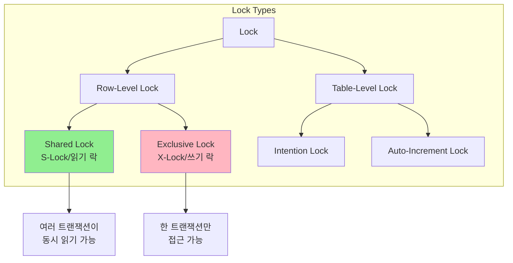
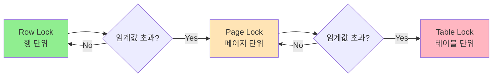
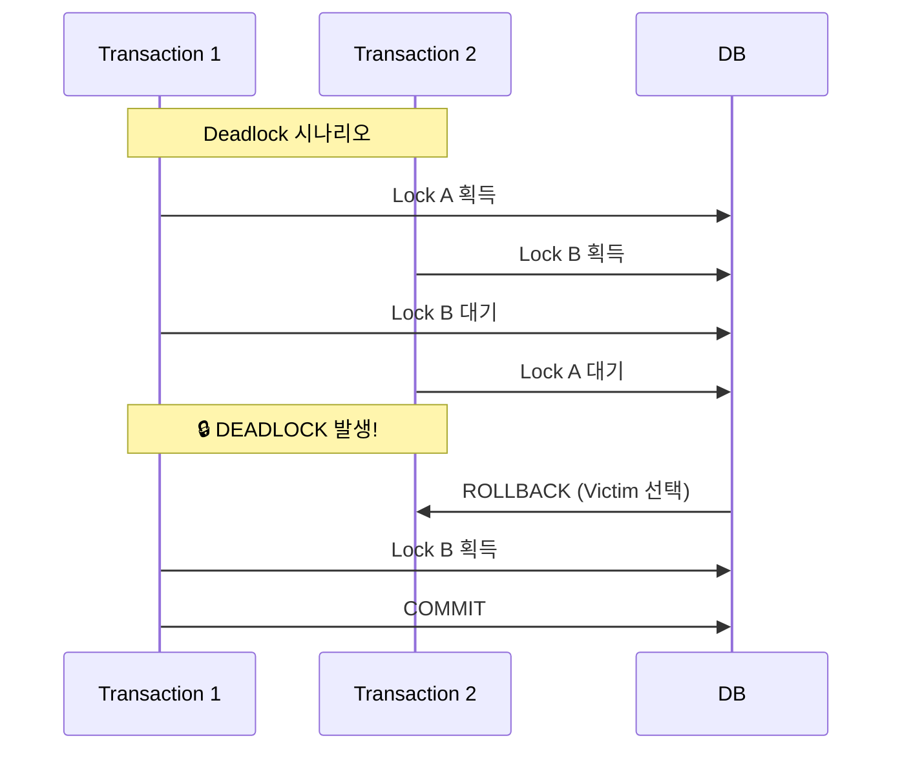

# 데이터베이스 Lock 메커니즘

**Lock이란?**

트랜잭션이 데이터에 대한 **배타적 접근 권한**을 확보하는 메커니즘입니다. 동시성 제어의 핵심 기술입니다.

**Lock의 종류**



**Lock 호환성 매트릭스**

|  | S-Lock | X-Lock |
| --- | --- | --- |
| **S-Lock** | ✅ 호환 | ❌ 충돌 |
| **X-Lock** | ❌ 충돌 | ❌ 충돌 |

S-Lock - `SELECT ... FOR SHARE`

X-Lock - `SELECT ... FOR UPDATE`

**Lock Escalation**



### Deadlock 발생과 해결



### Deadlock 해결 전략

```sql
-- 1. Lock 순서 통일
-- 항상 같은 순서로 테이블/행에 접근

-- 나쁜 예
Transaction 1: UPDATE accounts SET ... WHERE id = 1; UPDATE accounts SET ... WHERE id = 2;
Transaction 2: UPDATE accounts SET ... WHERE id = 2; UPDATE accounts SET ... WHERE id = 1;

-- 좋은 예 (ID 순서로 정렬)
Transaction 1: UPDATE accounts SET ... WHERE id IN (1,2) ORDER BY id;
Transaction 2: UPDATE accounts SET ... WHERE id IN (1,2) ORDER BY id;

-- 2. Lock 타임아웃 설정
SET innodb_lock_wait_timeout = 5; -- 5초 대기

-- 3. 트랜잭션 크기 최소화
-- 짧은 트랜잭션으로 분할
```

제공해주신 락(Lock) 메커니즘 요약 자료 아주 잘 정리하셨네요. S-Lock, X-Lock, 데드락의 기본 개념을 명확히 짚어주셨습니다.

지난번 트랜잭션 설명에 이어, 이 락(Lock) 개념을 **Spring Boot + JPA (Kotlin)** 환경에서 어떻게 실용적으로 적용하는지, 그리고 요약 자료에서 한 걸음 더 나아간 실무적인 고려사항들을 보충 설명해 드릴게요.

-----

## 🚀 1. Spring (JPA)에서 락은 언제, 어떻게 동작하는가?

제공 자료의 `SELECT ... FOR UPDATE` 같은 SQL을 직접 날릴 일은 드뭅니다. JPA가 대부분을 추상화해주기 때문이죠.

### 1-1. 묵시적 락 (Implicit Locking)

개발자가 요청하지 않아도 JPA가 **자동으로** 거는 락입니다.

* **X-Lock (쓰기 락):**
    * `JPA save()` (Update 시), `delete()` 호출 시: JPA는 해당 엔티티(Row)에 **X-Lock**을 겁니다.
    * 트랜잭션이 커밋될 때까지 다른 트랜잭션은 이 Row를 수정/삭제할 수 없습니다.

### 1-2. 명시적 락 (Explicit Locking)

개발자가 **직접** 락을 요청하는 것입니다. 이것이 바로 지난번 논의했던 '재고 동시성' 문제의 핵심입니다.

JPA에서는 `@Lock` 어노테이션을 사용합니다.

```kotlin
// ProductRepository.kt
interface ProductRepository : JpaRepository<Product, Long> {

    // ⭐️ X-Lock (Exclusive Lock)
    // SQL: SELECT ... FOR UPDATE
    // "이 Row는 나만 쓸 거니까, 수정/읽기 모두 대기시켜!"
    // (지난번 재고 차감 시나리오에서 사용)
    @Lock(LockModeType.PESSIMISTIC_WRITE)
    @Query("SELECT p FROM Product p WHERE p.id = :id")
    fun findByIdWithPessimisticWriteLock(id: Long): Product?

    // ⭐️ S-Lock (Shared Lock)
    // SQL: SELECT ... FOR SHARE
    // "나는 읽기만 할게. 다른 S-Lock은 허용. (X-Lock은 대기)"
    // 예: 주문 처리 중 '상품 정보'가 절대 변경되면 안 될 때
    @Lock(LockModeType.PESSIMISTIC_READ)
    @Query("SELECT p FROM Product p WHERE p.id = :id")
    fun findByIdWithPessimisticReadLock(id: Long): Product?
}

// OrderService.kt
@Service
class OrderService(private val productRepository: ProductRepository) {

    @Transactional
    fun createOrder(productId: Long, quantity: Int) {
        // 1. 트랜잭션 시작
        // 2. 이 시점에 Product Row에 X-Lock이 걸림 (PESSIMISTIC_WRITE)
        val product = productRepository.findByIdWithPessimisticWriteLock(productId)
            ?: throw EntityNotFoundException("상품 없음")

        // 3. 다른 트랜잭션은 이 상품의 Lock이 풀릴 때까지 대기
        if (product.stock < quantity) {
            throw RuntimeException("재고 부족")
        }
        product.stock -= quantity
        
        // 4. 주문 생성 로직...
        
        // 5. 트랜잭션 커밋 (이때 Lock 해제)
    }
}
```

이것을 **비관적 락 (Pessimistic Locking)** 이라고 부릅니다. "충돌은 어차피 일어날 거야"라고 가정하고 DB 레벨에서 선제적으로 락을 거는 방식이죠.

-----

## 📈 2. (자료에 없는) 낙관적 락 (Optimistic Locking)

이커머스에서 비관적 락만큼, 혹은 그보다 더 많이 쓰이는 중요한 개념입니다.

**"충돌은 잘 일어나지 않을 거야. 일단 진행하고, 혹시 충돌나면 그때 가서 처리하자\!"** 라는 접근법입니다. DB 락 대신 **버전(Version) 정보**를 사용합니다.

### 2-1. 동작 원리 (JPA `@Version`)

1.  **엔티티에 버전 필드 추가:**

    ```kotlin
    @Entity
    data class Product(
        @Id val id: Long,
        var name: String,
        var stock: Int,

        // ⭐️ 낙관적 락을 위한 버전 필드
        @Version
        val version: Long = 0L 
    )
    ```

2.  **트랜잭션 1 (T1) - 상품 수정:**

    * T1이 '노트북' (version=1, stock=10) 정보를 읽습니다.
    * T1이 재고를 9로 변경하고 `save()` (커밋) 시도.
    * JPA가 날리는 SQL:
      ```sql
      UPDATE product SET stock = 9, version = 2 
      WHERE id = 1 AND version = 1; -- ⭐️ 중요
      ```
    * 성공 (1개 Row 변경). T1 커밋 완료.

3.  **동시성 충돌 시나리오:**

    * T1: '노트북' (version=1, stock=10) 읽음.
    * T2: '노트북' (version=1, stock=10) 읽음.
    * T1: 재고 9로 변경 후 커밋. (DB: version=2, stock=9)
    * T2: (T1이 커밋된 줄 모름) 재고 8로 변경 후 커밋 시도.
    * JPA가 날리는 SQL:
      ```sql
      UPDATE product SET stock = 8, version = 2 
      WHERE id = 1 AND version = 1; -- ⭐️ T2는 여전히 version=1로 알고 있음
      ```
    * **실패\!** (0개 Row 변경). DB의 현재 버전은 2인데, T2는 1을 기준으로 업데이트하려 했기 때문입니다.
    * JPA는 T2에게 `ObjectOptimisticLockingFailureException` 예외를 발생시킵니다.

### 2-2. 비관적 vs 낙관적: 언제 무엇을 쓸까?

| 구분 | 비관적 락 (Pessimistic) | 낙관적 락 (Optimistic) |
| --- | --- | --- |
| **핵심** | DB 락 (`FOR UPDATE`) | 어플리케이션 버전 (`@Version`) |
| **동작** | 락이 풀릴 때까지 **대기** | 충돌 시 **예외 발생** (실패) |
| **성능** | 락 경합 시 성능 저하 | 롤백/재시도 로직 필요 |
| **적합한 곳** | **충돌이 빈번한** 작업 (e.g., **재고 차감**, 선착순 티켓팅) | **충돌이 드문** 작업 (e.g., 상품 설명 수정, 유저 정보 변경) |

-----

## 🔒 3. (자료 보충) Intention Lock의 역할

자료의 다이어그램에 `Intention Lock`이 언급되었네요. 이건 개발자가 직접 쓰는 락은 아니지만, MySQL(InnoDB)이 효율성을 위해 내부적으로 사용합니다.

* **목적:** 테이블 락(Table-Level)과 로우 락(Row-Level)의 공존.
* **시나리오:**
    1.  T1이 **Row A**에 X-Lock (쓰기 락)을 걸려고 합니다.
    2.  이때 T1은 **Row A**에 X-Lock을 거는 동시에, **Table 전체**에 **"IX-Lock" (Intention-Exclusive)** 이라는 '표시'를 남깁니다.
    3.  이 '표시'의 의미는 "나 이 테이블의 *어떤 Row*에 X-Lock 걸었어\!" 입니다.
    4.  이때 T2가 `ALTER TABLE` (테이블 전체 X-Lock)을 시도합니다.
    5.  T2는 테이블의 Row를 일일이 확인할 필요 없이, 테이블의 **Intention Lock (IX-Lock)** '표시'만 보고도 "아, 누가 Row 쓰고 있네. 대기해야겠다"라고 바로 판단할 수 있습니다.

**요약:** Intention Lock은 Row 락의 존재를 Table 레벨에 알려주는 '안내판' 역할을 하여 락 검사 효율을 높여줍니다.

-----

## 💥 4. Spring 환경에서의 데드락

자료에서 데드락의 고전적인 예시(T1: A-\>B, T2: B-\>A)를 잘 보여줬습니다. Spring 환경에서는 이게 서비스 로직 순서로 나타납니다.

**시나리오:** '주문 서비스'와 '유저 서비스'

* `OrderService` (T1): \*\*주문(A)\*\*을 생성하고, \*\*유저(B)\*\*의 포인트를 적립한다. (락 순서: A -\> B)
* `UserService` (T2): **유저(B)** 정보를 수정하고, 해당 유저의 최근 **주문(A)** 상태를 갱신한다. (락 순서: B -\> A)

두 트랜잭션이 동시에 실행되면 데드락이 발생할 수 있습니다.

**해결책 (자료 인용):** **Lock 순서 통일**.

* 팀(조직) 내에서 "유저와 주문을 함께 다룰 때는, 반드시 **유저(B)를 먼저** 락을 걸고, 그다음 \*\*주문(A)\*\*을 락 건다"와 같은 **규칙**을 정하고 모든 코드에서 준수해야 합니다.

이처럼 DB 락 메커니즘은 Spring과 JPA라는 추상화 뒤에 숨겨져 있지만, 고성능 이커머스 서비스를 만들기 위해서는 그 원리를 정확히 이해하고 \*\*'비관적 락'\*\*과 **'낙관적 락'** 중 상황에 맞는 전략을 선택하는 것이 시니어 개발자의 중요한 역량입니다.