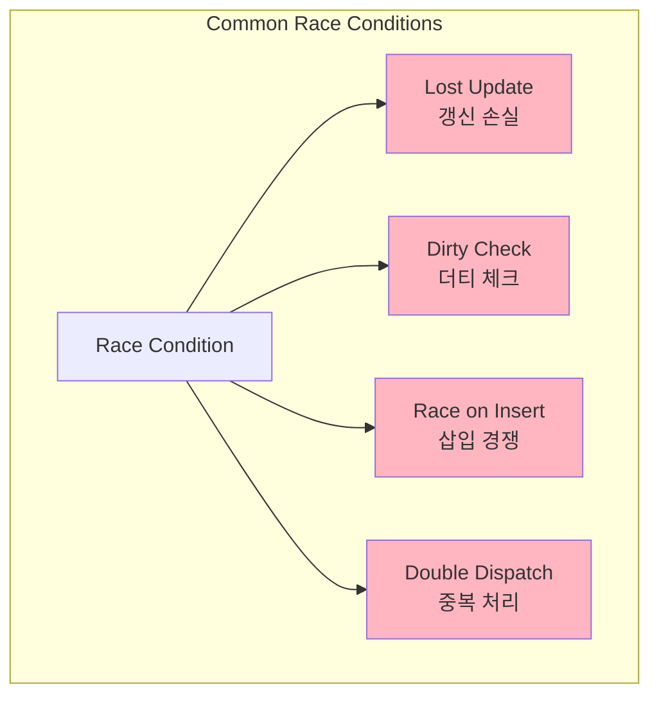
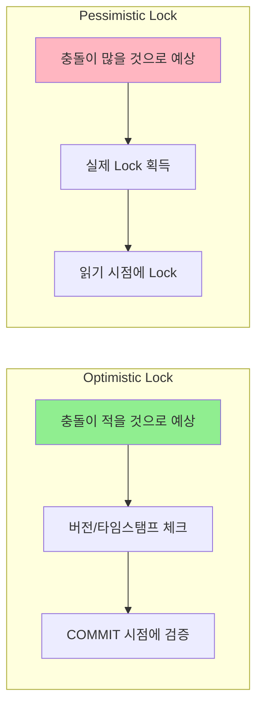

# Race condition

**Race Condition이란?**

여러 프로세스/스레드가 공유 자원에 **동시에 접근**할 때 실행 순서에 따라 결과가 달라지는 상황입니다.

### 대표적인 Race Condition 패턴



**Lost Update 예시**


### 재고 차감 Race Condition

```sql
-- 🔴 문제가 있는 코드
SELECT stock FROM products WHERE id = 1; -- stock = 10
-- 애플리케이션에서 체크
IF stock >= order_quantity THEN
    UPDATE products SET stock = stock - order_quantity WHERE id = 1;
END IF;

-- ✅ 해결 방법 1: 원자적 연산
UPDATE products
SET stock = stock - 5
WHERE id = 1 AND stock >= 5;

-- 영향받은 행 수 체크
IF ROW_COUNT() = 0 THEN
    -- 재고 부족
END IF;

-- ✅ 해결 방법 2: SELECT FOR UPDATE
BEGIN;
SELECT stock FROM products WHERE id = 1 FOR UPDATE;
-- 다른 트랜잭션은 이 행에 접근 불가
IF stock >= 5 THEN
    UPDATE products SET stock = stock - 5 WHERE id = 1;
    COMMIT;
ELSE
    ROLLBACK;
END IF;

-- ✅ 해결 방법 3: 낙관적 락 (version 컬럼 사용)
SELECT stock, version FROM products WHERE id = 1;
-- stock = 10, version = 1

UPDATE products
SET stock = stock - 5, version = version + 1
WHERE id = 1 AND version = 1;

IF ROW_COUNT() = 0 THEN
    -- 다른 트랜잭션이 먼저 수정함, 재시도 필요
END IF;

```

### 포인트 적립 중복 방지

### 좌석 예약 동시성 처리

```sql
-- 좌석 예약 테이블
CREATE TABLE seat_reservations (
    seat_id INT,
    show_id INT,
    user_id INT,
    status ENUM('available', 'reserved', 'paid'),
    reserved_at TIMESTAMP,
    PRIMARY KEY (seat_id, show_id)
);

-- ✅ 좌석 선점 로직
BEGIN;

-- 1. 좌석 상태 확인 및 잠금
SELECT status FROM seat_reservations
WHERE seat_id = 101 AND show_id = 1
FOR UPDATE;

-- 2. available인 경우만 예약
UPDATE seat_reservations
SET status = 'reserved',
    user_id = 123,
    reserved_at = NOW()
WHERE seat_id = 101
  AND show_id = 1
  AND status = 'available';

IF ROW_COUNT() > 0 THEN
    COMMIT;
    -- 예약 성공
ELSE
    ROLLBACK;
    -- 이미 예약된 좌석
END IF;

-- 임시 예약 만료 처리 (배치)
UPDATE seat_reservations
SET status = 'available', user_id = NULL
WHERE status = 'reserved'
  AND reserved_at < DATE_SUB(NOW(), INTERVAL 10 MINUTE);

```

---

## 낙관적 락 vs 비관적 락

---

## 낙관적 락 vs 비관적 락

**개념 비교**



### 낙관적 락 구현

```sql
-- 버전 컬럼을 이용한 낙관적 락
CREATE TABLE products (
    id INT PRIMARY KEY,
    name VARCHAR(100),
    price DECIMAL(10,2),
    version INT DEFAULT 0
);

-- 조회
SELECT id, name, price, version FROM products WHERE id = 1;
-- version = 5

-- 업데이트 (version 체크)
UPDATE products
SET price = 1500,
    version = version + 1
WHERE id = 1
  AND version = 5;

-- 영향받은 행이 0이면 다른 트랜잭션이 먼저 수정함
IF ROW_COUNT() = 0 THEN
    -- 충돌 처리: 재시도 또는 에러
END IF;

```

### 비관적 락 구현

```sql
-- SELECT FOR UPDATE를 이용한 비관적 락
BEGIN;

-- 행 레벨 배타 락 획득
SELECT * FROM inventory
WHERE product_id = 1
FOR UPDATE;

-- 다른 트랜잭션은 이 행에 접근 불가
UPDATE inventory
SET quantity = quantity - 5
WHERE product_id = 1;

COMMIT;
```

**선택 기준**

| 기준 | 낙관적 락 | 비관적 락 |
| --- | --- | --- |
| **충돌 빈도** | 낮음 | 높음 |
| **처리량** | 높음 | 낮음 |
| **복잡도** | 낮음 | 높음 |
| **데드락 위험** | 없음 | 있음 |
| **적합한 시나리오** | 읽기 위주 | 쓰기 경쟁 심함 |

> 📚 참고: Concurrency Control
>
> - [Wikipedia - Optimistic concurrency control](https://en.wikipedia.org/wiki/Optimistic_concurrency_control)
> - [PostgreSQL - Explicit Locking](https://www.postgresql.org/docs/current/explicit-locking.html)

Race condition(경쟁 상태)에 대한 요약본 잘 봤습니다. 핵심을 정확히 짚으셨네요. '재고 차감', '좌석 예약' 등 제공된 예시들은 이커머스 서버 개발자가 매일같이 마주하는 문제입니다.

이 개념들을 Spring Boot + Kotlin 환경에 맞춰 시니어 개발자의 관점에서 "그래서, **어떻게** 구현하고 **무엇을** 피해야 하는가"에 초점을 맞춰 보충 설명해 드리겠습니다.

-----

## 🚀 1. 가장 흔한 함정: "Check-Then-Act" (읽고-쓰기)

제공해주신 자료의 "문제가 있는 코드"는 모든 Race Condition의 근원입니다.

```sql
-- 🔴 문제가 있는 코드
SELECT stock FROM products WHERE id = 1; -- 1. Check (읽기)
-- 애플리케이션에서 체크
IF stock >= order_quantity THEN
    -- 2. Act (쓰기)
    UPDATE products SET stock = stock - order_quantity WHERE id = 1;
END IF;
```

T1과 T2가 **동시에** 1번(Check)을 실행하면(예: 재고 10개), 두 트랜잭션 모두 `stock >= 5`가 참(True)이 됩니다. 결국 둘 다 2번(Act)을 실행하려 하고, 재고는 `10 -> 5 -> 0`이 되어야 하지만 `10 -> 5`가 두 번 실행되어 `10 -> 5`로 끝나거나, 심하면 `stock = -5`가 될 수도 있습니다.

이 "Check"와 "Act" 사이의 \*\*시간적 틈(Gap)\*\*이 바로 경쟁 상태가 발생하는 지점입니다. 시니어 개발자의 최우선 과제는 이 틈을 없애는 것입니다.

-----

## 🛠️ 2. Spring/JPA로 해결하기 (자료의 3가지 해결책)

자료에서 제시한 3가지 DB 해결책은 Spring/JPA에서 아래와 같이 구현됩니다.

### ✅ 해결 1: 원자적 연산 (Atomic Operation)

**"Check-Then-Act"를 하나의 연산(Query)으로 합칩니다.** 이것이 가장 간단하고 성능도 좋습니다.

JPA Repository에서 `@Modifying`과 `@Query`를 사용해 구현합니다.

```kotlin
// ProductRepository.kt
interface ProductRepository : JpaRepository<Product, Long> {

    // ⭐️ "재고가 5개 이상일 때만 5개를 차감해" 라는 SQL을 한 번에 실행
    @Modifying
    @Query("""
        UPDATE Product p 
        SET p.stock = p.stock - :quantity 
        WHERE p.id = :productId AND p.stock >= :quantity
    """)
    fun decreaseStock(
        @Param("productId") productId: Long,
        @Param("quantity") quantity: Int
    ): Int // 👈 "영향받은 행 수(ROW_COUNT)"가 반환됨
}

// OrderService.kt
@Service
class OrderService(private val productRepository: ProductRepository) {

    @Transactional
    fun placeOrder(productId: Long, quantity: Int) {
        
        // Check와 Act가 하나의 쿼리로 실행됨 (Atomic)
        val updatedRows = productRepository.decreaseStock(productId, quantity)

        // ⭐️ ROW_COUNT() 체크
        if (updatedRows == 0) {
            // 재고가 부족했거나, 상품이 없어서 쿼리가 실패함
            throw OutOfStockException("재고 부족")
        }
        
        // ... 주문 생성 로직 ...
    }
}
```

### ✅ 해결 2: 비관적 락 (Pessimistic Lock)

**"Act"를 하기 전에 "Check" 대상(Row)을 `SELECT ... FOR UPDATE`로 잠급니다.**

`@Lock` 어노테이션을 사용합니다. (이전 Lock 설명에서 다룬 내용입니다.)

```kotlin
// ProductRepository.kt
interface ProductRepository : JpaRepository<Product, Long> {
    
    // ⭐️ PESSIMISTIC_WRITE = "SELECT ... FOR UPDATE"
    @Lock(LockModeType.PESSIMISTIC_WRITE)
    @Query("SELECT p FROM Product p WHERE p.id = :id")
    fun findByIdWithPessimisticLock(id: Long): Product?
}

// OrderService.kt
@Transactional
fun placeOrder(productId: Long, quantity: Int) {
    
    // 1. (Check) 이 시점에 T1이 Row Lock을 획득
    //    T2는 여기서 T1의 트랜잭션이 끝날 때까지 대기(Wait)
    val product = productRepository.findByIdWithPessimisticLock(productId)
        ?: throw ProductNotFoundException("상품 없음")

    // 2. (Act)
    if (product.stock < quantity) {
        throw OutOfStockException("재고 부족")
    }
    product.stock -= quantity
    
    // ... 주문 생성 로직 ...
    
    // 3. T1 커밋 (Lock 해제) -> T2가 이어서 락 획득 후 진행
}
```

### ✅ 해결 3: 낙관적 락 (Optimistic Lock)

\*\*"일단 Act 하고, Check는 나중에(Commit 시점) 한다"\*\*는 접근입니다. `@Version`을 사용합니다.

```kotlin
// Product.kt (Entity)
@Entity
data class Product(
    // ...
    var stock: Int,
    
    @Version // ⭐️ 낙관적 락을 위한 버전
    val version: Long = 0L
)

// OrderService.kt
@Transactional
fun placeOrder(productId: Long, quantity: Int) {
    // 1. (Check) T1, T2 모두 재고 10개, version 1을 읽음
    val product = productRepository.findById(productId)
        .orElseThrow { ProductNotFoundException("상품 없음") }

    // (Application-level check)
    if (product.stock < quantity) {
        throw OutOfStockException("재고 부족")
    }
    
    // 2. (Act)
    product.stock -= quantity // T1: 5, T2: 5

    // 3. T1 커밋 시도
    // SQL: UPDATE product SET stock=5, version=2 WHERE id=1 AND version=1
    // T1 커밋 성공! (DB: stock=5, version=2)
    
    // 4. T2 커밋 시도
    // SQL: UPDATE product SET stock=5, version=2 WHERE id=1 AND version=1
    // ⭐️ 실패! (ROW_COUNT = 0)
    //    -> DB의 version(2)과 T2가 읽은 version(1)이 다름
    
    // 5. Spring이 T2에게 ObjectOptimisticLockingFailureException 예외를 던짐
}
```

* **중요:** 낙관적 락은 **예외가 발생**합니다. 이 예외를 `catch` 해서 사용자에게 "다시 시도해주세요"라고 알리거나, 재시도(Retry) 로직을 구현해야 합니다.

-----

## 🏭 3. DB 락으로 안될 때: Application Lock

Race condition의 대상이 DB Row가 아닐 수도 있습니다.

* **예시:** "선착순 100명에게 외부 API로 쿠폰 발급하기"
    * DB 락은 의미가 없습니다. 자원은 "100명"이라는 \*\*숫자(Counter)\*\*와 **외부 API 호출 행위** 자체입니다.
    * 이때 여러 서버(JVM)에서 동시에 접근하는 것을 막아야 합니다.

### 3-1. (함정) `synchronized`

가장 간단한 JVM 레벨 락입니다.

```kotlin
@Service
class CouponService {
    // ❌ AVOID: 절대 사용 금지
    @Synchronized
    fun issueCoupon(userId: Long) {
        // ...
    }
}
```

* **문제점:** `synchronized`는 **하나의 JVM(서버 인스턴스) 안에서만** 스레드 접근을 막습니다.
* 이커머스 서버는 보통 2대 이상(Scale-out)으로 운영됩니다. 서버 1의 락과 서버 2의 락은 **서로 다른 락**이므로, Race condition을 전혀 막지 못합니다.

### 3-2. (정답) 분산 락 (Distributed Lock)

여러 서버 인스턴스(JVM)가 공유하는 **제3의 저장소**를 이용해 락을 구현합니다.

* **주로 사용:** **Redis** (e.g., `SETNX` 명령어)
* **Spring 구현:** `Redisson` (Redis 기반 락 라이브러리)을 가장 많이 씁니다.

<!-- end list -->

```kotlin
// DistributedLockService.kt (Redisson 사용 예시)
@Service
class CouponService(private val redissonClient: RedissonClient) {

    fun issueFirstComeCoupon(userId: Long, couponCode: String) {
        
        // ⭐️ "coupon_lock" 이라는 이름의 락을 모든 서버가 공유
        val lock = redissonClient.getLock("coupon_lock:$couponCode")
        
        try {
            // 1. 락 획득 시도 (최대 5초 대기, 10초 후 자동 만료)
            val isLocked = lock.tryLock(5, 10, TimeUnit.SECONDS)
            
            if (!isLocked) {
                throw RuntimeException("락 획득 실패 (다른 서버 처리 중)")
            }

            // --- 락 획득 성공 (Critical Section) ---
            val count = couponRepository.getIssuedCount(couponCode)
            if (count < 100) {
                // ... 외부 API로 쿠폰 발급 ...
                couponRepository.incrementCount(couponCode)
            }
            // ----------------------------------------

        } finally {
            // 2. 락 해제 (반드시 finally에서!)
            if (lock.isHeldByCurrentThread) {
                lock.unlock()
            }
        }
    }
}
```

-----

## 🎯 4. 시니어의 선택 가이드

자료의 마지막 표(선택 기준)는 훌륭합니다. 이커머스 실무에 맞춰 더 구체화해 드릴게요.

| 시나리오 | 문제 | 추천 전략 | 이유 |
| :--- | :--- | :--- | :--- |
| **재고 차감**<br>(e.g., 주문) | 충돌 매우 빈번 (High Contention) | **1. 원자적 연산** (Best) <br> **2. 비관적 락** (Good) | "재고가 없으면 실패"가 명확함. `UPDATE..WHERE`로 틈을 없애는 것이 가장 빠르고 확실함. 비관적 락은 대기를 유발하나 데이터 정합성을 100% 보장함. |
| **쿠폰/포인트 사용**<br>(e.g., 1인 1회) | 중복 사용 (Double Dispatch) | **DB Unique Constraint** | "락"보다 강력한 것이 DB 제약조건. `(user_id, coupon_id)`에 유니크 키를 걸면 락 자체가 필요 없음. DB가 알아서 중복 삽입을 막아줌. |
| **게시글/상품 수정**<br>(e.g., 관리자 페이지) | 충돌 드묾 (Low Contention) | **낙관적 락** (`@Version`) | A관리자와 B관리자가 동시에 수정할 확률은 낮음. 락을 거는 비용보다, 충돌 시 예외를 던져 "새로고침 후 다시 시도"하라고 알리는 것이 효율적임. |
| **선착순 이벤트**<br>(e.g., 타임 딜) | 외부 API 호출 등 DB 외 자원 | **분산 락 (Redis)** | DB Row 락이 아님. 여러 서버가 공유하는 자원(Redis)을 통해 임계 영역(Critical Section)을 만들어야 함. |

제공해주신 자료는 "무엇(What)"을 다루고, 제 설명은 "어떻게(How)"와 "언제(When)"를 다룹니다. 이 둘을 조합하면 Race condition에 대한 완벽한 대응 전략을 수립하실 수 있을 겁니다.