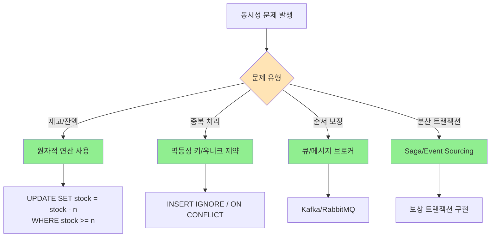

# 실무 동시성 문제 해결 전략

### 문제 진단 체크리스트

✅ **Lock 모니터링 및 진단 명령**

```sql
-- MySQL: Lock 상태 확인
SHOW ENGINE INNODB STATUS;
SELECT * FROM sys.innodb_lock_waits;

-- PostgreSQL: 블로킹 쿼리 확인
SELECT * FROM pg_stat_activity WHERE wait_event_type = 'Lock';

-- 오래 실행되는 트랜잭션 찾기
SELECT * FROM information_schema.INNODB_TRX
WHERE TIME_TO_SEC(TIMEDIFF(NOW(), trx_started)) > 10;

-- 데드락 히스토리
SHOW ENGINE INNODB STATUS\\G

```

### 실무 트러블슈팅 사례

**Case 1: 대량 업데이트로 인한 Lock 대기**

```sql
-- 문제: 100만 건 업데이트로 테이블 전체 Lock
UPDATE users SET last_login = NOW();

-- 해결: 배치 단위로 나누어 처리
-- 1000건씩 나누어 처리하고 다른 트랜잭션에 기회 제공

```

**Case 2: 인덱스 없는 Foreign Key로 인한 데드락**

```sql
-- 해결: Foreign Key 컬럼에 인덱스 추가
CREATE INDEX idx_orders_user_id ON orders(user_id);

```

### 동시성 제어 Best Practices

1. **트랜잭션 크기 최소화**
    - 필요한 작업만 트랜잭션 내에서 수행
    - 외부 API 호출은 트랜잭션 밖에서
2. **적절한 격리 수준 선택**
    - 대부분의 경우 DBMS 기본값으로 충분
    - 특별한 요구사항이 있을 때만 상향 조정
3. **인덱스 최적화**
    - Lock 경쟁을 줄이기 위한 적절한 인덱스
    - 불필요한 테이블 스캔 방지
4. **배치 처리 고려**
    - 대량 업데이트는 청크 단위로 처리
    - 피크 시간을 피해 실행
5. **모니터링과 알림**
    - Lock 대기 시간 임계값 설정
    - 데드락 발생 시 즉시 알림

### 케이스별 해결 방법



> 📚 참고: Production Best Practices
>
> - [MySQL - InnoDB Locking and Transaction Model](https://dev.mysql.com/doc/refman/8.0/en/innodb-locking-transaction-model.html)
> - [Martin Fowler - Patterns of Enterprise Application Architecture](https://martinfowler.com/books/eaa.html)
> - [Microservices.io - Saga Pattern](https://microservices.io/patterns/data/saga.html)

제공해주신 **실무 동시성 문제 해결 전략** 자료는 장애 대응 시 바로 꺼내 볼 수 있는 훌륭한 '치트 시트'입니다. 특히 **Lock 모니터링 SQL**과 **케이스별 해결 방법(재고/중복/순서)** 분류는 실무에서 매우 유용합니다.

시니어 서버 개발자로서, 이 전략들을 **Kotlin + Spring Boot 이커머스 서비스**에 어떻게 녹여내야 하는지, 자료에 담기지 않은 '디테일한 구현 전략'을 보충해 드리겠습니다.

-----

## 🛠️ 1. 트랜잭션 범위와 외부 API (가장 흔한 실수)

자료의 Best Practices 1번인 \*\*"트랜잭션 크기 최소화 - 외부 API 호출은 트랜잭션 밖에서"\*\*는 이커머스 결제 로직에서 생명과도 같습니다.

### ❌ 흔한 실수: 통으로 묶기

PG사(결제 대행사) 결제 승인 요청은 네트워크 상황에 따라 1\~3초 이상 걸릴 수 있습니다.

```kotlin
// ❌ BAD: DB 커넥션을 잡고 PG 응답을 기다림 (최악의 경우 DB 풀 고갈)
@Transactional
fun processPayment(orderId: Long) {
    val order = orderRepository.findById(orderId) // DB Lock 시작
    order.status = OrderStatus.PROCESSING
    
    // ⚠️ 여기서 3초 걸리면, DB 커넥션도 3초간 낭비되고 Lock도 안 풀림
    paymentGateway.requestPayment(...) 
    
    order.status = OrderStatus.PAID
    orderRepository.save(order) // DB Lock 해제
}
```

### ✅ 시니어의 해결책: 트랜잭션 분리

외부 API 호출 전후로 트랜잭션을 쪼개야 합니다.

```kotlin
// ✅ GOOD: 외부 API 호출은 트랜잭션 밖으로 뺌
fun processPayment(orderId: Long) {
    // 1. 주문 상태 변경 (짧은 트랜잭션)
    updateOrderStatus(orderId, OrderStatus.PROCESSING) 

    // 2. 외부 API 호출 (DB 트랜잭션 없음)
    val result = paymentGateway.requestPayment(...)

    // 3. 결과 저장 (짧은 트랜잭션)
    completePayment(orderId, result)
}

@Transactional
fun updateOrderStatus(id: Long, status: OrderStatus) { ... }

@Transactional
fun completePayment(id: Long, result: PaymentResult) { ... }
```

-----

## 📦 2. 대량 업데이트 처리 (Bulk Update)

자료의 **Case 1: 대량 업데이트로 인한 Lock 대기** 상황입니다. "배치 단위로 나누어 처리"하라는 솔루션이 있는데, 이를 코드로 구현할 때 주의할 점이 있습니다.

### ❌ 위험한 코드: JPA Dirty Checking 루프

```kotlin
@Transactional
fun updateLastLoginAll() {
    // 100만 개를 다 영속성 컨텍스트에 올리면 OOM 발생 + 테이블 락
    val users = userRepository.findAll() 
    users.forEach { it.lastLogin = LocalDateTime.now() }
}
```

### ✅ 시니어의 해결책: Chunk Processing (배치 처리)

Spring Batch를 쓰기엔 너무 간단한 작업이라면, Kotlin의 `chunked`와 트랜잭션 분리를 활용합니다.

```kotlin
fun updateLastLoginInChunks() {
    var page = 0
    val pageSize = 1000 // 자료에서 제안한 1000건 단위

    while (true) {
        // ⭐️ 중요: 별도의 트랜잭션으로 실행해야 Lock이 주기적으로 풀림
        val updatedCount = processChunk(page, pageSize)
        if (updatedCount < pageSize) break
        page++
        
        // 다른 트랜잭션이 끼어들 수 있도록 잠깐 쉼 (선택 사항)
        Thread.sleep(50) 
    }
}

@Transactional(propagation = Propagation.REQUIRES_NEW) // 항상 새 트랜잭션
fun processChunk(page: Int, size: Int): Int {
    val users = userRepository.findAllBy(PageRequest.of(page, size))
    users.forEach { it.lastLogin = LocalDateTime.now() }
    return users.size
}
```

-----

## 🔑 3. 인덱스와 데드락 (Case 2 심층 분석)

자료에서 \*\*"인덱스 없는 Foreign Key로 인한 데드락"\*\*을 언급했습니다. 이게 왜 발생하는지 이해하는 게 중요합니다.

* **상황:** `Orders` 테이블이 `Users` 테이블을 참조(`user_id`)함.
* **문제:** `Users` 테이블의 특정 유저를 삭제하거나 ID를 수정하려 할 때, DB는 데이터 무결성을 위해 자식 테이블인 `Orders`를 검사해야 합니다.
* **인덱스가 없으면:** `Orders` 테이블을 **Full Scan** 하면서 테이블 전체에 락(Shared Lock)을 걸어버릴 수 있습니다. 이때 다른 트랜잭션이 주문을 넣으려 하면(Write Lock) 데드락이 터집니다.
* **해결:** 자료대로 FK 컬럼(`user_id`)에 반드시 인덱스를 걸어야 합니다.

-----

## 🛡️ 4. 멱등성(Idempotency) 구현 전략

자료의 케이스별 해결 방법 중 **"중복 처리 -\> 멱등성 키"** 부분입니다. 따닥(Double Click) 방지를 위해 필수입니다.

### Redis를 활용한 멱등성 키 구현 예시

클라이언트가 요청 시 헤더에 고유한 `Idempotency-Key` (UUID 등)를 실어 보낸다고 가정합니다.

```kotlin
@Service
class IdempotencyService(private val redisTemplate: StringRedisTemplate) {

    fun checkAndSaveKey(key: String, ttlSeconds: Long): Boolean {
        // Redis의 SETNX (Set If Not Exists) 활용
        // 키가 없을 때만 저장하고 true 반환. 이미 있으면 false 반환.
        val isSuccess = redisTemplate.opsForValue()
            .setIfAbsent("idempotency:$key", "USED", Duration.ofSeconds(ttlSeconds))
        
        return isSuccess == true
    }
}

// Controller
@PostMapping("/orders")
fun createOrder(@RequestHeader("Idempotency-Key") key: String, ...) {
    if (!idempotencyService.checkAndSaveKey(key, 60)) {
        throw DuplicateRequestException("이미 처리 중인 요청입니다.")
    }
    // ... 주문 로직 ...
}
```

이 방식은 DB 유니크 제약조건(Unique Constraint)보다 훨씬 빠르고 DB 부하를 줄여줍니다.

-----

## 🔍 5. 모니터링: SQL을 넘어 APM으로

자료에 있는 `SHOW ENGINE INNODB STATUS` 같은 명령어는 장애가 발생한 **그 순간**에 들어가서 쳐야 의미가 있습니다.

실무에서는 **사후 분석**과 **알림**이 중요합니다.

1.  **Pinpoint / Datadog / New Relic:** 같은 APM 도구를 붙여야 합니다. "어떤 API가 호출될 때 DB 락 대기 시간이 길어지는지" 그래프로 볼 수 있습니다.
2.  **Slow Query Log:** DB 설정에서 1\~2초 이상 걸리는 쿼리는 무조건 로그로 남기고, 이를 Slack 등으로 알림 받도록 설정하세요. 자료의 `INNODB_TRX` 조회 로직을 주기적인 스케줄러로 돌려서 슬랙으로 쏘는 것도 좋은 방법입니다.

-----

## 요약 및 제안

제공해주신 자료는 동시성 문제 해결의 **'지도'** 역할을 하고, 제가 보충해 드린 내용은 그 지도를 들고 실제 길을 찾아가는 **'나침반'** 역할(코드 구현, 설정)을 합니다.

**이커머스 프로젝트에 바로 적용해 볼 만한 다음 단계:**

1.  **결제 로직 리팩토링:** 외부 API 호출(PG사)이 `@Transactional` 안에 포함되어 있는지 확인하고 분리하기.
2.  **멱등성 테스트:** 주문 버튼을 매크로로 10번 동시에 눌렀을 때, 주문이 딱 1개만 생성되는지 Redis 멱등성 로직으로 검증하기.

이 두 가지만 확실히 잡아도 실무 레벨의 안정성을 확보할 수 있습니다. 혹시 `Spring Batch` 설정이나 `Redis` 설정 관련해서 더 구체적인 코드가 필요하시면 말씀해주세요.